# 👨🏾‍💻 Section 04: Server Side + Client side rendenring

## 📑 Table of Contents

- [⚙️ Section: Server Side + Client side rendenring](#️-section-server-side--client-side-rendenring)
  - [📑 Table of Contents](#-table-of-contents)
  - [🔧 Lesson 037](#-lesson-037)
  - [🔧 Lesson 038](#-lesson-038)
  - [🔧 Lesson 039](#-lesson-039)
  - [🔧 Lesson 040](#-lesson-040)
  - [🔧 Lesson 041](#-lesson-041)
  - [🔧 Lesson 042](#-lesson-042)
  - [🔧 Lesson 043](#-lesson-043)
  - [🔧 Lesson 044](#-lesson-044)
  - [📎 Related Files](#-related-files)
  - [🔗 References](#-references)

---

## Getting Started

First, create a `Next` project

```bash
npx create-next-app [project-name]
```

Choose:

```bash
✔ Would you like to use the recommended Next.js defaults? › No, customize settings
✔ Would you like to use TypeScript? … No / `Yes`
✔ Which linter would you like to use? › `ESLint`
✔ Would you like to use React Compiler? … `No` / Yes
✔ Would you like to use Tailwind CSS? … No / `Yes`
✔ Would you like your code inside a `src/` directory? … `No` / Yes
✔ Would you like to use App Router? (recommended) … No / `Yes`
✔ Would you like to customize the import alias (`@/*` by default)? … `No` / Yes
```

Second, run the development server:

```bash
npm run dev
# or
yarn dev
# or
pnpm dev
# or
bun dev
```

Open [http://localhost:3000](http://localhost:3000) with your browser to see the result.

## 🔧 1. Lesson 037 — *MyDashboard*

### 🧠 1.1 Context  
_This lesson covers the initial setup of the MyDashboard project. It establishes the basic Next.js project structure by configuring global styles with Tailwind CSS, creating the main page and the first dashboard page (counter). It also implements a redirect from the homepage to the counter page to facilitate access during development._

### 1. Open **`globals.css`** file:

```css
/* src/app/globals.css */
@import "tailwindcss";

:root {
  --background: #ffffff;
  --foreground: #171717;
}

@theme inline {
  --color-background: var(--background);
  --color-foreground: var(--foreground);
  --font-sans: var(--font-geist-sans);
  --font-mono: var(--font-geist-mono);
}

/* @media (prefers-color-scheme: dark) {
  :root {
    --background: #0a0a0a;
    --foreground: #ededed;
  }
} */ // 👈🏽 ✅

body {
  background: var(--background);
  color: var(--foreground);
  font-family: Arial, Helvetica, sans-serif;
}
```

### 2. Open **`src/app/page.tsx`** file:

```tsx
export default function HomePage() {
  return (
    <>
      <h1>Hello World</h1>
    </>
  );
}
```

### 3. Create **`dashboard/counter/page.tsx`** file:

```tsx
/* src/app/dashboard/counter/page.tsx */
export default function CounterPage() {
  return (
    <div>
      <h1>Page Counter</h1>
    </div>
  );
}
```

> Go to [counter page](http://localhost:3000/dashboard/counter)

### 4. Renavigate rom homepage directly to counter page:

```tsx
/* src/app/page.tsx */
import { redirect } from "next/navigation";
export default function HomePage() {
  redirect("/dashboard/counter");
}
```

> Go to [Home page](http://localhost:3000)

## 🔧 2. Lesson 038 — *My Dashboard Structure*

### 🧠 2.1 Context  
_This lesson establishes the visual structure of the dashboard. It obtains a dark navigation component from Tailwind CSS and integrates it into the dashboard layout. The `layout.tsx` file is created for the dashboard, including a sidebar navigation with logo, user profile, and navigation menu with multiple options (Dashboard, Database, Cloud Storage, Reports, Security, Extensions, Settings). HTML code is adapted to React by converting attributes like `class` to `className` and adjusting SVG elements._

### 1. Get the dashboard component code

[Dark dashboard navigation system made using Tailwind CSS](https://www.creative-tim.com/twcomponents/component/dashboard-navigation)

### 2. Add the **`src/app/dashboard/layout.tsx`** file:

```tsx
/* src/app/dashboard/layout.tsx */
export default function DashboardLayout({
  children,
}: {
  children: React.ReactNode;
}) {
  return (
    <div>
      <h1>Hello Root Layout Dashboard</h1>
    </div>
  );
}
```

### 3. Add the Dashboard code from the Tailwind URL into this Layout:

```tsx
/* src/app/dashboard/layout.tsx */
export default function DashboardLayout({
  children,
}: {
  children: React.ReactNode;
}) {
  return (
    <div className="bg-slate-100 overflow-y-scroll w-screen h-screen antialiased text-slate-300 selection:bg-blue-600 selection:text-white">
      <div className="flex flex-col relative w-screen">
        <div
          id="menu"
          className="bg-gray-900 min-h-screen z-10 text-slate-300 w-64 fixed left-0 h-screen overflow-y-scroll"
        >
          <div id="logo" className="my-4 px-6">
            <h1 className="text-lg md:text-2xl font-bold text-white">
              Dash<span className="text-blue-500">8</span>.
            </h1>
            <p className="text-slate-500 text-sm">
              Manage your actions and activities
            </p>
          </div>
          <div id="profile" className="px-6 py-10">
            <p className="text-slate-500">Welcome back,</p>
            <a href="#" className="inline-flex space-x-2 items-center">
              <span>
                
              </span>
              <span className="text-sm md:text-base font-bold">
                Edward Tompson
              </span>
            </a>
          </div>
          <div id="nav" className="w-full px-6">
            <a
              href="#"
              className="w-full px-2 inline-flex space-x-2 items-center border-b border-slate-700 py-3 bg-blue-800 hover:bg-white/5 transition ease-linear duration-150"
            >
              <div>
                <svg
                  xmlns="http://www.w3.org/2000/svg"
                  fill="none"
                  viewBox="0 0 24 24"
                  strokeWidth="1.5"
                  stroke="currentColor"
                  className="w-6 h-6 text-white"
                >
                  <path
                    strokeLinecap="round"
                    strokeLinejoin="round"
                    d="M3.75 6A2.25 2.25 0 016 3.75h2.25A2.25 2.25 0 0110.5 6v2.25a2.25 2.25 0 01-2.25 2.25H6a2.25 2.25 0 01-2.25-2.25V6zM3.75 15.75A2.25 2.25 0 016 13.5h2.25a2.25 2.25 0 012.25 2.25V18a2.25 2.25 0 01-2.25 2.25H6A2.25 2.25 0 013.75 18v-2.25zM13.5 6a2.25 2.25 0 012.25-2.25H18A2.25 2.25 0 0120.25 6v2.25A2.25 2.25 0 0118 10.5h-2.25a2.25 2.25 0 01-2.25-2.25V6zM13.5 15.75a2.25 2.25 0 012.25-2.25H18a2.25 2.25 0 012.25 2.25V18A2.25 2.25 0 0118 20.25h-2.25A2.25 2.25 0 0113.5 18v-2.25z"
                  />
                </svg>
              </div>
              <div className="flex flex-col">
                <span className="text-lg font-bold leading-5 text-white">
                  Dashboard
                </span>
                <span className="text-sm text-white/50 hidden md:block">
                  Data Overview
                </span>
              </div>
            </a>
            <a
              href="#"
              className="w-full px-2 inline-flex space-x-2 items-center border-b border-slate-700 py-3 hover:bg-white/5 transition ease-linear duration-150"
            >
              <div>
                <svg
                  xmlns="http://www.w3.org/2000/svg"
                  fill="none"
                  viewBox="0 0 24 24"
                  strokeWidth="1.5"
                  stroke="currentColor"
                  className="w-6 h-6"
                >
                  <path
                    strokeLinecap="round"
                    strokeLinejoin="round"
                    d="M20.25 6.375c0 2.278-3.694 4.125-8.25 4.125S3.75 8.653 3.75 6.375m16.5 0c0-2.278-3.694-4.125-8.25-4.125S3.75 4.097 3.75 6.375m16.5 0v11.25c0 2.278-3.694 4.125-8.25 4.125s-8.25-1.847-8.25-4.125V6.375m16.5 0v3.75m-16.5-3.75v3.75m16.5 0v3.75C20.25 16.153 16.556 18 12 18s-8.25-1.847-8.25-4.125v-3.75m16.5 0c0 2.278-3.694 4.125-8.25 4.125s-8.25-1.847-8.25-4.125"
                  />
                </svg>
              </div>
              <div className="flex flex-col">
                <span className="text-lg text-slate-300 font-bold leading-5">
                  Database
                </span>
                <span className="text-sm text-slate-500 hidden md:block">
                  Database Manager
                </span>
              </div>
            </a>
            <a
              href="#"
              className="w-full px-2 inline-flex space-x-2 items-center border-b border-slate-700 py-3 hover:bg-white/5 transition ease-linear duration-150"
            >
              <div>
                <svg
                  xmlns="http://www.w3.org/2000/svg"
                  fill="none"
                  viewBox="0 0 24 24"
                  strokeWidth="1.5"
                  stroke="currentColor"
                  className="w-6 h-6"
                >
                  <path
                    strokeLinecap="round"
                    strokeLinejoin="round"
                    d="M2.25 15a4.5 4.5 0 004.5 4.5H18a3.75 3.75 0 001.332-7.257 3 3 0 00-3.758-3.848 5.25 5.25 0 00-10.233 2.33A4.502 4.502 0 002.25 15z"
                  />
                </svg>
              </div>
              <div className="flex flex-col">
                <span className="text-lg text-slate-300 font-bold leading-5">
                  Cloud Storage
                </span>
                <span className="text-sm text-slate-500 hidden md:block">
                  Manage Cloud Storage
                </span>
              </div>
            </a>
            <a
              href="#"
              className="w-full px-2 inline-flex space-x-2 items-center border-b border-slate-700 py-3 hover:bg-white/5 transition ease-linear duration-150"
            >
              <div>
                <svg
                  xmlns="http://www.w3.org/2000/svg"
                  fill="none"
                  viewBox="0 0 24 24"
                  strokeWidth="1.5"
                  stroke="currentColor"
                  className="w-6 h-6"
                >
                  <path
                    strokeLinecap="round"
                    strokeLinejoin="round"
                    d="M3 3v1.5M3 21v-6m0 0l2.77-.693a9 9 0 016.208.682l.108.054a9 9 0 006.086.71l3.114-.732a48.524 48.524 0 01-.005-10.499l-3.11.732a9 9 0 01-6.085-.711l-.108-.054a9 9 0 00-6.208-.682L3 4.5M3 15V4.5"
                  />
                </svg>
              </div>
              <div className="flex flex-col">
                <span className="text-lg text-slate-300 font-bold leading-5">
                  Reports
                </span>
                <span className="text-sm text-slate-500 hidden md:block">
                  Manage Reports
                </span>
              </div>
            </a>
            <a
              href="#"
              className="w-full px-2 inline-flex space-x-2 items-center border-b border-slate-700 py-3 hover:bg-white/5 transition ease-linear duration-150"
            >
              <div>
                <svg
                  xmlns="http://www.w3.org/2000/svg"
                  fill="none"
                  viewBox="0 0 24 24"
                  strokeWidth="1.5"
                  stroke="currentColor"
                  className="w-6 h-6"
                >
                  <path
                    strokeLinecap="round"
                    strokeLinejoin="round"
                    d="M15.75 5.25a3 3 0 013 3m3 0a6 6 0 01-7.029 5.912c-.563-.097-1.159.026-1.563.43L10.5 17.25H8.25v2.25H6v2.25H2.25v-2.818c0-.597.237-1.17.659-1.591l6.499-6.499c.404-.404.527-1 .43-1.563A6 6 0 1121.75 8.25z"
                  />
                </svg>
              </div>
              <div className="flex flex-col">
                <span className="text-lg text-slate-300 font-bold leading-5">
                  Security
                </span>
                <span className="text-sm text-slate-500 hidden md:block">
                  Generate Security Keys
                </span>
              </div>
            </a>
            <a
              href="#"
              className="w-full px-2 inline-flex space-x-2 items-center border-b border-slate-700 py-3 hover:bg-white/5 transition ease-linear duration-150"
            >
              <div>
                <svg
                  xmlns="http://www.w3.org/2000/svg"
                  fill="none"
                  viewBox="0 0 24 24"
                  strokeWidth="1.5"
                  stroke="currentColor"
                  className="w-6 h-6"
                >
                  <path
                    strokeLinecap="round"
                    strokeLinejoin="round"
                    d="M2.25 7.125C2.25 6.504 2.754 6 3.375 6h6c.621 0 1.125.504 1.125 1.125v3.75c0 .621-.504 1.125-1.125 1.125h-6a1.125 1.125 0 01-1.125-1.125v-3.75zM14.25 8.625c0-.621.504-1.125 1.125-1.125h5.25c.621 0 1.125.504 1.125 1.125v8.25c0 .621-.504 1.125-1.125 1.125h-5.25a1.125 1.125 0 01-1.125-1.125v-8.25zM3.75 16.125c0-.621.504-1.125 1.125-1.125h5.25c.621 0 1.125.504 1.125 1.125v2.25c0 .621-.504 1.125-1.125 1.125h-5.25a1.125 1.125 0 01-1.125-1.125v-2.25z"
                  />
                </svg>
              </div>
              <div className="flex flex-col">
                <span className="text-lg text-slate-300 font-bold leading-5">
                  Extensions
                </span>
                <span className="text-sm text-slate-500 hidden md:block">
                  Manage Extensions
                </span>
              </div>
            </a>
            <a
              href="#"
              className="w-full px-2 inline-flex space-x-2 items-center py-3 hover:bg-white/5 transition ease-linear duration-150"
            >
              <div>
                <svg
                  xmlns="http://www.w3.org/2000/svg"
                  fill="none"
                  viewBox="0 0 24 24"
                  strokeWidth="1.5"
                  stroke="currentColor"
                  className="w-6 h-6"
                >
                  <path
                    strokeLinecap="round"
                    strokeLinejoin="round"
                    d="M4.5 12a7.5 7.5 0 0015 0m-15 0a7.5 7.5 0 1115 0m-15 0H3m16.5 0H21m-1.5 0H12m-8.457 3.077l1.41-.513m14.095-5.13l1.41-.513M5.106 17.785l1.15-.964m11.49-9.642l1.149-.964M7.501 19.795l.75-1.3m7.5-12.99l.75-1.3m-6.063 16.658l.26-1.477m2.605-14.772l.26-1.477m0 17.726l-.26-1.477M10.698 4.614l-.26-1.477M16.5 19.794l-.75-1.299M7.5 4.205L12 12m6.894 5.785l-1.149-.964M6.256 7.178l-1.15-.964m15.352 8.864l-1.41-.513M4.954 9.435l-1.41-.514M12.002 12l-3.75 6.495"
                  />
                </svg>
              </div>
              <div className="flex flex-col">
                <span className="text-lg text-slate-300 font-bold leading-5">
                  Settings
                </span>
                <span className="text-sm text-slate-500 hidden md:block">
                  Edit App Settings
                </span>
              </div>
            </a>
          </div>
        </div>
      </div>
    </div>
  );
}
```

> Notes:

- Replace all `class` by `className`.
- Selft-close the `` tag: ``
- Replace each `stroke-linecap` by `strokeLinecap`.
- Replace each `stroke-linejoin` by `strokeLinejoin`.
- Replace each `stroke-width` by `strokeWidth`.

## 🔧 3. Lesson 039 — *Sidebar & main content*

### 🧠 3.1 Context  
_This lesson focuses on separation of concerns and code organization. The dashboard layout is refactored to separate the sidebar into an independent component (`Sidebar.tsx`). The layout is adjusted to properly display the sidebar alongside the main content using the `children` prop. The `fixed` positioning is removed from the sidebar and a flexible layout is configured that allows the main content to display next to the sidebar. A barrel file (`index.ts`) is also created to facilitate imports._

### 1. Add the `{ children }` prop in this `layout.tsx`:

- Replace `<div className="flex flex-col relative w-screen">` by `<div className="flex">`
- Delete `fixed` in `<div id="menu" className="bg-gray-900 min-h-screen z-10 text-slate-300 w-64 fixed left-0 h-screen overflow-y-scroll">`
- Style `{ children }`

```tsx
/* src/app/dashboard/layout.tsx */
export default function DashboardLayout({
  children,
}: {
  children: React.ReactNode;
}) {
  return (
    <div className="bg-slate-100 overflow-y-scroll w-screen h-screen antialiased text-slate-300 selection:bg-blue-600 selection:text-white">
      <div className="flex">
        {" "}
        // 👈🏽 ✅<div
          id="menu"
          className="bg-gray-900 min-h-screen z-10 text-slate-300 w-64 left-0 h-screen overflow-y-scroll"
        >
          ...
        </div>
        {children}
      </div>
    </div>
  );
}
```

### 2. Creaate **`Sidebar.tsx`** component:

#### 1. From **`Layout.tsx`**, Cut/Remove the content between:

- `<div className="flex">` and
- `<div className="p-2 w-full text-slate-900">`

#### 2. Paste this content in **`Sidebar`** component:

```tsx
/* src/app/components/Sidebar.tsx */
export const Sidebar = () => {
  return (
    <div
      id="menu"
      className="bg-gray-900 min-h-screen z-10 text-slate-300 w-64 left-0 h-screen overflow-y-scroll"
    >
      <div id="logo" className="my-4 px-6">
        <h1 className="text-lg md:text-2xl font-bold text-white">
          Dash<span className="text-blue-500">8</span>.
        </h1>
        <p className="text-slate-500 text-sm">
          Manage your actions and activities
        </p>
      </div>
      <div id="profile" className="px-6 py-10">
        <p className="text-slate-500">Welcome back,</p>
        <a href="#" className="inline-flex space-x-2 items-center">
          <span>
            
          </span>
          <span className="text-sm md:text-base font-bold">Edward Tompson</span>
        </a>
      </div>
      <div id="nav" className="w-full px-6">
        <a
          href="#"
          className="w-full px-2 inline-flex space-x-2 items-center border-b border-slate-700 py-3 bg-blue-800 hover:bg-white/5 transition ease-linear duration-150"
        >
          <div>
            <svg
              xmlns="http://www.w3.org/2000/svg"
              fill="none"
              viewBox="0 0 24 24"
              strokeWidth="1.5"
              stroke="currentColor"
              className="w-6 h-6 text-white"
            >
              <path
                strokeLinecap="round"
                strokeLinejoin="round"
                d="M3.75 6A2.25 2.25 0 016 3.75h2.25A2.25 2.25 0 0110.5 6v2.25a2.25 2.25 0 01-2.25 2.25H6a2.25 2.25 0 01-2.25-2.25V6zM3.75 15.75A2.25 2.25 0 016 13.5h2.25a2.25 2.25 0 012.25 2.25V18a2.25 2.25 0 01-2.25 2.25H6A2.25 2.25 0 013.75 18v-2.25zM13.5 6a2.25 2.25 0 012.25-2.25H18A2.25 2.25 0 0120.25 6v2.25A2.25 2.25 0 0118 10.5h-2.25a2.25 2.25 0 01-2.25-2.25V6zM13.5 15.75a2.25 2.25 0 012.25-2.25H18a2.25 2.25 0 012.25 2.25V18A2.25 2.25 0 0118 20.25h-2.25A2.25 2.25 0 0113.5 18v-2.25z"
              />
            </svg>
          </div>
          <div className="flex flex-col">
            <span className="text-lg font-bold leading-5 text-white">
              Dashboard
            </span>
            <span className="text-sm text-white/50 hidden md:block">
              Data Overview
            </span>
          </div>
        </a>
        <a
          href="#"
          className="w-full px-2 inline-flex space-x-2 items-center border-b border-slate-700 py-3 hover:bg-white/5 transition ease-linear duration-150"
        >
          <div>
            <svg
              xmlns="http://www.w3.org/2000/svg"
              fill="none"
              viewBox="0 0 24 24"
              strokeWidth="1.5"
              stroke="currentColor"
              className="w-6 h-6"
            >
              <path
                strokeLinecap="round"
                strokeLinejoin="round"
                d="M20.25 6.375c0 2.278-3.694 4.125-8.25 4.125S3.75 8.653 3.75 6.375m16.5 0c0-2.278-3.694-4.125-8.25-4.125S3.75 4.097 3.75 6.375m16.5 0v11.25c0 2.278-3.694 4.125-8.25 4.125s-8.25-1.847-8.25-4.125V6.375m16.5 0v3.75m-16.5-3.75v3.75m16.5 0v3.75C20.25 16.153 16.556 18 12 18s-8.25-1.847-8.25-4.125v-3.75m16.5 0c0 2.278-3.694 4.125-8.25 4.125s-8.25-1.847-8.25-4.125"
              />
            </svg>
          </div>
          <div className="flex flex-col">
            <span className="text-lg text-slate-300 font-bold leading-5">
              Database
            </span>
            <span className="text-sm text-slate-500 hidden md:block">
              Database Manager
            </span>
          </div>
        </a>
        <a
          href="#"
          className="w-full px-2 inline-flex space-x-2 items-center border-b border-slate-700 py-3 hover:bg-white/5 transition ease-linear duration-150"
        >
          <div>
            <svg
              xmlns="http://www.w3.org/2000/svg"
              fill="none"
              viewBox="0 0 24 24"
              strokeWidth="1.5"
              stroke="currentColor"
              className="w-6 h-6"
            >
              <path
                strokeLinecap="round"
                strokeLinejoin="round"
                d="M2.25 15a4.5 4.5 0 004.5 4.5H18a3.75 3.75 0 001.332-7.257 3 3 0 00-3.758-3.848 5.25 5.25 0 00-10.233 2.33A4.502 4.502 0 002.25 15z"
              />
            </svg>
          </div>
          <div className="flex flex-col">
            <span className="text-lg text-slate-300 font-bold leading-5">
              Cloud Storage
            </span>
            <span className="text-sm text-slate-500 hidden md:block">
              Manage Cloud Storage
            </span>
          </div>
        </a>
        <a
          href="#"
          className="w-full px-2 inline-flex space-x-2 items-center border-b border-slate-700 py-3 hover:bg-white/5 transition ease-linear duration-150"
        >
          <div>
            <svg
              xmlns="http://www.w3.org/2000/svg"
              fill="none"
              viewBox="0 0 24 24"
              strokeWidth="1.5"
              stroke="currentColor"
              className="w-6 h-6"
            >
              <path
                strokeLinecap="round"
                strokeLinejoin="round"
                d="M3 3v1.5M3 21v-6m0 0l2.77-.693a9 9 0 016.208.682l.108.054a9 9 0 006.086.71l3.114-.732a48.524 48.524 0 01-.005-10.499l-3.11.732a9 9 0 01-6.085-.711l-.108-.054a9 9 0 00-6.208-.682L3 4.5M3 15V4.5"
              />
            </svg>
          </div>
          <div className="flex flex-col">
            <span className="text-lg text-slate-300 font-bold leading-5">
              Reports
            </span>
            <span className="text-sm text-slate-500 hidden md:block">
              Manage Reports
            </span>
          </div>
        </a>
        <a
          href="#"
          className="w-full px-2 inline-flex space-x-2 items-center border-b border-slate-700 py-3 hover:bg-white/5 transition ease-linear duration-150"
        >
          <div>
            <svg
              xmlns="http://www.w3.org/2000/svg"
              fill="none"
              viewBox="0 0 24 24"
              strokeWidth="1.5"
              stroke="currentColor"
              className="w-6 h-6"
            >
              <path
                strokeLinecap="round"
                strokeLinejoin="round"
                d="M15.75 5.25a3 3 0 013 3m3 0a6 6 0 01-7.029 5.912c-.563-.097-1.159.026-1.563.43L10.5 17.25H8.25v2.25H6v2.25H2.25v-2.818c0-.597.237-1.17.659-1.591l6.499-6.499c.404-.404.527-1 .43-1.563A6 6 0 1121.75 8.25z"
              />
            </svg>
          </div>
          <div className="flex flex-col">
            <span className="text-lg text-slate-300 font-bold leading-5">
              Security
            </span>
            <span className="text-sm text-slate-500 hidden md:block">
              Generate Security Keys
            </span>
          </div>
        </a>
        <a
          href="#"
          className="w-full px-2 inline-flex space-x-2 items-center border-b border-slate-700 py-3 hover:bg-white/5 transition ease-linear duration-150"
        >
          <div>
            <svg
              xmlns="http://www.w3.org/2000/svg"
              fill="none"
              viewBox="0 0 24 24"
              strokeWidth="1.5"
              stroke="currentColor"
              className="w-6 h-6"
            >
              <path
                strokeLinecap="round"
                strokeLinejoin="round"
                d="M2.25 7.125C2.25 6.504 2.754 6 3.375 6h6c.621 0 1.125.504 1.125 1.125v3.75c0 .621-.504 1.125-1.125 1.125h-6a1.125 1.125 0 01-1.125-1.125v-3.75zM14.25 8.625c0-.621.504-1.125 1.125-1.125h5.25c.621 0 1.125.504 1.125 1.125v8.25c0 .621-.504 1.125-1.125 1.125h-5.25a1.125 1.125 0 01-1.125-1.125v-8.25zM3.75 16.125c0-.621.504-1.125 1.125-1.125h5.25c.621 0 1.125.504 1.125 1.125v2.25c0 .621-.504 1.125-1.125 1.125h-5.25a1.125 1.125 0 01-1.125-1.125v-2.25z"
              />
            </svg>
          </div>
          <div className="flex flex-col">
            <span className="text-lg text-slate-300 font-bold leading-5">
              Extensions
            </span>
            <span className="text-sm text-slate-500 hidden md:block">
              Manage Extensions
            </span>
          </div>
        </a>
        <a
          href="#"
          className="w-full px-2 inline-flex space-x-2 items-center py-3 hover:bg-white/5 transition ease-linear duration-150"
        >
          <div>
            <svg
              xmlns="http://www.w3.org/2000/svg"
              fill="none"
              viewBox="0 0 24 24"
              strokeWidth="1.5"
              stroke="currentColor"
              className="w-6 h-6"
            >
              <path
                strokeLinecap="round"
                strokeLinejoin="round"
                d="M4.5 12a7.5 7.5 0 0015 0m-15 0a7.5 7.5 0 1115 0m-15 0H3m16.5 0H21m-1.5 0H12m-8.457 3.077l1.41-.513m14.095-5.13l1.41-.513M5.106 17.785l1.15-.964m11.49-9.642l1.149-.964M7.501 19.795l.75-1.3m7.5-12.99l.75-1.3m-6.063 16.658l.26-1.477m2.605-14.772l.26-1.477m0 17.726l-.26-1.477M10.698 4.614l-.26-1.477M16.5 19.794l-.75-1.299M7.5 4.205L12 12m6.894 5.785l-1.149-.964M6.256 7.178l-1.15-.964m15.352 8.864l-1.41-.513M4.954 9.435l-1.41-.514M12.002 12l-3.75 6.495"
              />
            </svg>
          </div>
          <div className="flex flex-col">
            <span className="text-lg text-slate-300 font-bold leading-5">
              Settings
            </span>
            <span className="text-sm text-slate-500 hidden md:block">
              Edit App Settings
            </span>
          </div>
        </a>
      </div>
    </div>
  );
};
```

#### 3. Create **`index.ts`** file:

```ts
/* src/app/components/index.ts */
export { Sidebar } from "./Sidebar";
```

### 3. Import **`Sidebar`** component in **`Layout`**:

```tsx
/* src/app/dashboard/layout.tsx */
import { Sidebar } from "../components"; // 👈🏽 ✅
export default function DashboardLayout({
  children,
}: {
  children: React.ReactNode;
}) {
  return (
    <div className="bg-slate-100 overflow-y-scroll w-screen h-screen antialiased text-slate-300 selection:bg-blue-600 selection:text-white">
      <div className="flex">
        <Sidebar /> // 👈🏽 ✅
        <div className="p-2 w-full text-slate-900">{children}</div>
      </div>
    </div>
  );
}
```

### 4. Update the **`Sidebar`** component:

- Add `style={{ width: '400px' }}` in `<div id="menu" className="...">`
- Keep 2 `<a href="#"...>` from `<div id="nav" className="w-full px-6">` only and isolate them.
- Change the name profile with yours.

```tsx
/*  */
export const Sidebar = () => {
  return (
    <div
      id="menu"
      style={{ width: "400px" }}
      className="bg-gray-900 min-h-screen z-10 text-slate-300 w-64 left-0 h-screen overflow-y-scroll"
    >
      <div id="logo" className="my-4 px-6">
        <h1 className="text-lg md:text-2xl font-bold text-white">
          Dash<span className="text-blue-500">8</span>.
        </h1>
        <p className="text-slate-500 text-sm">
          Manage your actions and activities
        </p>
      </div>
      <div id="profile" className="px-6 py-10">
        <p className="text-slate-500">Welcome back,</p>
        <a href="#" className="inline-flex space-x-2 items-center">
          <span>
            
          </span>
          <span className="text-sm md:text-base font-bold">
            Luis Medina Coca
          </span>
        </a>
      </div>
      <div id="nav" className="w-full px-6">
        <a
          href="#"
          className="w-full px-2 inline-flex space-x-2 items-center border-b border-slate-700 py-3 bg-blue-800 hover:bg-white/5 transition ease-linear duration-150"
        >
          <div>
            <svg
              xmlns="http://www.w3.org/2000/svg"
              fill="none"
              viewBox="0 0 24 24"
              strokeWidth="1.5"
              stroke="currentColor"
              className="w-6 h-6 text-white"
            >
              <path
                strokeLinecap="round"
                strokeLinejoin="round"
                d="M3.75 6A2.25 2.25 0 016 3.75h2.25A2.25 2.25 0 0110.5 6v2.25a2.25 2.25 0 01-2.25 2.25H6a2.25 2.25 0 01-2.25-2.25V6zM3.75 15.75A2.25 2.25 0 016 13.5h2.25a2.25 2.25 0 012.25 2.25V18a2.25 2.25 0 01-2.25 2.25H6A2.25 2.25 0 013.75 18v-2.25zM13.5 6a2.25 2.25 0 012.25-2.25H18A2.25 2.25 0 0120.25 6v2.25A2.25 2.25 0 0118 10.5h-2.25a2.25 2.25 0 01-2.25-2.25V6zM13.5 15.75a2.25 2.25 0 012.25-2.25H18a2.25 2.25 0 012.25 2.25V18A2.25 2.25 0 0118 20.25h-2.25A2.25 2.25 0 0113.5 18v-2.25z"
              />
            </svg>
          </div>
          <div className="flex flex-col">
            <span className="text-lg font-bold leading-5 text-white">
              Dashboard
            </span>
            <span className="text-sm text-white/50 hidden md:block">
              Data Overview
            </span>
          </div>
        </a>

        <a
          href="#"
          className="w-full px-2 inline-flex space-x-2 items-center border-b border-slate-700 py-3 hover:bg-white/5 transition ease-linear duration-150"
        >
          <div>
            <svg
              xmlns="http://www.w3.org/2000/svg"
              fill="none"
              viewBox="0 0 24 24"
              strokeWidth="1.5"
              stroke="currentColor"
              className="w-6 h-6"
            >
              <path
                strokeLinecap="round"
                strokeLinejoin="round"
                d="M20.25 6.375c0 2.278-3.694 4.125-8.25 4.125S3.75 8.653 3.75 6.375m16.5 0c0-2.278-3.694-4.125-8.25-4.125S3.75 4.097 3.75 6.375m16.5 0v11.25c0 2.278-3.694 4.125-8.25 4.125s-8.25-1.847-8.25-4.125V6.375m16.5 0v3.75m-16.5-3.75v3.75m16.5 0v3.75C20.25 16.153 16.556 18 12 18s-8.25-1.847-8.25-4.125v-3.75m16.5 0c0 2.278-3.694 4.125-8.25 4.125s-8.25-1.847-8.25-4.125"
              />
            </svg>
          </div>
          <div className="flex flex-col">
            <span className="text-lg text-slate-300 font-bold leading-5">
              Database
            </span>
            <span className="text-sm text-slate-500 hidden md:block">
              Database Manager
            </span>
          </div>
        </a>
      </div>
    </div>
  );
};
```

## 🔧 4. Lesson 040 — *Next/Image*

### 🧠 4.1 Context  
_This lesson introduces the use of Next.js optimized `Image` component to replace traditional HTML `` tags. It is implemented in the Sidebar component to display the user avatar. The Next.js Image component provides automatic image optimization, lazy loading, and better performance. It requires configuring allowed domains in `next.config.ts` through `remotePatterns` to load images from external sources like Unsplash._

### ⚡ 4.2 Incidents Found  
| Issue | Status | Log/Error |
|---|---|---|
| Hostname not allowed | Fixed | Added remotePatterns in next.config.ts |

Check it out this URL: [Components | Image Componnt | Next.js](https://nextjs.org/docs/app/api-reference/components/image)

### 1. Import `Image` from next/image`

```tsx
/* src/app/components/Sidebar.tsx */
import Image from "next/image";

export const Sidebar = () => {
  return (
    <div
      id="menu"
      style={{ width: "400px" }}
      className="bg-gray-900 min-h-screen z-10 text-slate-300 w-64 left-0 h-screen overflow-y-scroll"
    >
      <div id="logo" className="my-4 px-6">
        <h1 className="text-lg md:text-2xl font-bold text-white">
          Dash<span className="text-blue-500">8</span>.
        </h1>
        <p className="text-slate-500 text-sm">
          Manage your actions and activities
        </p>
      </div>
      <div id="profile" className="px-6 py-10">
        <p className="text-slate-500">Welcome back,</p>
        <a href="#" className="inline-flex space-x-2 items-center">
          <span>
            <Image // 👈🏽 ✅
              className="rounded-full w-8 h-8"
              src="https://images.unsplash.com/photo-1542909168-82c3e7fdca5c?ixlib=rb-4.0.3&ixid=MnwxMjA3fDB8MHxwaG90by1wYWdlfHx8fGVufDB8fHx8&auto=format&fit=crop&w=128&q=80"
              alt="User avatar" // 👈🏽 ✅
              width={50} // 👈🏽 ✅
              height={50} // 👈🏽 ✅
            />
          </span>
          <span className="text-sm md:text-base font-bold">
            Luis Medina Coca
          </span>
        </a>
      </div>
      <div id="nav" className="w-full px-6">
        <a
          href="#"
          className="w-full px-2 inline-flex space-x-2 items-center border-b border-slate-700 py-3 bg-blue-800 hover:bg-white/5 transition ease-linear duration-150"
        >
          <div>
            <svg
              xmlns="http://www.w3.org/2000/svg"
              fill="none"
              viewBox="0 0 24 24"
              strokeWidth="1.5"
              stroke="currentColor"
              className="w-6 h-6 text-white"
            >
              <path
                strokeLinecap="round"
                strokeLinejoin="round"
                d="M3.75 6A2.25 2.25 0 016 3.75h2.25A2.25 2.25 0 0110.5 6v2.25a2.25 2.25 0 01-2.25 2.25H6a2.25 2.25 0 01-2.25-2.25V6zM3.75 15.75A2.25 2.25 0 016 13.5h2.25a2.25 2.25 0 012.25 2.25V18a2.25 2.25 0 01-2.25 2.25H6A2.25 2.25 0 013.75 18v-2.25zM13.5 6a2.25 2.25 0 012.25-2.25H18A2.25 2.25 0 0120.25 6v2.25A2.25 2.25 0 0118 10.5h-2.25a2.25 2.25 0 01-2.25-2.25V6zM13.5 15.75a2.25 2.25 0 012.25-2.25H18a2.25 2.25 0 012.25 2.25V18A2.25 2.25 0 0118 20.25h-2.25A2.25 2.25 0 0113.5 18v-2.25z"
              />
            </svg>
          </div>
          <div className="flex flex-col">
            <span className="text-lg font-bold leading-5 text-white">
              Dashboard
            </span>
            <span className="text-sm text-white/50 hidden md:block">
              Data Overview
            </span>
          </div>
        </a>

        <a
          href="#"
          className="w-full px-2 inline-flex space-x-2 items-center border-b border-slate-700 py-3 hover:bg-white/5 transition ease-linear duration-150"
        >
          <div>
            <svg
              xmlns="http://www.w3.org/2000/svg"
              fill="none"
              viewBox="0 0 24 24"
              strokeWidth="1.5"
              stroke="currentColor"
              className="w-6 h-6"
            >
              <path
                strokeLinecap="round"
                strokeLinejoin="round"
                d="M20.25 6.375c0 2.278-3.694 4.125-8.25 4.125S3.75 8.653 3.75 6.375m16.5 0c0-2.278-3.694-4.125-8.25-4.125S3.75 4.097 3.75 6.375m16.5 0v11.25c0 2.278-3.694 4.125-8.25 4.125s-8.25-1.847-8.25-4.125V6.375m16.5 0v3.75m-16.5-3.75v3.75m16.5 0v3.75C20.25 16.153 16.556 18 12 18s-8.25-1.847-8.25-4.125v-3.75m16.5 0c0 2.278-3.694 4.125-8.25 4.125s-8.25-1.847-8.25-4.125"
              />
            </svg>
          </div>
          <div className="flex flex-col">
            <span className="text-lg text-slate-300 font-bold leading-5">
              Database
            </span>
            <span className="text-sm text-slate-500 hidden md:block">
              Database Manager
            </span>
          </div>
        </a>
      </div>
    </div>
  );
};
```

> 🔥 Issue:

- Hostname not allowed.

### 2. Open **`next.config.ts`**

```ts
/* next.config.ts */
import type { NextConfig } from "next";
const nextConfig: NextConfig = {
  images: {
    remotePatterns: [
      {
        protocol: "https", // 👈🏽 ✅ <Image src="https://... />
        hostname: "images.unsplash.com", // 👈🏽 ✅ <Image src="...images.unsplash.com/..." />
      },
    ],
  },
};
export default nextConfig;
```

## 🔧 5. Lesson 041 — *Icons and active route*

### 🧠 5.1 Context  
_This lesson enhances the sidebar interface by adding icons using the `react-icons` library and creating a reusable `SidebarMenuItem` component for menu items. react-icons is installed and a React icon is added to the dashboard logo. A SidebarMenuItem component is created that accepts props like path, icon, title, and subTitle, allowing for a more maintainable and scalable structure. It sets the groundwork for implementing active navigation that will be completed in the next lesson._

### 1. Install [React-icons](https://react-icons.github.io/react-icons/):

```bash
npm install react-icons --save
```

> reference Link [Ionicons: Premium Open Source Icon Pack for Ionic Framework](https://ionic.io/ionicons/)

### 2. Import `IoLogoReact` in logo section:

```tsx
/* src/app/components/Sidebar.tsx */
import Image from "next/image";
import { IoLogoReact } from "react-icons/io5"; // 👈🏽 ✅ (2)
export const Sidebar = () => {
  return (
    <div
      id="menu"
      style={{ width: "400px" }}
      className="bg-gray-900 min-h-screen z-10 text-slate-300 w-64 left-0 h-screen overflow-y-scroll"
    >
      <div id="logo" className="my-4 px-6">
        <h1 className="flex items-center text-lg md:text-2xl font-bold text-white">
          <IoLogoReact className="mr-2" /> // 👈🏽 ✅ (1)
          <span>Dash-67</span>
          <span className="text-blue-500">8</span>.
        </h1>
        <p className="text-slate-500 text-sm">
          Manage your actions and activities
        </p>
      </div>
      <div id="profile" className="px-6 py-10">
        <p className="text-slate-500">Welcome back,</p>
        <a href="#" className="inline-flex space-x-2 items-center">
          ....
        </a>
      </div>
      <div id="nav" className="w-full px-6">
        <a
          href="#"
          className="w-full px-2 inline-flex space-x-2 items-center border-b border-slate-700 py-3 bg-blue-800 hover:bg-white/5 transition ease-linear duration-150"
        >
          ....
        </a>

        <a
          href="#"
          className="w-full px-2 inline-flex space-x-2 items-center border-b border-slate-700 py-3 hover:bg-white/5 transition ease-linear duration-150"
        >
          ....
        </a>
      </div>
    </div>
  );
};
```

### 3. Create `SidebarMenuItem.tsx` file:

```tsx
/* src/app/components/SidebarMenuItem.tsx */
import { JSX } from "react";

interface Props {
  //👈🏽 ✅
  path: string;
  icon: JSX.Element;
  title: string;
  subTitle: string;
}

const SidebarMenuItem = ({ path, icon, title, subTitle }: Props) => {
  //👈🏽 ✅
  return (
    <a
      href="#"
      className="w-full px-2 inline-flex space-x-2 items-center border-b border-slate-700 py-3 bg-blue-800 hover:bg-white/5 transition ease-linear duration-150"
    >
      <div>
        <svg
          xmlns="http://www.w3.org/2000/svg"
          fill="none"
          viewBox="0 0 24 24"
          strokeWidth="1.5"
          stroke="currentColor"
          className="w-6 h-6 text-white"
        >
          <path
            strokeLinecap="round"
            strokeLinejoin="round"
            d="M3.75 6A2.25 2.25 0 016 3.75h2.25A2.25 2.25 0 0110.5 6v2.25a2.25 2.25 0 01-2.25 2.25H6a2.25 2.25 0 01-2.25-2.25V6zM3.75 15.75A2.25 2.25 0 016 13.5h2.25a2.25 2.25 0 012.25 2.25V18a2.25 2.25 0 01-2.25 2.25H6A2.25 2.25 0 013.75 18v-2.25zM13.5 6a2.25 2.25 0 012.25-2.25H18A2.25 2.25 0 0120.25 6v2.25A2.25 2.25 0 0118 10.5h-2.25a2.25 2.25 0 01-2.25-2.25V6zM13.5 15.75a2.25 2.25 0 012.25-2.25H18a2.25 2.25 0 012.25 2.25V18A2.25 2.25 0 0118 20.25h-2.25A2.25 2.25 0 0113.5 18v-2.25z"
          />
        </svg>
      </div>
      <div className="flex flex-col">
        <span className="text-lg font-bold leading-5 text-white">
          Dashboard
        </span>
        <span className="text-sm text-white/50 hidden md:block">
          Data Overview
        </span>
      </div>
    </a>
  );
};

export default SidebarMenuItem;
```

### 4. Import `SidebarMenuItem` from `Sidebar.tsx`:

```tsx
/* src/app/components/Sidebar.tsx */
import Image from "next/image";
import { IoLogoReact } from "react-icons/io5";
import SidebarMenuItem from "./SidebarMenuItem"; // 👈🏽 ✅

export const Sidebar = () => {
  return (
    <div
      id="menu"
      style={{ width: "400px" }}
      className="bg-gray-900 min-h-screen z-10 text-slate-300 w-64 left-0 h-screen overflow-y-scroll"
    >
      <div id="logo" className="my-4 px-6">
        <h1 className="flex items-center text-lg md:text-2xl font-bold text-white">
          <IoLogoReact className="mr-2" />
          <span>Dash-67</span>
          <span className="text-blue-500">8</span>.
        </h1>
        <p className="text-slate-500 text-sm">
          Manage your actions and activities
        </p>
      </div>
      <div id="profile" className="px-6 py-10">
        <p className="text-slate-500">Welcome back,</p>
        <a href="#" className="inline-flex space-x-2 items-center">
          <span>
            <Image
              className="rounded-full w-8 h-8"
              src="https://images.unsplash.com/photo-1542909168-82c3e7fdca5c?ixlib=rb-4.0.3&ixid=MnwxMjA3fDB8MHxwaG90by1wYWdlfHx8fGVufDB8fHx8&auto=format&fit=crop&w=128&q=80"
              alt="User avatar"
              width={50}
              height={50}
            />
          </span>
          <span className="text-sm md:text-base font-bold">
            Luis Medina Coca
          </span>
        </a>
      </div>
      <div id="nav" className="w-full px-6">
        <SidebarMenuItem path={""} icon={undefined} title={""} subTitle={""} />{" "}
        // 👈🏽 ✅
        <a
          href="#"
          className="w-full px-2 inline-flex space-x-2 items-center border-b border-slate-700 py-3 hover:bg-white/5 transition ease-linear duration-150"
        >
          <div>
            <svg
              xmlns="http://www.w3.org/2000/svg"
              fill="none"
              viewBox="0 0 24 24"
              strokeWidth="1.5"
              stroke="currentColor"
              className="w-6 h-6"
            >
              <path
                strokeLinecap="round"
                strokeLinejoin="round"
                d="M20.25 6.375c0 2.278-3.694 4.125-8.25 4.125S3.75 8.653 3.75 6.375m16.5 0c0-2.278-3.694-4.125-8.25-4.125S3.75 4.097 3.75 6.375m16.5 0v11.25c0 2.278-3.694 4.125-8.25 4.125s-8.25-1.847-8.25-4.125V6.375m16.5 0v3.75m-16.5-3.75v3.75m16.5 0v3.75C20.25 16.153 16.556 18 12 18s-8.25-1.847-8.25-4.125v-3.75m16.5 0c0 2.278-3.694 4.125-8.25 4.125s-8.25-1.847-8.25-4.125"
              />
            </svg>
          </div>
          <div className="flex flex-col">
            <span className="text-lg text-slate-300 font-bold leading-5">
              Database
            </span>
            <span className="text-sm text-slate-500 hidden md:block">
              Database Manager
            </span>
          </div>
        </a>
      </div>
    </div>
  );
};
```

#### 4.1 Add the `menuItems` array:

```tsx
/* src/app/components/Sidebar.tsx */
import Image from "next/image";
import { IoBrowsersOutline, IoCalculator, IoLogoReact } from "react-icons/io5";
import SidebarMenuItem from "./SidebarMenuItem";

const menuItems = [
  // 👈🏽 ✅ (1)
  {
    path: "/dashboard/main",
    icon: <IoBrowsersOutline size={40} />,
    title: "Dashboard",
    subTitle: "Visualization",
  },
  {
    path: "/dashboard/counter",
    icon: <IoCalculator size={40} />,
    title: "Counter",
    subTitle: "Counter Client Side",
  },
];

export const Sidebar = () => {
  return (
    <div
      id="menu"
      style={{ width: "400px" }}
      className="bg-gray-900 min-h-screen z-10 text-slate-300 w-64 left-0 h-screen overflow-y-scroll"
    >
      <div id="logo" className="my-4 px-6">
        <h1 className="flex items-center text-lg md:text-2xl font-bold text-white">
          <IoLogoReact className="mr-2" />
          <span>Dash-67</span>
          <span className="text-blue-500">8</span>.
        </h1>
        <p className="text-slate-500 text-sm">
          Manage your actions and activities
        </p>
      </div>
      <div id="profile" className="px-6 py-10">
        <p className="text-slate-500">Welcome back,</p>
        <a href="#" className="inline-flex space-x-2 items-center">
          <span>
            <Image
              className="rounded-full w-8 h-8"
              src="https://images.unsplash.com/photo-1542909168-82c3e7fdca5c?ixlib=rb-4.0.3&ixid=MnwxMjA3fDB8MHxwaG90by1wYWdlfHx8fGVufDB8fHx8&auto=format&fit=crop&w=128&q=80"
              alt="User avatar"
              width={50}
              height={50}
            />
          </span>
          <span className="text-sm md:text-base font-bold">
            Luis Medina Coca
          </span>
        </a>
      </div>
      <div id="nav" className="w-full px-6">
        {menuItems.map((item) => (
          <SidebarMenuItem key={item.path} {...item} /> // 👈🏽 ✅ (2)
        ))}
      </div>
    </div>
  );
};
```

## 🔧 6. Lesson 042 — *Task solution*

### 🧠 6.1 Context  
_This lesson completes the implementation of active navigation in the sidebar. The `usePathname()` hook from Next.js is used to detect the current route and apply visual styles to the corresponding menu item. `<a>` links are replaced with Next.js `Link` component for more efficient navigation. A `menuItems` array is implemented containing the configuration for each menu item, allowing for a more maintainable structure. An error related to using client hooks in server components is resolved by adding the "use client" directive._

### ⚡ 6.2 Incidents Found  
| Issue | Status | Log/Error |
|---|---|---|
| usePathname hook error | Fixed | Added "use client" directive |

### 1. Apply `usePathname()` hook:

```tsx
/* src/app/components/SidebarMenuItem.tsx */
import { usePathname } from "next/navigation"; // 👈🏽 ✅
import { JSX } from "react";
interface Props {
  path: string;
  icon: JSX.Element;
  title: string;
  subTitle: string;
}
const SidebarMenuItem = ({ path, icon, title, subTitle }: Props) => {
  const currentPath = usePathname(); // 👈🏽 ✅
  return (
    <a
      href="#"
      className="w-full px-2 inline-flex space-x-2 items-center border-b border-slate-700 py-3 bg-blue-800 hover:bg-white/5 transition ease-linear duration-150"
    >
      <div>
        <svg
          xmlns="http://www.w3.org/2000/svg"
          fill="none"
          viewBox="0 0 24 24"
          strokeWidth="1.5"
          stroke="currentColor"
          className="w-6 h-6 text-white"
        >
          <path
            strokeLinecap="round"
            strokeLinejoin="round"
            d="M3.75 6A2.25 2.25 0 016 3.75h2.25A2.25 2.25 0 0110.5 6v2.25a2.25 2.25 0 01-2.25 2.25H6a2.25 2.25 0 01-2.25-2.25V6zM3.75 15.75A2.25 2.25 0 016 13.5h2.25a2.25 2.25 0 012.25 2.25V18a2.25 2.25 0 01-2.25 2.25H6A2.25 2.25 0 013.75 18v-2.25zM13.5 6a2.25 2.25 0 012.25-2.25H18A2.25 2.25 0 0120.25 6v2.25A2.25 2.25 0 0118 10.5h-2.25a2.25 2.25 0 01-2.25-2.25V6zM13.5 15.75a2.25 2.25 0 012.25-2.25H18a2.25 2.25 0 012.25 2.25V18A2.25 2.25 0 0118 20.25h-2.25A2.25 2.25 0 0113.5 18v-2.25z"
          />
        </svg>
      </div>
      <div className="flex flex-col">
        <span className="text-lg font-bold leading-5 text-white">
          Dashboard
        </span>
        <span className="text-sm text-white/50 hidden md:block">
          Data Overview
        </span>
      </div>
    </a>
  );
};
export default SidebarMenuItem;
```

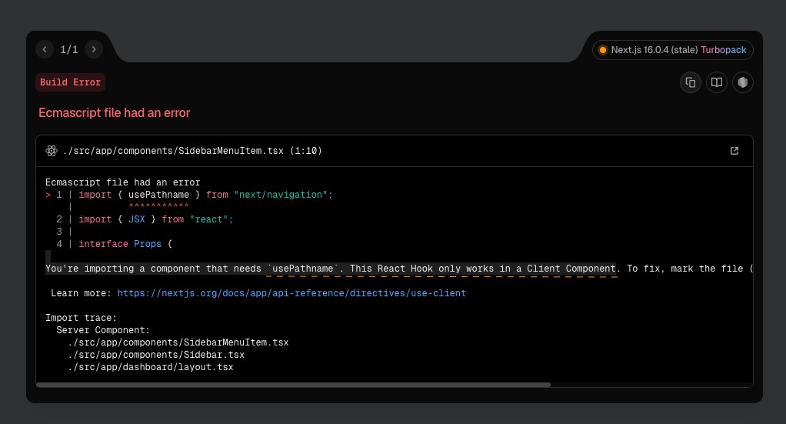

#### Fixing:

```tsx
/* src/app/components/SidebarMenuItem.tsx */
"use client"; // 👈🏽 ✅
import { usePathname } from "next/navigation";
import { JSX } from "react";

interface Props {
  path: string;
  icon: JSX.Element;
  title: string;
  subTitle: string;
}

const SidebarMenuItem = ({ path, icon, title, subTitle }: Props) => {
  const currentPath = usePathname();
  return (
    <a
      href="#"
      className="w-full px-2 inline-flex space-x-2 items-center border-b border-slate-700 py-3 bg-blue-800 hover:bg-white/5 transition ease-linear duration-150"
    >
      <div>
        <svg
          xmlns="http://www.w3.org/2000/svg"
          fill="none"
          viewBox="0 0 24 24"
          strokeWidth="1.5"
          stroke="currentColor"
          className="w-6 h-6 text-white"
        >
          <path
            strokeLinecap="round"
            strokeLinejoin="round"
            d="M3.75 6A2.25 2.25 0 016 3.75h2.25A2.25 2.25 0 0110.5 6v2.25a2.25 2.25 0 01-2.25 2.25H6a2.25 2.25 0 01-2.25-2.25V6zM3.75 15.75A2.25 2.25 0 016 13.5h2.25a2.25 2.25 0 012.25 2.25V18a2.25 2.25 0 01-2.25 2.25H6A2.25 2.25 0 013.75 18v-2.25zM13.5 6a2.25 2.25 0 012.25-2.25H18A2.25 2.25 0 0120.25 6v2.25A2.25 2.25 0 0118 10.5h-2.25a2.25 2.25 0 01-2.25-2.25V6zM13.5 15.75a2.25 2.25 0 012.25-2.25H18a2.25 2.25 0 012.25 2.25V18A2.25 2.25 0 0118 20.25h-2.25A2.25 2.25 0 0113.5 18v-2.25z"
          />
        </svg>
      </div>
      <div className="flex flex-col">
        <span className="text-lg font-bold leading-5 text-white">
          Dashboard
        </span>
        <span className="text-sm text-white/50 hidden md:block">
          Data Overview
        </span>
      </div>
    </a>
  );
};
export default SidebarMenuItem;
```

### 2. Update `SidebarMenuItem.tsx`:

```tsx
/* src/app/components/SidebarMenuItem.tsx */
"use client";
import Link from "next/link"; // 👈🏽 ✅ (2)
import { usePathname } from "next/navigation";
import { JSX } from "react";

interface Props {
  path: string;
  icon: JSX.Element;
  title: string;
  subTitle: string;
}

const SidebarMenuItem = ({ path, icon, title, subTitle }: Props) => {
  const currentPath = usePathname();
  return (
    <Link // 👈🏽 ✅ (1)
      href={path} // 👈🏽 ✅ (3)
      className={`w-full px-2 inline-flex space-x-2 items-center border-b border-slate-700 py-3 hover:bg-white/5 transition ease-linear duration-150 ${
        currentPath === path ? "bg-blue-800" : ""
      }`} // 👈🏽 ✅ (4)
    >
      <div>{icon}</div> // 👈🏽 ✅ (5)
      <div className="flex flex-col">
        <span className="text-lg font-bold leading-5 text-white">{title}</span>{" "}
        // 👈🏽 ✅ (6)
        <span className="text-sm text-white/50 hidden md:block">
          {subTitle}
        </span> // 👈🏽 ✅ (7)
      </div>
    </Link>
  );
};
export default SidebarMenuItem;
```

## 🔧 7. Lesson 043 — *state management - useState*

### 🧠 7.1 Context  
_This lesson introduces React state management using the `useState` hook. A counter component is created in the CounterPage that allows users to increment and decrement a value. The component demonstrates client-side interactivity by using the "use client" directive, which is necessary for using React hooks. The lesson also highlights an important limitation: metadata cannot be exported from client components, requiring a separation between server and client components in Next.js._

### ⚡ 7.2 Incidents Found  
| Issue | Status | Log/Error |
|---|---|---|
| Metadata cannot be used with "use client" | Fixed | Separated client and server components |

### 1. Adding style in CounterPage component:

```tsx
/* src/app/dashboard/counter/page.tsx */
export default function CounterPage() {
  return (
    <div className="flex flex-col items-center justify-center w-full h-full">
      <span>Products in shopping cart</span>
      <span className="text-9xl">10</span>
      <div>
        <button className="flex items-center justify-center p-2 rounded-xl bg-gray-900 text-white hover:bg-gray-600 transition-all w-[100px] mr-2">
          -1
        </button>
        <button className="flex items-center justify-center p-2 rounded-xl bg-gray-900 text-white hover:bg-gray-600 transition-all w-[100px] mr-2">
          +1
        </button>
      </div>
    </div>
  );
}
```

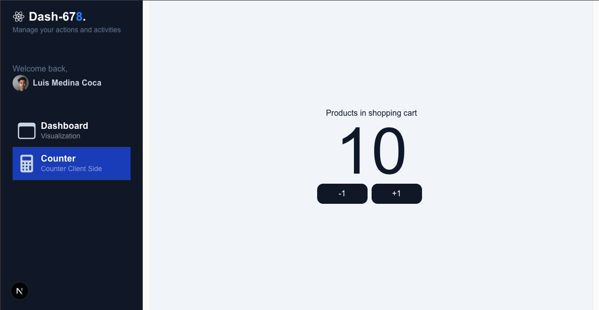

### 2. Apply **`useState`** in this page:

```tsx
/* src/app/dashboard/counter/page.tsx */
"use client"; // 👈🏽 ✅ (2)
import { useState } from "react"; // 👈🏽 ✅ (2)
export default function CounterPage() {
  const [count, setCounts] = useState(0); // 👈🏽 ✅ (1)
  return (
    <div className="flex flex-col items-center justify-center w-full h-full">
      <span>Products in shopping cart</span>
      <span className="text-9xl">{count}</span> // 👈🏽 ✅ (3)
      <div className="flex">
        <button
          className="flex items-center justify-center p-2 rounded-xl bg-gray-900 text-white hover:bg-gray-600 transition-all w-[100px] mr-2"
          onClick={() => setCounts(count - 1)} // 👈🏽 ✅ (4)
          disabled={count === 0} // 👈🏽 ✅ (4)
        >
          -1
        </button>
        <button
          className="flex items-center justify-center p-2 rounded-xl bg-gray-900 text-white hover:bg-gray-600 transition-all w-[100px] mr-2"
          onClick={() => setCounts(count + 1)} // 👈🏽 ✅ (5)
        >
          +1
        </button>
      </div>
    </div>
  );
}
```

### 3. Add `metadata` in `Counter` component:

```tsx
/*  */
"use client";
import { Metadata } from "next/types"; // 👈🏽 ✅ (2)
import { useState } from "react";

export const metadata: Metadata = {
  // 👈🏽 ✅ (1)
  title: "Counter Page",
  description: "Simple Counter Page",
};
export default function CounterPage() {
  const [count, setCounts] = useState(0);
  return (
    <div className="flex flex-col items-center justify-center w-full h-full">
      <span>Products in shopping cart</span>
      <span className="text-9xl">{count}</span>
      <div className="flex">
        <button
          className="flex items-center justify-center p-2 rounded-xl bg-gray-900 text-white hover:bg-gray-600 transition-all w-[100px] mr-2"
          onClick={() => setCounts(count - 1)}
          disabled={count === 0}
        >
          -1
        </button>
        <button
          className="flex items-center justify-center p-2 rounded-xl bg-gray-900 text-white hover:bg-gray-600 transition-all w-[100px] mr-2"
          onClick={() => setCounts(count + 1)}
        >
          +1
        </button>
      </div>
    </div>
  );
}
```

> 🔥 Issue:

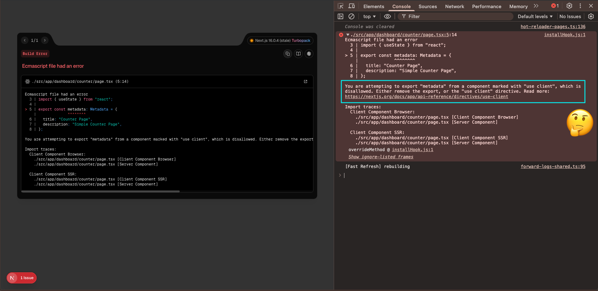

## 🔧 8. Lesson 044 — *Let's think in terms of folders and small components*

### 🧠 8.1 Context  
_This lesson emphasizes component organization and the separation between server-side and client-side components in Next.js. The counter logic is extracted from the page component into a separate `CartCounter` component within a `shopping-cart` folder structure. This demonstrates best practices for organizing code by feature/domain. The lesson also introduces barrel exports (`index.ts`) for cleaner imports and explains how to pass server-side data (like initial values) to client components as props, illustrating the interaction between server and client components in Next.js App Router._

### 1. Create **`shopping-cart/components/CartCounter.jsx`**:

```
02-my-dashboard
├── docs
│   └── LECTURE_STEPS.md
├── img/
├── public/
├── src
│   ├── app
│   │   ├── components
│   │   │   ├── Sidebar.tsx
│   │   │   ├── SidebarMenuItem.tsx
│   │   │   └── index.ts
│   │   ├── dashboard
│   │   │   ├── counter
│   │   │   │   └── page.tsx
│   │   │   ├── main
│   │   │   │   └── page.tsx
│   │   │   └── layout.tsx
│   │   ├── shopping-cart             # 👈🏽 ✅
│   │   │   ├── components            # 👈🏽 ✅
│   │   │   │   └── CartCounter.jsx   # 👈🏽 ✅
│   │   │   └── index.ts
│   │   ├── favicon.ico
│   │   ├── globals.css
│   │   ├── layout.tsx
│   │   └── page.tsx
│   └── test.txt
├── eslint.config.mjs
```

### 2. Update **`src/app/dashboard/counter/page.tsx`**:
```tsx
/* src/app/dashboard/counter/page.tsx */
//"use-client"
import { Metadata } from "next/types";
//import { useState } from "react";
import { CartCounter } from "../../shopping-cart";

export const metadata: Metadata = {
  title: "𝌰 Shopping Cart",
  description: "Simple Counter Page",
};

export default function CounterPage() {
  //const [count, setCounts] = useState(0);
  return (
    <div className="flex flex-col items-center justify-center w-full h-full">
      <span>Products in shopping cart</span>
      <CartCounter />
      {/*
        <span className="text-9xl">{count}</span>
      <div className="flex">
        <button
          className="flex items-center justify-center p-2 rounded-xl bg-gray-900 text-white hover:bg-gray-600 transition-all w-[100px] mr-2"
          onClick={() => setCounts(count - 1)}
          disabled={count === 0}
        >
          -1
        </button>
        <button
          className="flex items-center justify-center p-2 rounded-xl bg-gray-900 text-white hover:bg-gray-600 transition-all w-[100px] mr-2"
          onClick={() => setCounts(count + 1)}
        >
          +1
        </button>
      </div>
      */}
    </div>
  );
}
```

### 3. Update **`src/app/shopping-cart/components/CartCounter.jsx`** file:
```tsx
/* src/app/shopping-cart/components/CartCounter.jsx */
'use client';
import { useState } from "react";

const CartCounter = () => {
  const [count, setCounts] = useState(0);
  return (
    <>
      <span className="text-9xl">{count}</span>
      <div className="flex">
        <button
          className="flex items-center justify-center p-2 rounded-xl bg-gray-900 text-white hover:bg-gray-600 transition-all w-[100px] mr-2"
          onClick={() => setCounts(count - 1)}
          disabled={count === 0}
        >
          -1
        </button>
        <button
          className="flex items-center justify-center p-2 rounded-xl bg-gray-900 text-white hover:bg-gray-600 transition-all w-[100px] mr-2"
          onClick={() => setCounts(count + 1)}
        >
          +1
        </button>
      </div>
    </>
  )
}

export default CartCounter;
```

#### Update **`src/app/shopping-cart/index.ts`** file as barril:
```tsx
export { default as CartCounter } from './components/CartCounter';
```

With more than one component:

export in barril file:
```js
export { default as CartCounter } from './components/CartCounter';
export { default as CartItem }    from './components/CartItem';
export { default as CartGrid }    from './components/CartGrid';
```

Import:
```tsx
import { CartCounter, CartItem, CartGrid } from '../../shopping-cart';
```

### 4. Server side vs client side:

#### 1 Sever side from **`src/app/dashboard/counter/page.tsx`**:
```tsx
import { CartCounter } from "../../shopping-cart";
import { Metadata } from "next/types";

export const metadata: Metadata = {
  title: "𝌰 Shopping Cart",
  description: "Simple Counter Page",
};

// i.e a value generated from the server or reading from an API or any other server.  // 👈🏽 ✅
const value = 20;  // 👈🏽 ✅||||||

export default function CounterPage() {
  return (
    <div className="flex flex-col items-center justify-center w-full h-full">
      <span>Products in shopping cart</span>
      <CartCounter value={value} />
    </div>
  );
}
```

#### 2. Client side **`src/app/shopping-cart/components/CartCounter.tsx`**:
```tsx
"use client";
import { useState } from "react";

//Interface for Props:
interface Props {  // 👈🏽 ✅
  value?: number;
}

const CartCounter = ({ value = 10 }: Props) => {  // 👈🏽 ✅
  const [count, setCounts] = useState(value);
  return (
    <>
      <span className="text-9xl">{count}</span>
      <div className="flex">
        <button
          className="flex items-center justify-center p-2 rounded-xl bg-gray-900 text-white hover:bg-gray-600 transition-all w-[100px] mr-2"
          onClick={() => setCounts(count - 1)}
          disabled={count === 0}
        >
          -1
        </button>
        <button
          className="flex items-center justify-center p-2 rounded-xl bg-gray-900 text-white hover:bg-gray-600 transition-all w-[100px] mr-2"
          onClick={() => setCounts(count + 1)}
        >
          +1
        </button>
      </div>
    </>
  );
};

export default CartCounter;
```

---

## 📎 Related Files
- `src/app/components/Sidebar.tsx`
- `src/app/components/SidebarMenuItem.tsx`
- `src/app/dashboard/counter/page.tsx`
- `src/app/shopping-cart/components/CartCounter.tsx`

## 🔗 References
- [Next.js Documentation](https://nextjs.org/docs)
- [React Icons](https://react-icons.github.io/react-icons/)
- [Tailwind CSS](https://tailwindcss.com/)

---

# 👨🏾‍💻 Section 05: Dynamic Generation – SSR

## 📑 Table of Contents

- [⚙️ Section: Dynamic Generation – SSR](#️-section-dynamic-generation--ssr)
  - [📑 Table of Contents](#-table-of-contents-1)
  - [🔧 Lesson 050 — *Following with the section*](#-1-lesson-050--following-with-the-section)
  - [🔧 Lesson 051 — *Data Fetching - Next13+*](#-2-lesson-051--data-fetching---next13)
  - [🔧 Lesson 052 — *Assign data type and displays images*](#-3-lesson-052--assign-data-type-and-displays-images)
  - [🔧 Lesson 053 — *Task Solution*](#-4-lesson-053--task-solution)
  - [🔧 Lesson 054 — *Let's think in small components*](#-5-lesson-054--lets-think-in-small-components)
  - [🔧 Lesson 055 — *Image Priority - Loading Priority*](#-6-lesson-055--image-priority---loading-priority)
  - [🔧 Lesson 056 — *Next - Error Page*](#-7-lesson-056--next---error-page)
  - [🔧 Lesson 057 — *Dynamic Routes - URL arguments*](#-8-lesson-057--dynamic-routes---url-arguments)
  - [🔧 Lesson 058 — *Loading Pokemon information by ID*](#-8-lesson-058--loading-pokemon-information-by-id)
  - [🔧 Lesson 059 — *Dynamic Metadata*](#-10-lesson-059--dynamic-metadata)
  - [🔧 Lesson 060 — *Pokemon screen*](#-11-lesson-060--pokemon-screen)
  - [🔧 Lesson 061 — *Debugging code - Breakpoints*](#-12-lesson-061--debugging-code---breakpoints)
  - [🔧 Lesson 062 — *Not found Page - 404*](#-13-lesson-062--not-found-page---404)
  - [🔧 Lesson 063 — *Wrap-Up Notes*](#-14-lesson-063--wrap-up-notes)
  - [📎 Related Files](#-related-files-1)
  - [🔗 References](#-references-1)

---

## 🔧 1. Lesson 050 — *Following with the section*

### 🧠 1.1 Context  
_This lesson introduces the Pokemons section of the dashboard, marking the beginning of the Dynamic Generation section. A new page route is created at `src/app/dashboard/pokemons/page.tsx` with a basic structure. The Pokemons menu item is added to the sidebar navigation with an appropriate icon and subtitle indicating "Static Generation". This sets up the foundation for implementing server-side rendering and data fetching in subsequent lessons._

### 1. Create **`src/app/dashboard/pokemons/page.tsx`** file:
```
02-my-dashboard
├── docs
│   └── LECTURE_STEPS.md
├── img/
├── public/
├── src
│   ├── app
│   │   ├── components
│   │   │   ├── Sidebar.tsx
│   │   │   ├── SidebarMenuItem.tsx
│   │   │   └── index.ts
│   │   ├── dashboard
│   │   │   ├── counter
│   │   │   │   └── page.tsx
│   │   │   ├── main
│   │   │   │   └── page.tsx
│   │   │   ├── pokemons              # 👈🏽 ✅
│   │   │   │   └── page.tsx          # 👈🏽 ✅
│   │   │   └── layout.tsx
│   │   ├── shopping-cart             
│   │   │   ├── components            
│   │   │   │   └── CartCounter.jsx   
│   │   │   └── index.ts
│   │   ├── favicon.ico
│   │   ├── globals.css
│   │   ├── layout.tsx
│   │   └── page.tsx
│   └── test.txt
├── eslint.config.mjs
```

```tsx
/* src/app/dashboard/pokemons/page.tsx */
export default function PokemonsPage() {
  return (
    <div>
      <h1>Hello Page Pokemons</h1>
    </div>
  );
}
```

### 2. Add the **`Pokemon`** in sidebar menuItems:
```tsx
/*  */
import Image from "next/image";
import { IoBrowsersOutline, IoCalculator, IoFootball, IoLogoReact } from "react-icons/io5";
import SidebarMenuItem from "./SidebarMenuItem";
const menuItems = [
  {
    path: "/dashboard/main",
    icon: <IoBrowsersOutline size={40} />,
    title: "Dashboard",
    subTitle: "Visualization",
  },
  {
    path: "/dashboard/counter",
    icon: <IoCalculator size={40} />,
    title: "Counter",
    subTitle: "Counter Client Side",
  },
  {  // 👈🏽 ✅
    path: "/dashboard/pokemons",
    icon: <IoFootball size={40} />,
    title: "Pokemons",
    subTitle: "Static Generation",
  },  // 👈🏽 ✅
];

export const Sidebar = () => {
  return (
    <div
      id="menu"
      style={{ width: "400px" }}
      className="bg-gray-900 min-h-screen z-10 text-slate-300 w-64 left-0 h-screen overflow-y-scroll"
    >
      <div id="logo" className="my-4 px-6">
        <h1 className="flex items-center text-lg md:text-2xl font-bold text-white">
          <IoLogoReact className="mr-2" />
          <span>Dash-67</span>
          <span className="text-blue-500">8</span>.
        </h1>
        <p className="text-slate-500 text-sm">Manage your actions and activities</p>
      </div>
      <div id="profile" className="px-6 py-10">
        <p className="text-slate-500">Welcome back,</p>
        <a href="#" className="inline-flex space-x-2 items-center">
          <span>
            <Image
              className="rounded-full w-8 h-8"
              src="https://images.unsplash.com/photo-1542909168-82c3e7fdca5c?ixlib=rb-4.0.3&ixid=MnwxMjA3fDB8MHxwaG90by1wYWdlfHx8fGVufDB8fHx8&auto=format&fit=crop&w=128&q=80"
              alt="User avatar"
              width={50}
              height={50}
            />
          </span>
          <span className="text-sm md:text-base font-bold">Luis Medina Coca</span>
        </a>
      </div>
      <div id="nav" className="w-full px-6">
        {menuItems.map((item) => (
          <SidebarMenuItem key={item.path} {...item} />
        ))}
      </div>
    </div>
  );
};
```

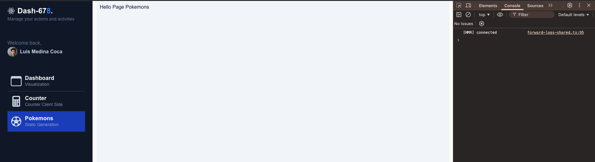


## 🔧 2. Lesson 051 — *Data Fetching - Next13+*

### 🧠 2.1 Context  
_This lesson demonstrates server-side data fetching in Next.js 13+ using async/await in server components. The PokeAPI is used as the data source to fetch a list of 151 Pokemon. A `getPokemons` function is created that makes an HTTP request to the PokeAPI endpoint and returns the JSON response. The function is called directly in the page component, which runs on the server, showcasing Next.js App Router's ability to fetch data at request time without client-side JavaScript._

### 🔍 2.2 Testing (Postman)  
- Method: GET
- Endpoint: `http://pokeapi.co/api/v2/pokemon?limit=151&offset=0`
- Environment:
- Auth:
- Script tests:
- Pre-request scripts:
- Assertions:

### 1. Test in POSTMAN:
#### **GET /**  
**URL:** `http://pokeapi.co/api/v2/pokemon?limit=151&offset=0`  
**Description:** Check that the server is running.
```json
{
    "count": 1328,
    "next": "https://pokeapi.co/api/v2/pokemon?offset=151&limit=151",
    "previous": null,
    "results": [
        {
            "name": "bulbasaur",
            "url": "https://pokeapi.co/api/v2/pokemon/1/"
        },
        {
            "name": "ivysaur",
            "url": "https://pokeapi.co/api/v2/pokemon/2/"
        },
        {
            "name": "venusaur",
            "url": "https://pokeapi.co/api/v2/pokemon/3/"
        },
        {
            "name": "charmander",
            "url": "https://pokeapi.co/api/v2/pokemon/4/"
        },
        {
            "name": "charmeleon",
            "url": "https://pokeapi.co/api/v2/pokemon/5/"
        },
        {
            "name": "charizard",
            "url": "https://pokeapi.co/api/v2/pokemon/6/"
        },
        {
            "name": "squirtle",
            "url": "https://pokeapi.co/api/v2/pokemon/7/"
        },
        {
            "name": "wartortle",
            "url": "https://pokeapi.co/api/v2/pokemon/8/"
        },
        {
            "name": "blastoise",
            "url": "https://pokeapi.co/api/v2/pokemon/9/"
        },
        {
            "name": "caterpie",
            "url": "https://pokeapi.co/api/v2/pokemon/10/"
        },
        {
            "name": "metapod",
            "url": "https://pokeapi.co/api/v2/pokemon/11/"
        },
        {
            "name": "butterfree",
            "url": "https://pokeapi.co/api/v2/pokemon/12/"
        },
        {
            "name": "weedle",
            "url": "https://pokeapi.co/api/v2/pokemon/13/"
        },
        {
            "name": "kakuna",
            "url": "https://pokeapi.co/api/v2/pokemon/14/"
        },
        {
            "name": "beedrill",
            "url": "https://pokeapi.co/api/v2/pokemon/15/"
        },
        {
            "name": "pidgey",
            "url": "https://pokeapi.co/api/v2/pokemon/16/"
        },
        {
            "name": "pidgeotto",
            "url": "https://pokeapi.co/api/v2/pokemon/17/"
        },
        {
            "name": "pidgeot",
            "url": "https://pokeapi.co/api/v2/pokemon/18/"
        },
        {
            "name": "rattata",
            "url": "https://pokeapi.co/api/v2/pokemon/19/"
        },
        {
            "name": "raticate",
            "url": "https://pokeapi.co/api/v2/pokemon/20/"
        },
        {
            "name": "spearow",
            "url": "https://pokeapi.co/api/v2/pokemon/21/"
        },
        {
            "name": "fearow",
            "url": "https://pokeapi.co/api/v2/pokemon/22/"
        },
        {
            "name": "ekans",
            "url": "https://pokeapi.co/api/v2/pokemon/23/"
        },
        {
            "name": "arbok",
            "url": "https://pokeapi.co/api/v2/pokemon/24/"
        },
        {
            "name": "pikachu",
            "url": "https://pokeapi.co/api/v2/pokemon/25/"
        },
        {
            "name": "raichu",
            "url": "https://pokeapi.co/api/v2/pokemon/26/"
        },
        {
            "name": "sandshrew",
            "url": "https://pokeapi.co/api/v2/pokemon/27/"
        },
        {
            "name": "sandslash",
            "url": "https://pokeapi.co/api/v2/pokemon/28/"
        },
        {
            "name": "nidoran-f",
            "url": "https://pokeapi.co/api/v2/pokemon/29/"
        },
        {
            "name": "nidorina",
            "url": "https://pokeapi.co/api/v2/pokemon/30/"
        },
        {
            "name": "nidoqueen",
            "url": "https://pokeapi.co/api/v2/pokemon/31/"
        },
        {
            "name": "nidoran-m",
            "url": "https://pokeapi.co/api/v2/pokemon/32/"
        },
        {
            "name": "nidorino",
            "url": "https://pokeapi.co/api/v2/pokemon/33/"
        },
        {
            "name": "nidoking",
            "url": "https://pokeapi.co/api/v2/pokemon/34/"
        },
        {
            "name": "clefairy",
            "url": "https://pokeapi.co/api/v2/pokemon/35/"
        },
        {
            "name": "clefable",
            "url": "https://pokeapi.co/api/v2/pokemon/36/"
        },
        {
            "name": "vulpix",
            "url": "https://pokeapi.co/api/v2/pokemon/37/"
        },
        {
            "name": "ninetales",
            "url": "https://pokeapi.co/api/v2/pokemon/38/"
        },
        {
            "name": "jigglypuff",
            "url": "https://pokeapi.co/api/v2/pokemon/39/"
        },
        {
            "name": "wigglytuff",
            "url": "https://pokeapi.co/api/v2/pokemon/40/"
        },
        {
            "name": "zubat",
            "url": "https://pokeapi.co/api/v2/pokemon/41/"
        },
        {
            "name": "golbat",
            "url": "https://pokeapi.co/api/v2/pokemon/42/"
        },
        {
            "name": "oddish",
            "url": "https://pokeapi.co/api/v2/pokemon/43/"
        },
        {
            "name": "gloom",
            "url": "https://pokeapi.co/api/v2/pokemon/44/"
        },
        {
            "name": "vileplume",
            "url": "https://pokeapi.co/api/v2/pokemon/45/"
        },
        {
            "name": "paras",
            "url": "https://pokeapi.co/api/v2/pokemon/46/"
        },
        {
            "name": "parasect",
            "url": "https://pokeapi.co/api/v2/pokemon/47/"
        },
        {
            "name": "venonat",
            "url": "https://pokeapi.co/api/v2/pokemon/48/"
        },
        {
            "name": "venomoth",
            "url": "https://pokeapi.co/api/v2/pokemon/49/"
        },
        {
            "name": "diglett",
            "url": "https://pokeapi.co/api/v2/pokemon/50/"
        },
        {
            "name": "dugtrio",
            "url": "https://pokeapi.co/api/v2/pokemon/51/"
        },
        {
            "name": "meowth",
            "url": "https://pokeapi.co/api/v2/pokemon/52/"
        },
        {
            "name": "persian",
            "url": "https://pokeapi.co/api/v2/pokemon/53/"
        },
        {
            "name": "psyduck",
            "url": "https://pokeapi.co/api/v2/pokemon/54/"
        },
        {
            "name": "golduck",
            "url": "https://pokeapi.co/api/v2/pokemon/55/"
        },
        {
            "name": "mankey",
            "url": "https://pokeapi.co/api/v2/pokemon/56/"
        },
        {
            "name": "primeape",
            "url": "https://pokeapi.co/api/v2/pokemon/57/"
        },
        {
            "name": "growlithe",
            "url": "https://pokeapi.co/api/v2/pokemon/58/"
        },
        {
            "name": "arcanine",
            "url": "https://pokeapi.co/api/v2/pokemon/59/"
        },
        {
            "name": "poliwag",
            "url": "https://pokeapi.co/api/v2/pokemon/60/"
        },
        {
            "name": "poliwhirl",
            "url": "https://pokeapi.co/api/v2/pokemon/61/"
        },
        {
            "name": "poliwrath",
            "url": "https://pokeapi.co/api/v2/pokemon/62/"
        },
        {
            "name": "abra",
            "url": "https://pokeapi.co/api/v2/pokemon/63/"
        },
        {
            "name": "kadabra",
            "url": "https://pokeapi.co/api/v2/pokemon/64/"
        },
        {
            "name": "alakazam",
            "url": "https://pokeapi.co/api/v2/pokemon/65/"
        },
        {
            "name": "machop",
            "url": "https://pokeapi.co/api/v2/pokemon/66/"
        },
        {
            "name": "machoke",
            "url": "https://pokeapi.co/api/v2/pokemon/67/"
        },
        {
            "name": "machamp",
            "url": "https://pokeapi.co/api/v2/pokemon/68/"
        },
        {
            "name": "bellsprout",
            "url": "https://pokeapi.co/api/v2/pokemon/69/"
        },
        {
            "name": "weepinbell",
            "url": "https://pokeapi.co/api/v2/pokemon/70/"
        },
        {
            "name": "victreebel",
            "url": "https://pokeapi.co/api/v2/pokemon/71/"
        },
        {
            "name": "tentacool",
            "url": "https://pokeapi.co/api/v2/pokemon/72/"
        },
        {
            "name": "tentacruel",
            "url": "https://pokeapi.co/api/v2/pokemon/73/"
        },
        {
            "name": "geodude",
            "url": "https://pokeapi.co/api/v2/pokemon/74/"
        },
        {
            "name": "graveler",
            "url": "https://pokeapi.co/api/v2/pokemon/75/"
        },
        {
            "name": "golem",
            "url": "https://pokeapi.co/api/v2/pokemon/76/"
        },
        {
            "name": "ponyta",
            "url": "https://pokeapi.co/api/v2/pokemon/77/"
        },
        {
            "name": "rapidash",
            "url": "https://pokeapi.co/api/v2/pokemon/78/"
        },
        {
            "name": "slowpoke",
            "url": "https://pokeapi.co/api/v2/pokemon/79/"
        },
        {
            "name": "slowbro",
            "url": "https://pokeapi.co/api/v2/pokemon/80/"
        },
        {
            "name": "magnemite",
            "url": "https://pokeapi.co/api/v2/pokemon/81/"
        },
        {
            "name": "magneton",
            "url": "https://pokeapi.co/api/v2/pokemon/82/"
        },
        {
            "name": "farfetchd",
            "url": "https://pokeapi.co/api/v2/pokemon/83/"
        },
        {
            "name": "doduo",
            "url": "https://pokeapi.co/api/v2/pokemon/84/"
        },
        {
            "name": "dodrio",
            "url": "https://pokeapi.co/api/v2/pokemon/85/"
        },
        {
            "name": "seel",
            "url": "https://pokeapi.co/api/v2/pokemon/86/"
        },
        {
            "name": "dewgong",
            "url": "https://pokeapi.co/api/v2/pokemon/87/"
        },
        {
            "name": "grimer",
            "url": "https://pokeapi.co/api/v2/pokemon/88/"
        },
        {
            "name": "muk",
            "url": "https://pokeapi.co/api/v2/pokemon/89/"
        },
        {
            "name": "shellder",
            "url": "https://pokeapi.co/api/v2/pokemon/90/"
        },
        {
            "name": "cloyster",
            "url": "https://pokeapi.co/api/v2/pokemon/91/"
        },
        {
            "name": "gastly",
            "url": "https://pokeapi.co/api/v2/pokemon/92/"
        },
        {
            "name": "haunter",
            "url": "https://pokeapi.co/api/v2/pokemon/93/"
        },
        {
            "name": "gengar",
            "url": "https://pokeapi.co/api/v2/pokemon/94/"
        },
        {
            "name": "onix",
            "url": "https://pokeapi.co/api/v2/pokemon/95/"
        },
        {
            "name": "drowzee",
            "url": "https://pokeapi.co/api/v2/pokemon/96/"
        },
        {
            "name": "hypno",
            "url": "https://pokeapi.co/api/v2/pokemon/97/"
        },
        {
            "name": "krabby",
            "url": "https://pokeapi.co/api/v2/pokemon/98/"
        },
        {
            "name": "kingler",
            "url": "https://pokeapi.co/api/v2/pokemon/99/"
        },
        {
            "name": "voltorb",
            "url": "https://pokeapi.co/api/v2/pokemon/100/"
        },
        {
            "name": "electrode",
            "url": "https://pokeapi.co/api/v2/pokemon/101/"
        },
        {
            "name": "exeggcute",
            "url": "https://pokeapi.co/api/v2/pokemon/102/"
        },
        {
            "name": "exeggutor",
            "url": "https://pokeapi.co/api/v2/pokemon/103/"
        },
        {
            "name": "cubone",
            "url": "https://pokeapi.co/api/v2/pokemon/104/"
        },
        {
            "name": "marowak",
            "url": "https://pokeapi.co/api/v2/pokemon/105/"
        },
        {
            "name": "hitmonlee",
            "url": "https://pokeapi.co/api/v2/pokemon/106/"
        },
        {
            "name": "hitmonchan",
            "url": "https://pokeapi.co/api/v2/pokemon/107/"
        },
        {
            "name": "lickitung",
            "url": "https://pokeapi.co/api/v2/pokemon/108/"
        },
        {
            "name": "koffing",
            "url": "https://pokeapi.co/api/v2/pokemon/109/"
        },
        {
            "name": "weezing",
            "url": "https://pokeapi.co/api/v2/pokemon/110/"
        },
        {
            "name": "rhyhorn",
            "url": "https://pokeapi.co/api/v2/pokemon/111/"
        },
        {
            "name": "rhydon",
            "url": "https://pokeapi.co/api/v2/pokemon/112/"
        },
        {
            "name": "chansey",
            "url": "https://pokeapi.co/api/v2/pokemon/113/"
        },
        {
            "name": "tangela",
            "url": "https://pokeapi.co/api/v2/pokemon/114/"
        },
        {
            "name": "kangaskhan",
            "url": "https://pokeapi.co/api/v2/pokemon/115/"
        },
        {
            "name": "horsea",
            "url": "https://pokeapi.co/api/v2/pokemon/116/"
        },
        {
            "name": "seadra",
            "url": "https://pokeapi.co/api/v2/pokemon/117/"
        },
        {
            "name": "goldeen",
            "url": "https://pokeapi.co/api/v2/pokemon/118/"
        },
        {
            "name": "seaking",
            "url": "https://pokeapi.co/api/v2/pokemon/119/"
        },
        {
            "name": "staryu",
            "url": "https://pokeapi.co/api/v2/pokemon/120/"
        },
        {
            "name": "starmie",
            "url": "https://pokeapi.co/api/v2/pokemon/121/"
        },
        {
            "name": "mr-mime",
            "url": "https://pokeapi.co/api/v2/pokemon/122/"
        },
        {
            "name": "scyther",
            "url": "https://pokeapi.co/api/v2/pokemon/123/"
        },
        {
            "name": "jynx",
            "url": "https://pokeapi.co/api/v2/pokemon/124/"
        },
        {
            "name": "electabuzz",
            "url": "https://pokeapi.co/api/v2/pokemon/125/"
        },
        {
            "name": "magmar",
            "url": "https://pokeapi.co/api/v2/pokemon/126/"
        },
        {
            "name": "pinsir",
            "url": "https://pokeapi.co/api/v2/pokemon/127/"
        },
        {
            "name": "tauros",
            "url": "https://pokeapi.co/api/v2/pokemon/128/"
        },
        {
            "name": "magikarp",
            "url": "https://pokeapi.co/api/v2/pokemon/129/"
        },
        {
            "name": "gyarados",
            "url": "https://pokeapi.co/api/v2/pokemon/130/"
        },
        {
            "name": "lapras",
            "url": "https://pokeapi.co/api/v2/pokemon/131/"
        },
        {
            "name": "ditto",
            "url": "https://pokeapi.co/api/v2/pokemon/132/"
        },
        {
            "name": "eevee",
            "url": "https://pokeapi.co/api/v2/pokemon/133/"
        },
        {
            "name": "vaporeon",
            "url": "https://pokeapi.co/api/v2/pokemon/134/"
        },
        {
            "name": "jolteon",
            "url": "https://pokeapi.co/api/v2/pokemon/135/"
        },
        {
            "name": "flareon",
            "url": "https://pokeapi.co/api/v2/pokemon/136/"
        },
        {
            "name": "porygon",
            "url": "https://pokeapi.co/api/v2/pokemon/137/"
        },
        {
            "name": "omanyte",
            "url": "https://pokeapi.co/api/v2/pokemon/138/"
        },
        {
            "name": "omastar",
            "url": "https://pokeapi.co/api/v2/pokemon/139/"
        },
        {
            "name": "kabuto",
            "url": "https://pokeapi.co/api/v2/pokemon/140/"
        },
        {
            "name": "kabutops",
            "url": "https://pokeapi.co/api/v2/pokemon/141/"
        },
        {
            "name": "aerodactyl",
            "url": "https://pokeapi.co/api/v2/pokemon/142/"
        },
        {
            "name": "snorlax",
            "url": "https://pokeapi.co/api/v2/pokemon/143/"
        },
        {
            "name": "articuno",
            "url": "https://pokeapi.co/api/v2/pokemon/144/"
        },
        {
            "name": "zapdos",
            "url": "https://pokeapi.co/api/v2/pokemon/145/"
        },
        {
            "name": "moltres",
            "url": "https://pokeapi.co/api/v2/pokemon/146/"
        },
        {
            "name": "dratini",
            "url": "https://pokeapi.co/api/v2/pokemon/147/"
        },
        {
            "name": "dragonair",
            "url": "https://pokeapi.co/api/v2/pokemon/148/"
        },
        {
            "name": "dragonite",
            "url": "https://pokeapi.co/api/v2/pokemon/149/"
        },
        {
            "name": "mewtwo",
            "url": "https://pokeapi.co/api/v2/pokemon/150/"
        },
        {
            "name": "mew",
            "url": "https://pokeapi.co/api/v2/pokemon/151/"
        }
    ]
}
```

### 2. Update the `src/app/dashboard/pokemons/page.tsx` with the `fetch("http://pokeapi.co/api/v2/pokemon?limit=151&offset=0")`:

```tsx
/* src/app/dashboard/pokemons/page.tsx */
const getPokemons = async (limit = 20, offset = 0) => {  // 👈🏽 ✅
  const data = await fetch(`http://pokeapi.co/api/v2/pokemon?limit=${limit}&offset=${offset}`);
  const pokemon = await data.json();
  return pokemon;
};

export default async function PokemonsPage() {
  const pokemons = await getPokemons();  // 👈🏽 ✅
  return (
    <div>
      <h1>{JSON.stringify(pokemons)}</h1>  // 👈🏽 ✅
    </div>
  );
}
```

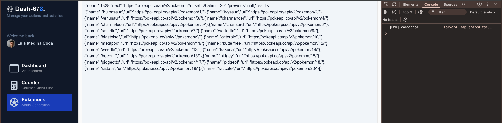


## 🔧 3. Lesson 052 — *Assign data type and displays images*

### 🧠 3.1 Context  
_This lesson focuses on TypeScript type safety and displaying Pokemon images. TypeScript interfaces are created for the API response (`PokemonsResponse`) and a simplified Pokemon model (`SimplePokemon`). The API response is transformed to extract Pokemon IDs from URLs and create a cleaner data structure. Next.js Image component is introduced to display Pokemon sprites from GitHub, requiring configuration of `remotePatterns` in `next.config.ts` to allow loading images from external domains. This demonstrates proper type handling and image optimization in Next.js._

### 🔍 3.2 Testing (Postman)  
- Method: GET
- Endpoint: `http://pokeapi.co/api/v2/pokemon?limit=151&offset=0`
- Environment:
- Auth:
- Script tests:
- Pre-request scripts:
- Assertions:

### 1. Go to Postman and copy pokemon response:

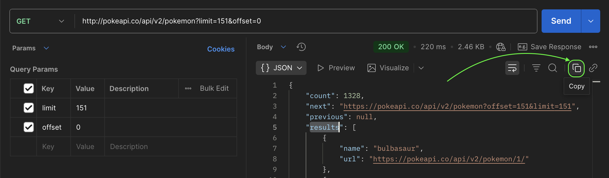

### 2. Create **`src/app/dashboard/pokemons/interfaces/pokemon-response.ts`** file:
1. Open `Visual Studio Code`
2. Open pokemon-response.ts file
3. Click on `View` then select on `Command Palette`.
4. Write `>Paste JSON as Code`
5. enter `PokemonsResponse` then hit enter.

```ts
/* src/app/dashboard/pokemons/interfaces/pokemon-response.ts */
export interface PokemonsResponse {
  count:    number;
  next:     string;
  previous: null;
  results:  Result[];
}

export interface Result {
  name: string;
  url:  string;
}
```

### 3. Create/Add `simple-pokemon` file:
```ts
/* src/app/dashboard/pokemons/interfaces/simple-pokemon.ts */
export interface SimplePokemon {
  id: string;
  name: string;
}
```

### 4. Go back to **`src/app/dashboard/pokemons/page.tsx`** and update it:
```tsx
/* src/app/dashboard/pokemons/page.tsx */
import Image from "next/image";
import { PokemonsResponse } from "./interfaces/pokemon-response";  // 👈🏽 ✅
import { SimplePokemon } from "./interfaces/simple-pokemon";  // 👈🏽 ✅
const getPokemons = async (limit = 20, offset = 0): Promise<SimplePokemon[]> => {
  const data: PokemonsResponse = await fetch(`http://pokeapi.co/api/v2/pokemon?limit=${limit}&offset=${offset}`)  // 👈🏽 ✅
  .then(
    (res) => res.json()
  );
  const pokemons = data.results.map((pokemon) => ({  // 👈🏽 ✅
    id: pokemon.url.split("/").at(-2)!,
    name: pokemon.name,
  }));
  return pokemons;
};
export default async function PokemonsPage() {
  const pokemons = await getPokemons(151);  // 👈🏽 ✅
  return (
    <div className="flex flex-col">  // 👈🏽 ✅
      {/*<h1>{JSON.stringify(pokemons)}</h1>*/}
      <div className="flex flex-wrap gap-10 items-center justify-center">
        <Image
          src={`https://raw.githubusercontent.com/PokeAPI/sprites/master/sprites/pokemon/other/dream-world/10.svg`}
          width={100}
          height={100}
          alt="name"
        />
      </div>
    </div>
  );
}
```

### 5. Update `next.config.ts` file:
```ts
/* next.config.ts */
import type { NextConfig } from "next";
const nextConfig: NextConfig = {
  images: {
    remotePatterns: [
      {
        protocol: "https",
        hostname: "images.unsplash.com",
      },
      {
        protocol: "https",  // 👈🏽 ✅
        hostname: "raw.githubusercontent.com",  // 👈🏽 ✅
      },
    ],
  },
};
export default nextConfig;
```


## 🔧 4. Lesson 053 — *Task Solution*

### 🧠 4.1 Context  
_This lesson completes the Pokemon list display by mapping through the fetched Pokemon data and rendering each Pokemon's image using the Next.js Image component. The `map` method is used to iterate over the `pokemons` array and create an Image component for each Pokemon, using the Pokemon ID to construct the sprite URL. This demonstrates rendering dynamic lists in React/Next.js and showcases the server-side rendering capabilities where all 151 Pokemon images are fetched and rendered on the server before being sent to the client._

### 1. Apply the `map` method in `pokemons` array:

```tsx
/* src/app/dashboard/pokemons/page.tsx */
import Image from "next/image";
import { PokemonsResponse } from "./interfaces/pokemon-response";
import { SimplePokemon } from "./interfaces/simple-pokemon";

const getPokemons = async (limit = 20, offset = 0): Promise<SimplePokemon[]> => {
  const data: PokemonsResponse = await fetch(`http://pokeapi.co/api/v2/pokemon?limit=${limit}&offset=${offset}`).then(
    (res) => res.json()
  );

  const pokemons = data.results.map((pokemon) => ({
    id: pokemon.url.split("/").at(-2)!,
    name: pokemon.name,
  }));
  return pokemons;
};

export default async function PokemonsPage() {
  const pokemons = await getPokemons(151);
  return (
    <div className="flex flex-col">

      <div className="flex flex-wrap gap-10 items-center justify-center">
        {pokemons.map((pokemon) => (  // 👈🏽 ✅
          <Image  // 👈🏽 ✅
            key={pokemon.id}
            src={`https://raw.githubusercontent.com/PokeAPI/sprites/master/sprites/pokemon/other/dream-world/${pokemon.id}.svg`}
            width={100}
            height={100}
            alt={pokemon.name}
          />
        ))}

      </div>
    </div>
  );
}
```

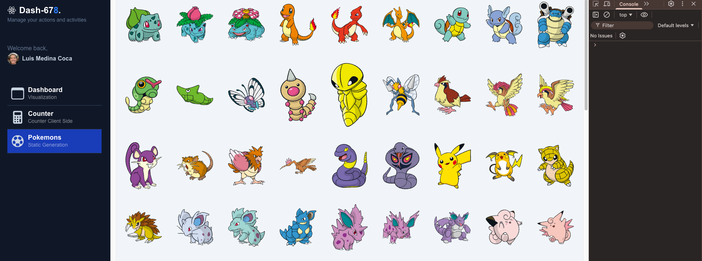


## 🔧 5. Lesson 054 — *Let's think in small components*

### 🧠 5.1 Context  
_This lesson emphasizes component decomposition and reusability by breaking down the Pokemon display into smaller, focused components. A `PokemonGrid` component is created to handle the grid layout and mapping logic, while a `PokemonCard` component is designed to display individual Pokemon information in a card format. The lesson demonstrates best practices for component organization, creating a barrel export pattern for cleaner imports, and shows how to structure components for maintainability. Some performance considerations are noted, such as image size consistency and the need for optimization when loading many images._

### 1. Add Pokemon List title:
```tsx
/* src/app/dashboard/pokemons/page.tsx */
import Image from "next/image";
import { PokemonsResponse } from "./interfaces/pokemon-response";
import { SimplePokemon } from "./interfaces/simple-pokemon";
const getPokemons = async (limit = 20, offset = 0): Promise<SimplePokemon[]> => {
  const data: PokemonsResponse = await fetch(`http://pokeapi.co/api/v2/pokemon?limit=${limit}&offset=${offset}`).then(
    (res) => res.json()
  );
  const pokemons = data.results.map((pokemon) => ({
    id: pokemon.url.split("/").at(-2)!,
    name: pokemon.name,
  }));
  return pokemons;
};
export default async function PokemonsPage() {
  const pokemons = await getPokemons(151);
  return (
    <div className="flex flex-col">

      <span className="text-5xl my-2 text-center">
        Pokémons List & <span>Static</span>  // 👈🏽 ✅
      </span>

      <div className="flex flex-wrap gap-10 items-center justify-center">
        {pokemons.map((pokemon) => (
          <Image
            key={pokemon.id}
            src={`https://raw.githubusercontent.com/PokeAPI/sprites/master/sprites/pokemon/other/dream-world/${pokemon.id}.svg`}
            width={100}
            height={100}
            alt={pokemon.name}
          />
        ))}
      </div>
    </div>
  );
}
```


### 2. Create **`components/PokemonGrid.tsx`** file and cut/paste  pokeemons.map section in here:

#### 2.1 Comment in **`src/app/dashboard/pokemons/page.tsx`** the pokemon.maps(...) code:
```tsx
/* src/app/dashboard/pokemons/page.tsx */
import Image from "next/image";
import { PokemonsResponse } from "./interfaces/pokemon-response";
import { SimplePokemon } from "./interfaces/simple-pokemon";
const getPokemons = async (limit = 20, offset = 0): Promise<SimplePokemon[]> => {
  const data: PokemonsResponse = await fetch(`http://pokeapi.co/api/v2/pokemon?limit=${limit}&offset=${offset}`).then(
    (res) => res.json()
  );
  const pokemons = data.results.map((pokemon) => ({
    id: pokemon.url.split("/").at(-2)!,
    name: pokemon.name,
  }));
  return pokemons;
};
export default async function PokemonsPage() {
  const pokemons = await getPokemons(151);
  return (
    <div className="flex flex-col">
      <span className="text-5xl my-2 text-center">
        Pokémons List & <span>Static</span>
      </span>

      {/* <div className="flex flex-wrap gap-10 items-center justify-center">
        {pokemons.map((pokemon) => (
          <Image
            key={pokemon.id}
            src={`https://raw.githubusercontent.com/PokeAPI/sprites/master/sprites/pokemon/other/dream-world/${pokemon.id}.svg`}
            width={100}
            height={100}
            alt={pokemon.name}
          />
        ))}
      </div> */}

    </div>
  );
}
```

#### 2.2 Move this commented code into `PokemonGrid` file:
```tsx
/* src/app/dashboard/pokemons/components/PokemonGrid.tsx */
import { SimplePokemon } from "../interfaces/simple-pokemon";  // 👈🏽 ✅ (2)

interface Props {  // 👈🏽 ✅ (1)
  pokemons: SimplePokemon[];
}

const PokemonGrid = ({ pokemons }: Props) => {  // 👈🏽 ✅ (1)
  return (
    <div className="flex flex-wrap gap-10 items-center justify-center">
      {pokemons.map((pokemon) => (
        // <Image
        //   key={pokemon.id}
        //   src={`https://raw.githubusercontent.com/PokeAPI/sprites/master/sprites/pokemon/other/dream-world/${pokemon.id}.svg`}
        //   width={100}
        //   height={100}
        //   alt={pokemon.name}
        // />  // 👈🏽 ✅ (3)
        <span key={pokemon.id}>abcdefghijkl</span>  // 👈🏽 ✅ (4)
      ))}
    </div>
  );
};

export default PokemonGrid;
```

[Tailwind CSS User card](https://www.creative-tim.com/twcomponents/component/user-card-7)

#### 2.4 Complete/Update the barrell `index` file with `PokemonGrid`:
```ts
/* src/app/dashboard/pokemons/index.ts */
export type { PokemonsResponse } from "./interfaces/pokemon-response";
export type { SimplePokemon } from "./interfaces/simple-pokemon";

export { default as PokemonGrid } from "./components/PokemonGrid";  // 👈🏽 ✅
```

#### 2.4 Import `PokemonGrid` into `Pokemons`:
```tsx
/* src/app/dashboard/pokemons/page.tsx */
//import Image from "next/image";
import { PokemonsResponse } from "./interfaces/pokemon-response";
import { SimplePokemon } from "./interfaces/simple-pokemon";
import PokemonGrid from "./components/PokemonGrid";
const getPokemons = async (limit = 20, offset = 0): Promise<SimplePokemon[]> => {
  const data: PokemonsResponse = await fetch(`http://pokeapi.co/api/v2/pokemon?limit=${limit}&offset=${offset}`).then(
    (res) => res.json()
  );
  const pokemons = data.results.map((pokemon) => ({
    id: pokemon.url.split("/").at(-2)!,
    name: pokemon.name,
  }));
  return pokemons;
};
export default async function PokemonsPage() {
  const pokemons = await getPokemons(151);
  return (
    <div className="flex flex-col">
      <span className="text-5xl my-2 text-center">
        Pokémons List & <span>Static</span>
      </span>

      <PokemonGrid pokemons={pokemons} />  // 👈🏽 ✅

    </div>
  );
}
```

#### 2.5 Update `PokemonCard` with card code from [Tailwind CSS User card](https://www.creative-tim.com/twcomponents/component/user-card-7):
```tsx
/* src/app/dashboard/pokemons/components/PokemonCard.tsx */
import Link from "next/link";
const PokemonCard = () => {
  return (
    <div className="mx-auto right-0 mt-2 w-60">
      <div className="bg-white rounded overflow-hidden shadow-lg">
        <div className="text-center p-6 bg-gray-800 border-b">
          <svg
            aria-hidden="true"
            role="img"
            className="h-24 w-24 text-white rounded-full mx-auto"
            width="32"
            height="32"
            preserveAspectRatio="xMidYMid meet"
            viewBox="0 0 256 256"
          >
            <path
              fill="currentColor"
              d="M172 120a44 44 0 1 1-44-44a44 44 0 0 1 44 44Zm60 8A104 104 0 1 1 128 24a104.2 104.2 0 0 1 104 104Zm-16 0a88 88 0 1 0-153.8 58.4a81.3 81.3 0 0 1 24.5-23a59.7 59.7 0 0 0 82.6 0a81.3 81.3 0 0 1 24.5 23A87.6 87.6 0 0 0 216 128Z"
            ></path>
          </svg>
          <p className="pt-2 text-lg font-semibold text-gray-50">John Doe</p>
          <p className="text-sm text-gray-100">John@Doe.com</p>
          <div className="mt-5">
            <a className="border rounded-full py-2 px-4 text-xs font-semibold text-gray-100">Manage your Account</a>
          </div>
        </div>
        <div className="border-b">
          <Link href="/dashboard/main" className="px-4 py-2 hover:bg-gray-100 flex"> {/* 👈🏽 ✅ 🤔 */}
            <div className="text-green-600">
              <svg
                fill="none"
                stroke="currentColor"
                strokeLinecap="round"
                strokeLinejoin="round"
                strokeWidth="1"
                viewBox="0 0 24 24"
                className="w-5 h-5"
              >
                <path d="M5 3v4M3 5h4M6 17v4m-2-2h4m5-16l2.286 6.857L21 12l-5.714 2.143L13 21l-2.286-6.857L5 12l5.714-2.143L13 3z" />
              </svg>
            </div>
            <div className="pl-3">
              <p className="text-sm font-medium text-gray-800 leading-none">Campaigns</p>
              <p className="text-xs text-gray-500">View your campaigns</p>
            </div>
          </Link>
          <Link href="/dashboard/main" className="px-4 py-2 hover:bg-gray-100 flex"> {/* 👈🏽 ✅ 🤔 */}
            <div className="text-gray-800">
              <svg
                fill="none"
                stroke="currentColor"
                strokeLinecap="round"
                strokeLinejoin="round"
                strokeWidth="1"
                viewBox="0 0 24 24"
                className="w-5 h-5"
              >
                <path d="M17 20h5v-2a3 3 0 00-5.356-1.857M17 20H7m10 0v-2c0-.656-.126-1.283-.356-1.857M7 20H2v-2a3 3 0 015.356-1.857M7 20v-2c0-.656.126-1.283.356-1.857m0 0a5.002 5.002 0 019.288 0M15 7a3 3 0 11-6 0 3 3 0 016 0zm6 3a2 2 0 11-4 0 2 2 0 014 0zM7 10a2 2 0 11-4 0 2 2 0 014 0z" />
              </svg>
            </div>
            <div className="pl-3">
              <p className="text-sm font-medium text-gray-800 leading-none">Donations</p>
              <p className="text-xs text-gray-500">View your last donations</p>
            </div>
          </Link>
        </div>

        <div className="">
          <a href="#" className="w-full px-4 py-2 pb-4 hover:bg-gray-100 flex">
            <p className="text-sm font-medium text-gray-800 leading-none">
              <svg
                xmlns="http://www.w3.org/2000/svg"
                aria-hidden="true"
                role="img"
                className="h-4 w-4 text-gray-800 fill-current animate-spin"
                width="32"
                height="32"
                preserveAspectRatio="xMidYMid meet"
                viewBox="0 0 1024 1024"
              >
                <path
                  fill="currentColor"
                  d="M988 548c-19.9 0-36-16.1-36-36c0-59.4-11.6-117-34.6-171.3a440.45 440.45 0 0 0-94.3-139.9a437.71 437.71 0 0 0-139.9-94.3C629 83.6 571.4 72 512 72c-19.9 0-36-16.1-36-36s16.1-36 36-36c69.1 0 136.2 13.5 199.3 40.3C772.3 66 827 103 874 150c47 47 83.9 101.8 109.7 162.7c26.7 63.1 40.2 130.2 40.2 199.3c.1 19.9-16 36-35.9 36z"
                ></path>
              </svg>{" "}
              Logout
            </p>
          </a>
        </div>
      </div>
    </div>
  );
};

export default PokemonCard;
```

From now and on
```tsx
<Link>
  <a className="...">something...</a>
</Link>
```
is not allowed. 🚀

So you must change:
```tsx
<Link className="...">
  something..
</Link>
```

### 3. Working on `PokemonGrid`:
```tsx
/* src/app/dashboard/pokemons/components/PokemonGrid.tsx */
import { SimplePokemon } from "../interfaces/simple-pokemon";
import PokemonCard from "./PokemonCard";

interface Props {
  pokemons: SimplePokemon[];
}

const PokemonGrid = ({ pokemons }: Props) => {
  return (
    <div className="flex flex-wrap gap-10 items-center justify-center">
      {pokemons.map((pokemon) => (
        <PokemonCard key={pokemon.id} pokemon={pokemon} /> {/* 👈🏽 ✅ */}
      ))}
    </div>
  );
};

export default PokemonGrid;
```

### 4. Update `PokemonCard` component:
```tsx
/* src/app/dashboard/pokemons/components/PokemonCard.tsx */
import Link from "next/link";
import Image from "next/image";
import { SimplePokemon } from "../interfaces/simple-pokemon";
import { IoHeartOutline } from "react-icons/io5";

interface Props {
  pokemon: SimplePokemon;
}
const PokemonCard = ({ pokemon }: Props) => {
  const { id, name } = pokemon;

  if (!id) return null;
  const imageUrl = `https://raw.githubusercontent.com/PokeAPI/sprites/master/sprites/pokemon/other/dream-world/${id}.svg`;

  return (
    <div className="mx-auto right-0 mt-2 w-60">
      <div className="flex flex-col bg-white rounded overflow-hidden shadow-lg">
        <div className="flex flex-col items-center justify-center text-center p-6 bg-gray-800 border-b">
          <Image key={id} src={imageUrl} width={100} height={100} alt={name} />
          <p className="pt-2 text-lg font-semibold text-gray-50 capitalize">{name}</p>
          <div className="mt-5">
            <Link
              href={`/dashboard/pokemon/${id}`}
              className="border rounded-full py-2 px-4 text-xs font-semibold text-gray-100"
            >
              More Info
            </Link>
          </div>
        </div>
        <div className="border-b">
          <Link href="/dashboard/main" className="px-4 py-2 hover:bg-gray-100 flex items-center">
            <div className="text-red-600">
              <IoHeartOutline size={20} />
            </div>
            <div className="pl-3">
              <p className="text-sm font-medium text-gray-800 leading-none">It&apos;s not favourite</p>
              <p className="text-xs text-gray-500">View your campaigns</p>
            </div>
          </Link>
        </div>
      </div>
    </div>
  );
};
export default PokemonCard;
```

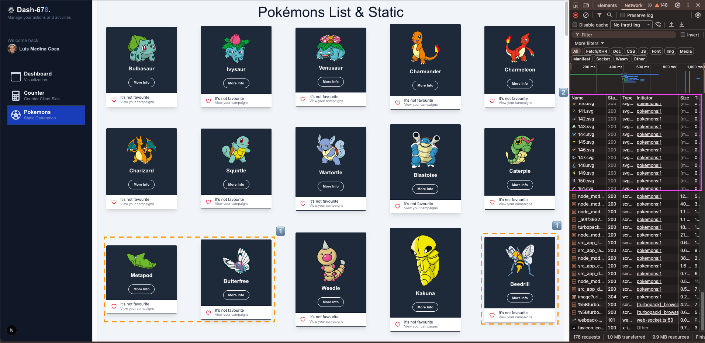

- 🐞 different image size.
- 🐞 each 151 loaded imagesß

---

## 📎 Related Files
- `src/app/dashboard/pokemons/page.tsx`
- `src/app/dashboard/pokemons/components/PokemonGrid.tsx`
- `src/app/dashboard/pokemons/components/PokemonCard.tsx`
- `src/app/dashboard/pokemons/interfaces/pokemon-response.ts`
- `src/app/dashboard/pokemons/interfaces/simple-pokemon.ts`
- `next.config.ts`

## 🔗 References
- [PokeAPI](https://pokeapi.co/)
- [Next.js Image Component](https://nextjs.org/docs/app/api-reference/components/image)
- [Tailwind CSS Components](https://www.creative-tim.com/twcomponents)

### ⚡ 5.2 Incidents Found  
| Issue | Status | Log/Error |
|---|---|---|
| Different image size | Pending | Images have inconsistent dimensions |
| Each 151 loaded images | Pending | Performance issue with loading all images |

### 🧱 5.3 Pending Fixes (TODO)
```md
- [ ] Fix image size consistency
- [ ] Optimize image loading (lazy load or pagination)
```


## 🔧 6. Lesson 055 — *Image Priority - Loading Priority*

### 🧠 6.1 Context  

In Next.js, the `Image` component provides a `priority` prop that controls how images are loaded and prioritized. By default, Next.js uses lazy loading for images, which means images are only loaded when they're about to enter the viewport. However, for images that are critical to the initial page load (like hero images or above-the-fold content), you can set `priority={true}` to preload them.

When `priority={true}`:
- The image is preloaded and given high priority during page load
- It helps improve Largest Contentful Paint (LCP) scores
- The image is loaded immediately, even if it's not yet visible in the viewport
- This is particularly useful for images that are "above the fold" or critical to the user experience

When `priority={false}` (default):
- Images are lazy-loaded as the user scrolls
- They only load when they're about to enter the viewport
- This reduces initial page load time and bandwidth usage
- Ideal for images below the fold or in grids/lists where not all images are immediately visible

In our Pokemon card grid scenario, since we're displaying multiple Pokemon cards and users need to scroll to see them all, setting `priority={false}` ensures that only the images visible in the viewport (and those about to enter it) are loaded, optimizing performance and reducing unnecessary network requests.

### 6.2 Updating and modifying the code:

#### 1 Adding `Priority` as property in `Image` in order to load images on demand:
```tsx
/* src/app/dashboard/pokemons/components/PokemonCard.tsx */
import Link from "next/link";
import Image from "next/image";
import { SimplePokemon } from "../interfaces/simple-pokemon";
import { IoHeartOutline } from "react-icons/io5";

interface Props {
  pokemon: SimplePokemon;
}
const PokemonCard = ({ pokemon }: Props) => {
  const { id, name } = pokemon;

  if (!id) return null;
  const imageUrl = `https://raw.githubusercontent.com/PokeAPI/sprites/master/sprites/pokemon/other/dream-world/${id}.svg`;

  return (
    <div className="mx-auto right-0 mt-2 w-60">
      <div className="flex flex-col bg-white rounded overflow-hidden shadow-lg">
        <div className="flex flex-col items-center justify-center text-center p-6 bg-gray-800 border-b">
          <Image 
            key={id} 
            src={imageUrl} 
            width={100} 
            height={100} 
            alt={name} 
            priority={false}  // 👈🏽 ✅
          />
          <p className="pt-2 text-lg font-semibold text-gray-50 capitalize">{name}</p>
          <div className="mt-5">
            <Link
              href={`/dashboard/pokemon/${id}`}
              className="border rounded-full py-2 px-4 text-xs font-semibold text-gray-100"
            >
              More Info
            </Link>
          </div>
        </div>
        <div className="border-b">
          <Link href="/dashboard/main" className="px-4 py-2 hover:bg-gray-100 flex items-center">
            <div className="text-red-600">
              <IoHeartOutline size={20} />
            </div>
            <div className="pl-3">
              <p className="text-sm font-medium text-gray-800 leading-none">It&apos;s not favourite</p>
              <p className="text-xs text-gray-500">View your campaigns</p>
            </div>
          </Link>
        </div>
      </div>
    </div>
  );
};
export default PokemonCard;
```


#### 2. Testing the `Priority` property:
*Steps*:
- Go to Network tab and clear it all
- Click on `Reaload` button and select `Empty cache and hard reload`.
- Slowly scrolling the page.

*Expected Results*:
- slowly loading for image.

#### 3. References:
  > [Components - Images Components | Nextjsß](https://nextjs.org/docs/app/api-reference/components/image#priority)


### ⚡ 6.3 Incidents Found  
| Issue | Status | Log/Error |
|---|---|---|
| Different image size | Pending | Images have inconsistent dimensions |
| Each 151 images page details| Pending | Loading each 151 image detail pages |

### 🧱 6.4 Pending Fixes (TODO)
```md
- [ ] Fix image size consistency
- [ ] Image detail pagesß
```


## 🔧 7. Lesson 056 — *Next - Error Page*

### 🧠 7.1 Context:   

In Next.js, error boundaries are special components that catch JavaScript errors anywhere in the component tree and display a fallback UI instead of crashing the entire application. The `error.tsx` file is a special file in Next.js App Router that acts as an error boundary for the route segment and its children.

When an error occurs in a Server Component or during data fetching, Next.js will automatically render the nearest `error.tsx` file. This file must be a Client Component (marked with `"use client"`) and receives two props:
- `error`: An Error object containing the error message and optionally a `digest` property for error tracking
- `reset`: A function that attempts to re-render the component tree, allowing users to recover from the error

This lesson demonstrates how to:
1. Simulate an error in a Server Component to trigger the error boundary
2. Create a custom error page with a user-friendly UI
3. Implement proper error handling with visual feedback and recovery options

### ⚙️ 7.2 Modification and Updating code:

#### 1. Simulating an error from Server Side:
```tsx
/* src/app/dashboard/pokemons/page.tsx */
//import Image from "next/image";
import { PokemonsResponse } from "./interfaces/pokemon-response";
import { SimplePokemon } from "./interfaces/simple-pokemon";
import PokemonGrid from "./components/PokemonGrid";

const getPokemons = async (limit = 20, offset = 0): Promise<SimplePokemon[]> => {
  const data: PokemonsResponse = await fetch(`http://pokeapi.co/api/v2/pokemon?limit=${limit}&offset=${offset}`).then(
    (res) => res.json()
  );

  const pokemons = data.results.map((pokemon) => ({
    id: pokemon.url.split("/").at(-2)!,
    name: pokemon.name,
  }));
  throw new Error("This error must not happen 💣 🔥");  // 👈🏽 ✅ server side error 🔥

  return pokemons;
};

export default async function PokemonsPage() {
  const pokemons = await getPokemons(151);
  return (
    <div className="flex flex-col">
      <span className="text-5xl my-2 text-center">
        Pokémons List & <span>Static</span>
      </span>

      <PokemonGrid pokemons={pokemons} />
    </div>
  );
}
```

[Error Handling](https://nextjs.org/docs/app/getting-started/error-handling)
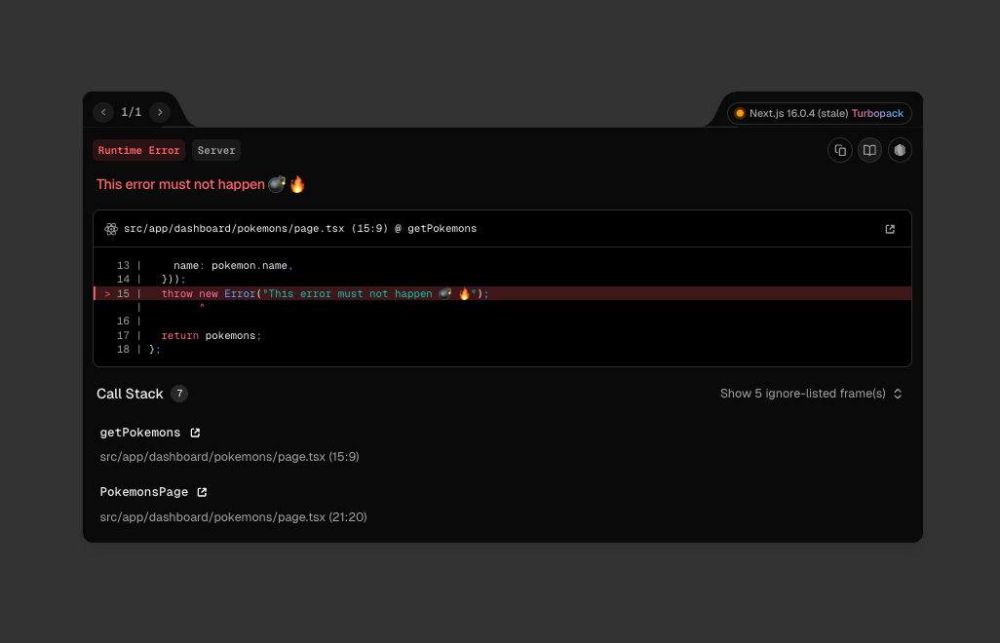

#### 2. Create `error.tsx` page:
```tsx
/* src/app/dashboard/pokemons/error.tsx */
"use client"; // Error boundaries must be Client Components
import { useEffect } from "react";
export default function Error({ error, reset }: { error: Error & { digest?: string }; reset: () => void }) {
  useEffect(() => {
    // Log the error to an error reporting service
    console.error(error);
  }, [error]);

  return (
    <div>
      <h2>Something went wrong!</h2>
      <span>{error.message}</span>  // 👈🏽 ✅
      <button
        onClick={
          // Attempt to recover by trying to re-render the segment
          () => reset()
        }
      >
        Try again
      </button>
    </div>
  );
}
```

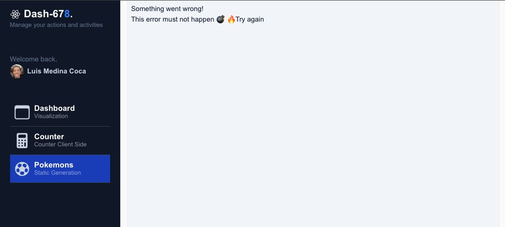

#### 3. Copy & Paste the 500-error page from [Tailwind CSS 500 Server Error | Illustration - pages](https://www.creative-tim.com/twcomponents/component/tailwind-css-500-server-error-illustration) code in `error.tsx` component:
```tsx
/* src/app/dashboard/pokemons/error.tsx */
"use client"; // Error boundaries must be Client Components
import { useEffect } from "react";
export default function Error({ error, reset }: { error: Error & { digest?: string }; reset: () => void }) {
  useEffect(() => {
    // Log the error to an error reporting service
    console.error(error);
  }, [error]);

  return (  // 👈🏽 ✅
    <div className="w-full h-screen flex flex-col items-center justify-center">
      <svg
        className="w-1/2 md:w-1/3 lg:w-1/4 text-blue-600"
        xmlns="http://www.w3.org/2000/svg"
        data-name="Layer 1"
        viewBox="0 0 1119.60911 699"
        xmlnsXlink="http://www.w3.org/1999/xlink"
      >
        <circle cx="292.60911" cy="213" r="213" fill="#f2f2f2"></circle>
        <path
          d="M31.39089,151.64237c0,77.49789,48.6181,140.20819,108.70073,140.20819"
          transform="translate(-31.39089 -100.5)"
          fill="#2f2e41"
        ></path>
        <path
          d="M140.09162,291.85056c0-78.36865,54.255-141.78356,121.30372-141.78356"
          transform="translate(-31.39089 -100.5)"
          fill="currentColor"
        ></path>
        <path
          d="M70.77521,158.66768c0,73.61476,31.00285,133.18288,69.31641,133.18288"
          transform="translate(-31.39089 -100.5)"
          fill="currentColor"
        ></path>
        <path
          d="M140.09162,291.85056c0-100.13772,62.7103-181.16788,140.20819-181.16788"
          transform="translate(-31.39089 -100.5)"
          fill="#2f2e41"
        ></path>
        <path
          d="M117.22379,292.83905s15.41555-.47479,20.06141-3.783,23.713-7.2585,24.86553-1.95278,23.16671,26.38821,5.76263,26.5286-40.43935-2.711-45.07627-5.53549S117.22379,292.83905,117.22379,292.83905Z"
          transform="translate(-31.39089 -100.5)"
          fill="#a8a8a8"
        ></path>
        <path
          d="M168.224,311.78489c-17.40408.14042-40.43933-2.71094-45.07626-5.53548-3.53126-2.151-4.93843-9.86945-5.40926-13.43043-.32607.014-.51463.02-.51463.02s.97638,12.43276,5.61331,15.2573,27.67217,5.67589,45.07626,5.53547c5.02386-.04052,6.7592-1.82793,6.66391-4.47526C173.87935,310.756,171.96329,311.75474,168.224,311.78489Z"
          transform="translate(-31.39089 -100.5)"
          opacity="0.2"
        ></path>
        <ellipse cx="198.60911" cy="424.5" rx="187" ry="25.43993" fill="#3f3d56"></ellipse>
        <ellipse cx="198.60911" cy="424.5" rx="157" ry="21.35866" opacity="0.1"></ellipse>
        <ellipse cx="836.60911" cy="660.5" rx="283" ry="38.5" fill="#3f3d56"></ellipse>
        <ellipse cx="310.60911" cy="645.5" rx="170" ry="23.12721" fill="#3f3d56"></ellipse>
        <path
          d="M494,726.5c90,23,263-30,282-90"
          transform="translate(-31.39089 -100.5)"
          fill="none"
          stroke="#2f2e41"
          stroke-miterlimit="10"
          stroke-width="2"
        ></path>
        <path
          d="M341,359.5s130-36,138,80-107,149-17,172"
          transform="translate(-31.39089 -100.5)"
          fill="none"
          stroke="#2f2e41"
          stroke-miterlimit="10"
          stroke-width="2"
        ></path>
        <path
          d="M215.40233,637.78332s39.0723-10.82,41.47675,24.04449-32.15951,44.78287-5.10946,51.69566"
          transform="translate(-31.39089 -100.5)"
          fill="none"
          stroke="#2f2e41"
          stroke-miterlimit="10"
          stroke-width="2"
        ></path>
        <path
          d="M810.09554,663.73988,802.218,714.03505s-38.78182,20.60284-11.51335,21.20881,155.73324,0,155.73324,0,24.84461,0-14.54318-21.81478l-7.87756-52.719Z"
          transform="translate(-31.39089 -100.5)"
          fill="#2f2e41"
        ></path>
        <path
          d="M785.21906,734.69812c6.193-5.51039,16.9989-11.252,16.9989-11.252l7.87756-50.2952,113.9216.10717,7.87756,49.582c9.185,5.08711,14.8749,8.987,18.20362,11.97818,5.05882-1.15422,10.58716-5.44353-18.20362-21.38921l-7.87756-52.719-113.9216,3.02983L802.218,714.03506S769.62985,731.34968,785.21906,734.69812Z"
          transform="translate(-31.39089 -100.5)"
          opacity="0.1"
        ></path>
        <rect x="578.43291" y="212.68859" width="513.25314" height="357.51989" rx="18.04568" fill="#2f2e41"></rect>
        <rect x="595.70294" y="231.77652" width="478.71308" height="267.83694" fill="#3f3d56"></rect>
        <circle cx="835.05948" cy="223.29299" r="3.02983" fill="#f2f2f2"></circle>
        <path
          d="M1123.07694,621.32226V652.6628a18.04341,18.04341,0,0,1-18.04568,18.04568H627.86949A18.04341,18.04341,0,0,1,609.8238,652.6628V621.32226Z"
          transform="translate(-31.39089 -100.5)"
          fill="#2f2e41"
        ></path>
        <polygon
          points="968.978 667.466 968.978 673.526 642.968 673.526 642.968 668.678 643.417 667.466 651.452 645.651 962.312 645.651 968.978 667.466"
          fill="#2f2e41"
        ></polygon>
        <path
          d="M1125.828,762.03359c-.59383,2.539-2.83591,5.21743-7.90178,7.75032-18.179,9.08949-55.1429-2.42386-55.1429-2.42386s-28.4804-4.84773-28.4804-17.573a22.72457,22.72457,0,0,1,2.49658-1.48459c7.64294-4.04351,32.98449-14.02122,77.9177.42248a18.73921,18.73921,0,0,1,8.54106,5.59715C1125.07908,756.45353,1126.50669,759.15715,1125.828,762.03359Z"
          transform="translate(-31.39089 -100.5)"
          fill="#2f2e41"
        ></path>
        <path
          d="M1125.828,762.03359c-22.251,8.526-42.0843,9.1622-62.43871-4.975-10.26507-7.12617-19.59089-8.88955-26.58979-8.75618,7.64294-4.04351,32.98449-14.02122,77.9177.42248a18.73921,18.73921,0,0,1,8.54106,5.59715C1125.07908,756.45353,1126.50669,759.15715,1125.828,762.03359Z"
          transform="translate(-31.39089 -100.5)"
          opacity="0.1"
        ></path>
        <ellipse cx="1066.53846" cy="654.13477" rx="7.87756" ry="2.42386" fill="#f2f2f2"></ellipse>
        <circle cx="835.05948" cy="545.66686" r="11.51335" fill="#f2f2f2"></circle>
        <polygon
          points="968.978 667.466 968.978 673.526 642.968 673.526 642.968 668.678 643.417 667.466 968.978 667.466"
          opacity="0.1"
        ></polygon>
        <rect x="108.60911" y="159" width="208" height="242" fill="#2f2e41"></rect>
        <rect x="87.60911" y="135" width="250" height="86" fill="#3f3d56"></rect>
        <rect x="87.60911" y="237" width="250" height="86" fill="#3f3d56"></rect>
        <rect x="87.60911" y="339" width="250" height="86" fill="#3f3d56"></rect>
        <rect x="271.60911" y="150" width="16" height="16" fill="currentColor" opacity="0.4"></rect>
        <rect x="294.60911" y="150" width="16" height="16" fill="currentColor" opacity="0.8"></rect>
        <rect x="317.60911" y="150" width="16" height="16" fill="currentColor"></rect>
        <rect x="271.60911" y="251" width="16" height="16" fill="currentColor" opacity="0.4"></rect>
        <rect x="294.60911" y="251" width="16" height="16" fill="currentColor" opacity="0.8"></rect>
        <rect x="317.60911" y="251" width="16" height="16" fill="currentColor"></rect>
        <rect x="271.60911" y="352" width="16" height="16" fill="currentColor" opacity="0.4"></rect>
        <rect x="294.60911" y="352" width="16" height="16" fill="currentColor" opacity="0.8"></rect>
        <rect x="317.60911" y="352" width="16" height="16" fill="currentColor"></rect>
        <circle cx="316.60911" cy="538" r="79" fill="#2f2e41"></circle>
        <rect x="280.60911" y="600" width="24" height="43" fill="#2f2e41"></rect>
        <rect x="328.60911" y="600" width="24" height="43" fill="#2f2e41"></rect>
        <ellipse cx="300.60911" cy="643.5" rx="20" ry="7.5" fill="#2f2e41"></ellipse>
        <ellipse cx="348.60911" cy="642.5" rx="20" ry="7.5" fill="#2f2e41"></ellipse>
        <circle cx="318.60911" cy="518" r="27" fill="#fff"></circle>
        <circle cx="318.60911" cy="518" r="9" fill="#3f3d56"></circle>
        <path
          d="M271.36733,565.03228c-6.37889-28.56758,14.01185-57.43392,45.544-64.47477s62.2651,10.41,68.644,38.9776-14.51861,39.10379-46.05075,46.14464S277.74622,593.59986,271.36733,565.03228Z"
          transform="translate(-31.39089 -100.5)"
          fill="currentColor"
        ></path>
        <ellipse
          cx="417.21511"
          cy="611.34365"
          rx="39.5"
          ry="12.40027"
          transform="translate(-238.28665 112.98044) rotate(-23.17116)"
          fill="#2f2e41"
        ></ellipse>
        <ellipse
          cx="269.21511"
          cy="664.34365"
          rx="39.5"
          ry="12.40027"
          transform="translate(-271.07969 59.02084) rotate(-23.17116)"
          fill="#2f2e41"
        ></ellipse>
        <path
          d="M394,661.5c0,7.732-19.90861,23-42,23s-43-14.268-43-22,20.90861-6,43-6S394,653.768,394,661.5Z"
          transform="translate(-31.39089 -100.5)"
          fill="#fff"
        ></path>
      </svg>

      <div className="flex flex-col items-center justify-center">
        <p className="text-5xl md:text-6xl lg:text-7xl font-bold tracking-wider text-gray-600 mt-8">500</p>
        <p className="text-2xl md:text-3xl lg:text-4xl font-bold text-gray-600 mt-2">Server Error</p>
        <p className="md:text-lg xl:text-xl text-gray-500 mt-4">Whoops, something went wrong on our servers.</p>
      </div>
    </div>
  );
}
```

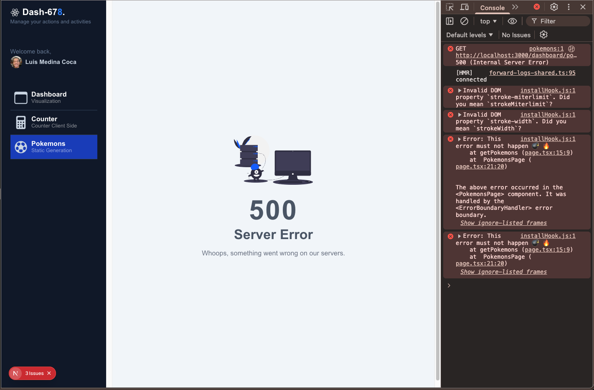

#### 4. Updating Strokes' errors:
```tsx
/* src/app/dashboard/pokemons/error.tsx */
"use client"; // Error boundaries must be Client Components

import { useEffect } from "react";

export default function Error({ error, reset }: { error: Error & { digest?: string }; reset: () => void }) {
  useEffect(() => {
    // Log the error to an error reporting service
    console.error(error);
  }, [error]);

  return (
    <div className="w-full h-screen flex flex-col items-center justify-center">
      <svg
        className="w-1/2 md:w-1/3 lg:w-1/4 text-blue-600"
        xmlns="http://www.w3.org/2000/svg"
        data-name="Layer 1"
        viewBox="0 0 1119.60911 699"
        xmlnsXlink="http://www.w3.org/1999/xlink"
      >
        <circle cx="292.60911" cy="213" r="213" fill="#f2f2f2"></circle>
        <path
          d="M31.39089,151.64237c0,77.49789,48.6181,140.20819,108.70073,140.20819"
          transform="translate(-31.39089 -100.5)"
          fill="#2f2e41"
        ></path>
        <path
          d="M140.09162,291.85056c0-78.36865,54.255-141.78356,121.30372-141.78356"
          transform="translate(-31.39089 -100.5)"
          fill="currentColor"
        ></path>
        <path
          d="M70.77521,158.66768c0,73.61476,31.00285,133.18288,69.31641,133.18288"
          transform="translate(-31.39089 -100.5)"
          fill="currentColor"
        ></path>
        <path
          d="M140.09162,291.85056c0-100.13772,62.7103-181.16788,140.20819-181.16788"
          transform="translate(-31.39089 -100.5)"
          fill="#2f2e41"
        ></path>
        <path
          d="M117.22379,292.83905s15.41555-.47479,20.06141-3.783,23.713-7.2585,24.86553-1.95278,23.16671,26.38821,5.76263,26.5286-40.43935-2.711-45.07627-5.53549S117.22379,292.83905,117.22379,292.83905Z"
          transform="translate(-31.39089 -100.5)"
          fill="#a8a8a8"
        ></path>
        <path
          d="M168.224,311.78489c-17.40408.14042-40.43933-2.71094-45.07626-5.53548-3.53126-2.151-4.93843-9.86945-5.40926-13.43043-.32607.014-.51463.02-.51463.02s.97638,12.43276,5.61331,15.2573,27.67217,5.67589,45.07626,5.53547c5.02386-.04052,6.7592-1.82793,6.66391-4.47526C173.87935,310.756,171.96329,311.75474,168.224,311.78489Z"
          transform="translate(-31.39089 -100.5)"
          opacity="0.2"
        ></path>
        <ellipse cx="198.60911" cy="424.5" rx="187" ry="25.43993" fill="#3f3d56"></ellipse>
        <ellipse cx="198.60911" cy="424.5" rx="157" ry="21.35866" opacity="0.1"></ellipse>
        <ellipse cx="836.60911" cy="660.5" rx="283" ry="38.5" fill="#3f3d56"></ellipse>
        <ellipse cx="310.60911" cy="645.5" rx="170" ry="23.12721" fill="#3f3d56"></ellipse>
        <path
          d="M494,726.5c90,23,263-30,282-90"
          transform="translate(-31.39089 -100.5)"
          fill="none"
          stroke="#2f2e41"
          strokeMiterlimit="10"
          strokeWidth="2"
        ></path>
        <path
          d="M341,359.5s130-36,138,80-107,149-17,172"
          transform="translate(-31.39089 -100.5)"
          fill="none"
          stroke="#2f2e41"
          strokeMiterlimit="10"
          strokeWidth="2"
        ></path>
        <path
          d="M215.40233,637.78332s39.0723-10.82,41.47675,24.04449-32.15951,44.78287-5.10946,51.69566"
          transform="translate(-31.39089 -100.5)"
          fill="none"
          stroke="#2f2e41"
          strokeMiterlimit="10"
          strokeWidth="2"
        ></path>
        <path
          d="M810.09554,663.73988,802.218,714.03505s-38.78182,20.60284-11.51335,21.20881,155.73324,0,155.73324,0,24.84461,0-14.54318-21.81478l-7.87756-52.719Z"
          transform="translate(-31.39089 -100.5)"
          fill="#2f2e41"
        ></path>
        <path
          d="M785.21906,734.69812c6.193-5.51039,16.9989-11.252,16.9989-11.252l7.87756-50.2952,113.9216.10717,7.87756,49.582c9.185,5.08711,14.8749,8.987,18.20362,11.97818,5.05882-1.15422,10.58716-5.44353-18.20362-21.38921l-7.87756-52.719-113.9216,3.02983L802.218,714.03506S769.62985,731.34968,785.21906,734.69812Z"
          transform="translate(-31.39089 -100.5)"
          opacity="0.1"
        ></path>
        <rect x="578.43291" y="212.68859" width="513.25314" height="357.51989" rx="18.04568" fill="#2f2e41"></rect>
        <rect x="595.70294" y="231.77652" width="478.71308" height="267.83694" fill="#3f3d56"></rect>
        <circle cx="835.05948" cy="223.29299" r="3.02983" fill="#f2f2f2"></circle>
        <path
          d="M1123.07694,621.32226V652.6628a18.04341,18.04341,0,0,1-18.04568,18.04568H627.86949A18.04341,18.04341,0,0,1,609.8238,652.6628V621.32226Z"
          transform="translate(-31.39089 -100.5)"
          fill="#2f2e41"
        ></path>
        <polygon
          points="968.978 667.466 968.978 673.526 642.968 673.526 642.968 668.678 643.417 667.466 651.452 645.651 962.312 645.651 968.978 667.466"
          fill="#2f2e41"
        ></polygon>
        <path
          d="M1125.828,762.03359c-.59383,2.539-2.83591,5.21743-7.90178,7.75032-18.179,9.08949-55.1429-2.42386-55.1429-2.42386s-28.4804-4.84773-28.4804-17.573a22.72457,22.72457,0,0,1,2.49658-1.48459c7.64294-4.04351,32.98449-14.02122,77.9177.42248a18.73921,18.73921,0,0,1,8.54106,5.59715C1125.07908,756.45353,1126.50669,759.15715,1125.828,762.03359Z"
          transform="translate(-31.39089 -100.5)"
          fill="#2f2e41"
        ></path>
        <path
          d="M1125.828,762.03359c-22.251,8.526-42.0843,9.1622-62.43871-4.975-10.26507-7.12617-19.59089-8.88955-26.58979-8.75618,7.64294-4.04351,32.98449-14.02122,77.9177.42248a18.73921,18.73921,0,0,1,8.54106,5.59715C1125.07908,756.45353,1126.50669,759.15715,1125.828,762.03359Z"
          transform="translate(-31.39089 -100.5)"
          opacity="0.1"
        ></path>
        <ellipse cx="1066.53846" cy="654.13477" rx="7.87756" ry="2.42386" fill="#f2f2f2"></ellipse>
        <circle cx="835.05948" cy="545.66686" r="11.51335" fill="#f2f2f2"></circle>
        <polygon
          points="968.978 667.466 968.978 673.526 642.968 673.526 642.968 668.678 643.417 667.466 968.978 667.466"
          opacity="0.1"
        ></polygon>
        <rect x="108.60911" y="159" width="208" height="242" fill="#2f2e41"></rect>
        <rect x="87.60911" y="135" width="250" height="86" fill="#3f3d56"></rect>
        <rect x="87.60911" y="237" width="250" height="86" fill="#3f3d56"></rect>
        <rect x="87.60911" y="339" width="250" height="86" fill="#3f3d56"></rect>
        <rect x="271.60911" y="150" width="16" height="16" fill="currentColor" opacity="0.4"></rect>
        <rect x="294.60911" y="150" width="16" height="16" fill="currentColor" opacity="0.8"></rect>
        <rect x="317.60911" y="150" width="16" height="16" fill="currentColor"></rect>
        <rect x="271.60911" y="251" width="16" height="16" fill="currentColor" opacity="0.4"></rect>
        <rect x="294.60911" y="251" width="16" height="16" fill="currentColor" opacity="0.8"></rect>
        <rect x="317.60911" y="251" width="16" height="16" fill="currentColor"></rect>
        <rect x="271.60911" y="352" width="16" height="16" fill="currentColor" opacity="0.4"></rect>
        <rect x="294.60911" y="352" width="16" height="16" fill="currentColor" opacity="0.8"></rect>
        <rect x="317.60911" y="352" width="16" height="16" fill="currentColor"></rect>
        <circle cx="316.60911" cy="538" r="79" fill="#2f2e41"></circle>
        <rect x="280.60911" y="600" width="24" height="43" fill="#2f2e41"></rect>
        <rect x="328.60911" y="600" width="24" height="43" fill="#2f2e41"></rect>
        <ellipse cx="300.60911" cy="643.5" rx="20" ry="7.5" fill="#2f2e41"></ellipse>
        <ellipse cx="348.60911" cy="642.5" rx="20" ry="7.5" fill="#2f2e41"></ellipse>
        <circle cx="318.60911" cy="518" r="27" fill="#fff"></circle>
        <circle cx="318.60911" cy="518" r="9" fill="#3f3d56"></circle>
        <path
          d="M271.36733,565.03228c-6.37889-28.56758,14.01185-57.43392,45.544-64.47477s62.2651,10.41,68.644,38.9776-14.51861,39.10379-46.05075,46.14464S277.74622,593.59986,271.36733,565.03228Z"
          transform="translate(-31.39089 -100.5)"
          fill="currentColor"
        ></path>
        <ellipse
          cx="417.21511"
          cy="611.34365"
          rx="39.5"
          ry="12.40027"
          transform="translate(-238.28665 112.98044) rotate(-23.17116)"
          fill="#2f2e41"
        ></ellipse>
        <ellipse
          cx="269.21511"
          cy="664.34365"
          rx="39.5"
          ry="12.40027"
          transform="translate(-271.07969 59.02084) rotate(-23.17116)"
          fill="#2f2e41"
        ></ellipse>
        <path
          d="M394,661.5c0,7.732-19.90861,23-42,23s-43-14.268-43-22,20.90861-6,43-6S394,653.768,394,661.5Z"
          transform="translate(-31.39089 -100.5)"
          fill="#fff"
        ></path>
      </svg>

      <div className="flex flex-col items-center justify-center">
        <p className="text-5xl md:text-6xl lg:text-7xl font-bold tracking-wider text-gray-600 mt-8">500</p>
        <p className="text-2xl md:text-3xl lg:text-4xl font-bold text-gray-600 mt-2">Server Error</p>
        <p className="md:text-lg xl:text-xl text-gray-500 mt-4">{error.message}</p>
      </div>
    </div>
  );
}
```

### 🧱 7.3 Pending Fixes (TODO)
```md
- [ ] Add a "Try again" button that calls the `reset()` function to allow users to retry the failed operation
- [ ] Implement error logging to an external error reporting service (e.g., Sentry, LogRocket) instead of just console.error
- [ ] Add error boundary for NotFoundError (404 errors) with a custom not-found.tsx page
- [ ] Consider adding error recovery strategies for specific error types (network errors, API errors, etc.)
- [ ] Add accessibility improvements to the error page (ARIA labels, keyboard navigation)
```

## 🔧 8. Lesson 057 — *Dynamic Routes - URL arguments*

### 🧠 8.1 Context:

In Next.js App Router, dynamic routes allow us to create pages that handle multiple paths based on URL parameters. This lesson focuses on implementing a dynamic route for individual Pokémon detail pages using the `[id]` folder structure.

**Key Concepts:**
- Dynamic segments are created using square brackets `[id]` in the folder name
- In Next.js 15+, route parameters (`params`) are now asynchronous and must be awaited
- The `params` prop contains a Promise that resolves to an object with the dynamic segment values
- This enables creating individual detail pages for each Pokémon (e.g., `/dashboard/pokemon/1`, `/dashboard/pokemon/25`, etc.)

**Use Case:**
When a user clicks on a Pokémon card from the list page (`/dashboard/pokemons`), they should be navigated to a detail page showing specific information about that Pokémon. The ID from the URL is used to fetch and display the corresponding Pokémon data.

**Implementation Steps:**
1. Create a dynamic route folder structure: `pokemon/[id]/page.tsx`
2. Define proper TypeScript interfaces for the route parameters
3. Extract the `id` parameter from the URL
4. Use the `id` to fetch and display Pokémon-specific data (to be implemented in future lessons)

### ⚙️ 8.2 Updating code according the context:

#### 1. Refactor the project structure:
```
02-my-dashboard/
│
├── 📄 package.json                       # Dependencies and scripts configuration
├── 📄 package-lock.json                  # Dependencies lock file
├── 📄 tsconfig.json                      # TypeScript configuration
├── 📄 next.config.ts                     # Next.js configuration
├── 📄 next-env.d.ts                      # Next.js types
├── 📄 eslint.config.mjs                  # ESLint configuration
├── 📄 postcss.config.mjs                 # PostCSS configuration
├── 📄 README.md                          # Project documentation
│
├── 📁 docs/                              # Course documentation
│   ├── LECTURE_STEPS.md
│   └── LECTURE_STEPS_v01.md
│
├── 📁 img/                               # Course reference images
│   └── ...
│
├── 📁 public/                            # Public static files
│   ├── file.svg
│   ├── globe.svg
│   ├── next.svg
│   ├── vercel.svg
│   └── window.svg
│
├── 📁 node_modules/                      # Installed dependencies (ignored)
│
└── 📁 src/                               # Main source code
    │
    ├── 📁 app/                           # Next.js App Router
    │   ├── 📄 layout.tsx                 # Main application layout
    │   ├── 📄 page.tsx                   # Home page
    │   ├── 📄 globals.css                # Global styles
    │   ├── 📄 favicon.ico                # Favicon
    │   │
    │   └── 📁 dashboard/                 # Dashboard section
    │       ├── 📄 layout.tsx             # Dashboard layout (with Sidebar)
    │       │
    │       ├── 📁 main/                  # Main dashboard page
    │       │   └── 📄 page.tsx
    │       │
    │       ├── 📁 counter/               # Counter page
    │       │   └── 📄 page.tsx
    │       │
    │       └── 📁 pokemons/              # Pokémons page
    │           ├── 📄 page.tsx           # Pokémons list
    │           └── 📄 error.tsx          # Error component
    │
    ├── 📁 components/                    # Shared components
    │   ├── 📄 index.ts                   # Barrel export
    │   ├── 📄 Sidebar.tsx                # Sidebar component
    │   └── 📄 SidebarMenuItem.tsx        # Sidebar menu item
    │
    ├── 📁 pokemons/                      # Pokémons module
    │   ├── 📄 index.ts                   # Barrel export
    │   │
    │   ├── 📁 components/                # Pokémons-specific components
    │   │   ├── 📄 PokemonCard.tsx        # Individual Pokémon card
    │   │   └── 📄 PokemonGrid.tsx        # Pokémons grid
    │   │
    │   └── 📁 interfaces/                # TypeScript interfaces
    │       ├── 📄 pokemon-response.ts    # API response
    │       └── 📄 simple-pokemon.ts      # Simplified Pokémon
    │
    └── 📁 shopping-cart/                 # Shopping cart module
        ├── 📄 index.ts                   # Barrel export
        │
        └── 📁 components/                # Cart components
            └── 📄 CartCounter.tsx        # Cart counter
```

#### 2. Create `/pokemon/[id]/page.tsx` file:
```tsx
/* src/app/dashboard/pokemon/[id]/page.tsx */
export default function PokemonPage() {
  return (
    <div>
      <h1>Hello Pokemon [ID] Page</h1>
    </div>
  );
}
```

#### 3. Adding the `props` in order to know how the `id` format is comming:
```tsx
/* src/app/dashboard/pokemon/[id]/page.tsx */
export default function PokemonPage(props: any) {
  console.log(props);  // 👈🏽 ✅ - server side
  return (
    <div>
      <h1>Hello Pokemon [ID] Page</h1>
    </div>
  );
}
```
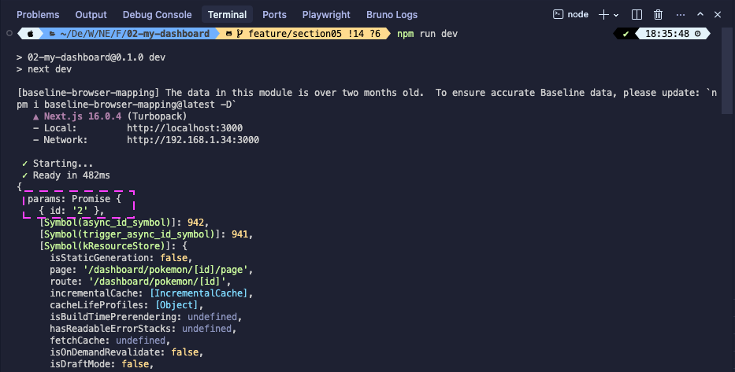


#### 4. Adding `Props` interface:
```tsx
/* src/app/dashboard/pokemon/[id]/page.tsx */
interface Props {
  params: Promise<{
    id: string; // usually those params are always 'string'.
  }>;
}  // 👈🏽 ✅

export default async function PokemonPage({ params }: Props) {
  const { id } = await params;  // 👈🏽 ✅
  console.log("ID:", id);

  return (
    <div>
      <h1>Hello Pokemon with ID: {id} - Page</h1>
    </div>
  );
}
```

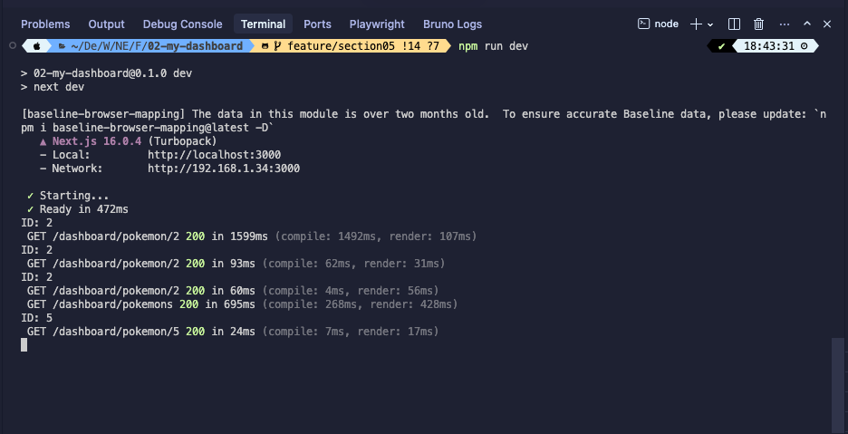

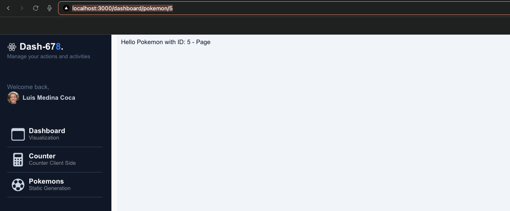


### ⚡ 8.3 Incidents Found

No critical incidents were found during the initial implementation. The dynamic route structure is correctly set up and the `id` parameter is successfully extracted from the URL. The following areas require attention but are not blocking issues:

| Issue | Status | Notes |
|---|---|---|
| Missing metadata | Pending | Page metadata (title, description) not yet configured |
| No data fetching | Pending | Pokémon data fetching logic not yet implemented |
| No error handling | Pending | Invalid ID handling not yet implemented |
| No loading state | Pending | Loading state for data fetching not yet implemented |

### 🧱 8.4 Pending Fixes (TODO)
```md
- [ ] Add metadata export for SEO and page title (using generateMetadata function)
- [ ] Implement data fetching function to retrieve Pokémon details by ID from PokeAPI
- [ ] Add error handling for invalid Pokémon IDs (404 not found)
- [ ] Create TypeScript interfaces for Pokémon detail data structure
- [ ] Implement loading state while fetching Pokémon data
- [ ] Add proper error boundary or not-found page for invalid routes
- [ ] Create UI components to display Pokémon details (image, stats, abilities, etc.)
- [ ] Add navigation back to Pokémon list page
- [ ] Implement proper URL validation for the ID parameter
- [ ] Add metadata generation function that uses the Pokémon name for dynamic page titles
```


## 🔧 9. Lesson 058 — *Loading Pokemon information by ID*

### 🧠 9.1 Context:   

Building on the dynamic route implementation from Lesson 057, this lesson focuses on fetching and displaying Pokémon data from the PokeAPI. The dynamic route structure (`pokemon/[id]/page.tsx`) is now ready to retrieve individual Pokémon details based on the ID parameter extracted from the URL.

**Key Concepts:**
- Server-side data fetching in Next.js App Router using async Server Components
- Fetching data from external APIs (PokeAPI) using the native `fetch` API
- TypeScript type safety by creating comprehensive interfaces for API responses
- Caching strategies using Next.js fetch options (`force-cache` for static data)

**Implementation Steps:**
1. Create an async `getPokemon` function to fetch Pokémon data from PokeAPI by ID
2. Define TypeScript interfaces for the complete Pokémon API response structure
3. Import and use the `Pokemon` interface to type the fetched data
4. Display the fetched Pokémon information in the page component
5. Export the new `Pokemon` interface through the barrel export pattern for reusability

**Technical Details:**
- The `getPokemon` function uses `fetch` with `cache: "force-cache"` for static generation
- The function is marked as `async` and returns a `Promise<Pokemon>`
- Server-side console logs help debug the data fetching process
- The Pokémon data is displayed using JSON.stringify for initial development (to be replaced with proper UI components in future lessons)


### ⚙️ 9.2 Updating code according the context:

#### 1. Create `getPokemon` function in `pokemon/[id]/page.tsx` file:
```tsx
/*  */
interface Props {
  params: Promise<{
    id: string;
  }>;
}

const getPokemon = async (id: string) => {
  const pokemon = await fetch(`https://pokeapi.co/api/v2/pokemon/${id}`, {
    cache: "force-cache", // TODO: change this in future steps
  }).then( resp => resp.json());

  console.log(pokemon.name); // from server side terminal

  return pokemon;
};  // 👈🏽 ✅

export default async function PokemonPage({ params }: Props) {
  const { id } = await params;
  console.log("ID:", id);
  const pokemon = await getPokemon(id);  // 👈🏽 ✅

  return (
    <div>
      <h1>Hello Pokemon with ID: {id} - Page</h1>
      <pre>🔥 {pokemon.name}</pre>
    </div>
  );
}
```

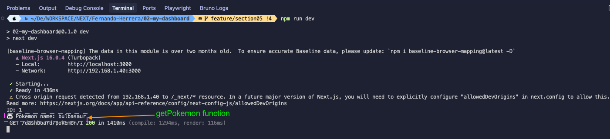
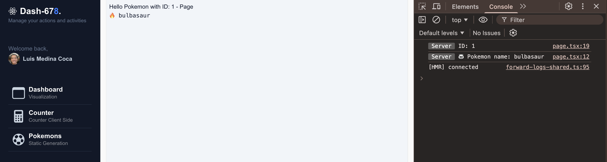

#### 2. Create Pokemon response Interface:
1. Go to Postman and make a request to this URL: `https://pokeapi.co/api/v2/pokemon/1`.
2. Copy the response.
3. Open **`VS Code`**
4. create `src/pokemons/interfaces/pokemon.ts` file
5. CMD/Ctrl + P
6. Write `> Paste JSON as Code`
7. Enter `Pokemon`
8. Pokemon Response Interface:
    ```ts
    /* src/pokemons/interfaces/pokemon.ts */
    export interface Pokemon {
      abilities:                Ability[];
      base_experience:          number;
      cries:                    Cries;
      forms:                    Species[];
      game_indices:             GameIndex[];
      height:                   number;
      held_items:               any[];
      id:                       number;
      is_default:               boolean;
      location_area_encounters: string;
      moves:                    Move[];
      name:                     string;
      order:                    number;
      past_abilities:           PastAbility[];
      past_types:               any[];
      species:                  Species;
      sprites:                  Sprites;
      stats:                    Stat[];
      types:                    Type[];
      weight:                   number;
    }

    export interface Ability {
      ability:   Species | null;
      is_hidden: boolean;
      slot:      number;
    }

    export interface Species {
      name: string;
      url:  string;
    }

    export interface Cries {
      latest: string;
      legacy: string;
    }

    export interface GameIndex {
      game_index: number;
      version:    Species;
    }

    export interface Move {
      move:                  Species;
      version_group_details: VersionGroupDetail[];
    }

    export interface VersionGroupDetail {
      level_learned_at:  number;
      move_learn_method: Species;
      order:             number | null;
      version_group:     Species;
    }

    export interface PastAbility {
      abilities:  Ability[];
      generation: Species;
    }

    export interface GenerationV {
      "black-white": Sprites;
    }

    export interface GenerationIv {
      "diamond-pearl":        Sprites;
      "heartgold-soulsilver": Sprites;
      platinum:               Sprites;
    }

    export interface Versions {
      "generation-i":    GenerationI;
      "generation-ii":   GenerationIi;
      "generation-iii":  GenerationIii;
      "generation-iv":   GenerationIv;
      "generation-v":    GenerationV;
      "generation-vi":   { [key: string]: Home };
      "generation-vii":  GenerationVii;
      "generation-viii": GenerationViii;
    }

    export interface Other {
      dream_world:        DreamWorld;
      home:               Home;
      "official-artwork": OfficialArtwork;
      showdown:           Sprites;
    }

    export interface Sprites {
      back_default:       string;
      back_female:        null;
      back_shiny:         string;
      back_shiny_female:  null;
      front_default:      string;
      front_female:       null;
      front_shiny:        string;
      front_shiny_female: null;
      other?:             Other;
      versions?:          Versions;
      animated?:          Sprites;
    }

    export interface GenerationI {
      "red-blue": RedBlue;
      yellow:     RedBlue;
    }

    export interface RedBlue {
      back_default:      string;
      back_gray:         string;
      back_transparent:  string;
      front_default:     string;
      front_gray:        string;
      front_transparent: string;
    }

    export interface GenerationIi {
      crystal: Crystal;
      gold:    Gold;
      silver:  Gold;
    }

    export interface Crystal {
      back_default:            string;
      back_shiny:              string;
      back_shiny_transparent:  string;
      back_transparent:        string;
      front_default:           string;
      front_shiny:             string;
      front_shiny_transparent: string;
      front_transparent:       string;
    }

    export interface Gold {
      back_default:       string;
      back_shiny:         string;
      front_default:      string;
      front_shiny:        string;
      front_transparent?: string;
    }

    export interface GenerationIii {
      emerald:             OfficialArtwork;
      "firered-leafgreen": Gold;
      "ruby-sapphire":     Gold;
    }

    export interface OfficialArtwork {
      front_default: string;
      front_shiny:   string;
    }

    export interface Home {
      front_default:      string;
      front_female:       null;
      front_shiny:        string;
      front_shiny_female: null;
    }

    export interface GenerationVii {
      icons:                  DreamWorld;
      "ultra-sun-ultra-moon": Home;
    }

    export interface DreamWorld {
      front_default: string;
      front_female:  null;
    }

    export interface GenerationViii {
      icons: DreamWorld;
    }

    export interface Stat {
      base_stat: number;
      effort:    number;
      stat:      Species;
    }

    export interface Type {
      slot: number;
      type: Species;
    }
    ```

#### 3. Add the new `Pokemon` response interface into `index` barrel file:
```ts
/* src/pokemons/index.ts */
export type { PokemonsResponse } from "./interfaces/pokemon-response";
export type { SimplePokemon } from "./interfaces/simple-pokemon";
export type { Pokemon } from "./interfaces/pokemon";  // 👈🏽 ✅

export { default as PokemonGrid } from "./components/PokemonGrid";
```

#### 4. Import new `Pokemon` response interface into `pokemon/[id]/page.tsx` file:
```tsx
/* src/app/dashboard/pokemon/[id]/page.tsx */
import { Pokemon } from "@/pokemons";  // 👈🏽 ✅ (Real API Pokemon Response Interface)

interface Props {
  params: Promise<{
    id: string;
  }>;
}

const getPokemon = async (id: string): Promise<Pokemon> => {  // 👈🏽 ✅
  const pokemon = await fetch(`https://pokeapi.co/api/v2/pokemon/${id}`, {
    cache: "force-cache", // TODO: change this in future steps
  }).then((resp) => resp.json());

  console.log("🐼 Pokemon name:", pokemon.name);

  return pokemon;
};

export default async function PokemonPage({ params }: Props) {
  const { id } = await params;
  console.log("ID:", id);
  const pokemon = await getPokemon(id);

  return (
    <div>
      <h1>Hello Pokemon with ID: {id} - Page</h1>
      <pre>🔥 {pokemon.name}</pre>
    </div>
  );
}
```

#### 5. Display all Pokemon information:
```tsx
/* src/app/dashboard/pokemon/[id]/page.tsx */
import { Pokemon } from "@/pokemons";

interface Props {
  params: Promise<{
    id: string;
  }>;
}

const getPokemon = async (id: string): Promise<Pokemon> => {
  const pokemon = await fetch(`https://pokeapi.co/api/v2/pokemon/${id}`, {
    cache: "force-cache", // TODO: change this in future steps
  }).then((resp) => resp.json());

  console.log("🐼 Pokemon name:", pokemon.name);

  return pokemon;
};

export default async function PokemonPage({ params }: Props) {
  const { id } = await params;
  console.log("ID:", id);
  const pokemon = await getPokemon(id);

  return (
    <div>
      <h1>Hello Pokemon with ID: {id} - Page</h1>
      <pre>🔥 {JSON.stringify(pokemon, null, 2)}</pre>
    </div>
  );
}
```
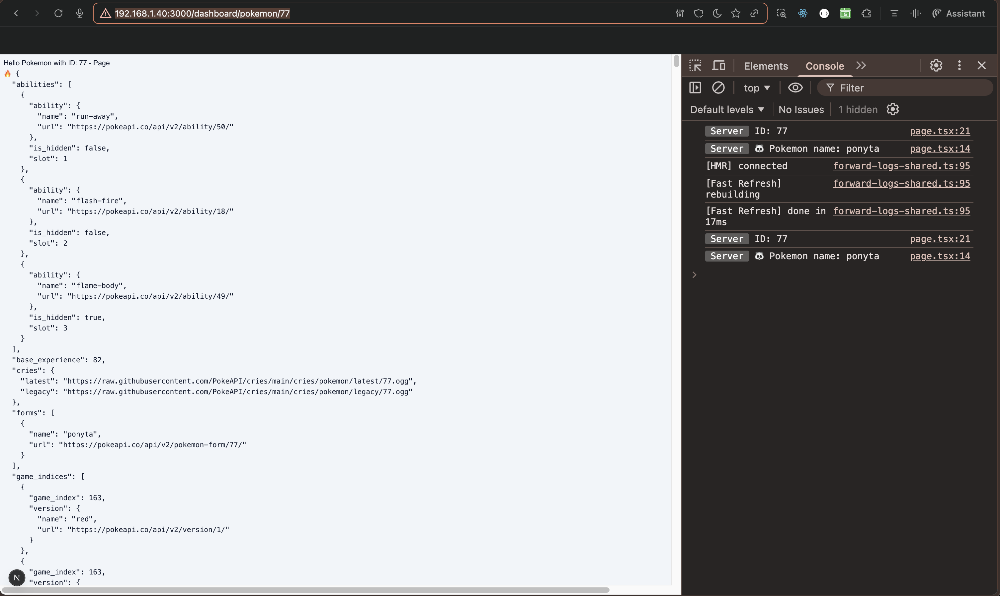


### 🧱 9.3 Pending Fixes (TODO)
```md
- [ ] Add Pokemon info inside the metadata using generateMetadata function
- [ ] Replace JSON.stringify display with proper UI components for Pokemon details
- [ ] Implement error handling for invalid Pokemon IDs (404 not found scenarios)
- [ ] Add loading state management for data fetching
- [ ] Create proper error boundary or not-found page for invalid routes
- [ ] Implement proper URL validation for the ID parameter
- [ ] Add navigation back to Pokemon list page
- [ ] Create reusable components to display Pokemon details (image, stats, abilities, types, etc.)
- [ ] Optimize cache strategy (consider revalidation or ISR for better data freshness)
- [ ] Add TypeScript error handling for API response validation
- [ ] Implement proper image optimization using Next.js Image component for Pokemon sprites
- [ ] Add metadata generation that dynamically uses the Pokemon name for SEO-friendly page titles
```


## 🔧 10. Lesson 059 — *Dynamic Metadata*

### 🧠 10.1 Context:

In Next.js, static metadata exports (`export const metadata`) work perfectly for static pages, but they cannot be used for dynamic routes that require runtime data. When building a Pokemon detail page with dynamic routes like `/pokemon/[id]`, we need to generate metadata dynamically based on the Pokemon ID.

The `generateMetadata` function is a special Next.js function that allows us to:
- Generate metadata asynchronously based on route parameters
- Access the same `params` object as the page component
- Return a `Metadata` object that will be used for SEO (title, description, Open Graph tags, etc.)
- Improve SEO by creating unique, descriptive page titles and descriptions for each Pokemon

This function runs on the server side before rendering the page, ensuring that search engines and social media platforms receive proper metadata for each Pokemon page. However, since both `generateMetadata` and the page component need Pokemon data, we must be careful to avoid duplicate API calls.

### ⚙️ 10.2 Updating code according the context:

#### 1. Impossible to have this `metadata` format for dynamic pages:
```tsx
/* src/app/dashboard/pokemon/[id]/page.tsx */
import { Pokemon } from "@/pokemons";

interface Props {
  params: Promise<{
    id: string;
  }>;
}

export const metadata = {  // 👈🏽 ✅
  title: "SEO Title",
  description: "SEO Description",
};

const getPokemon = async (id: string): Promise<Pokemon> => {
  const pokemon = await fetch(`https://pokeapi.co/api/v2/pokemon/${id}`, {
    cache: "force-cache", // TODO: change this in future steps
  }).then((resp) => resp.json());

  console.log("🐼 Pokemon name:", pokemon.name);

  return pokemon;
};

export default async function PokemonPage({ params }: Props) {
  const { id } = await params;
  console.log("ID:", id);
  const pokemon = await getPokemon(id);

  return (
    <div>
      <h1>Hello Pokemon with ID: {id} - Page</h1>
      <pre>🔥 {JSON.stringify(pokemon, null, 2)}</pre>
    </div>
  );
}
```

#### 2. Create a new function: **`generateMetadata()`**
```tsx
/* src/app/dashboard/pokemon/[id]/page.tsx */
import { Pokemon } from "@/pokemons";
import { Metadata } from "next";

interface Props {
  params: Promise<{
    id: string;
  }>;
}

//export const metadata = {
//  title: "SEO Title",
//  description: "SEO Description",
//};

export async function generateMetadata({ params }: Props): Promise<Metadata> {  // 👈🏽 ✅
  console.log("hello");
  return {
    title: "Hello",
    description: "Hello world",
  };
}

const getPokemon = async (id: string): Promise<Pokemon> => {
  const pokemon = await fetch(`https://pokeapi.co/api/v2/pokemon/${id}`, {
    cache: "force-cache", // TODO: change this in future steps
  }).then((resp) => resp.json());

  console.log("🐼 Pokemon name:", pokemon.name);

  return pokemon;
};

export default async function PokemonPage({ params }: Props) {
  const { id } = await params;
  console.log("ID:", id);
  const pokemon = await getPokemon(id);

  return (
    <div>
      <h1>Hello Pokemon with ID: {id} - Page</h1>
      <pre>🔥 {pokemon.name}</pre>  // 👈🏽 ✅
    </div>
  );
}
```

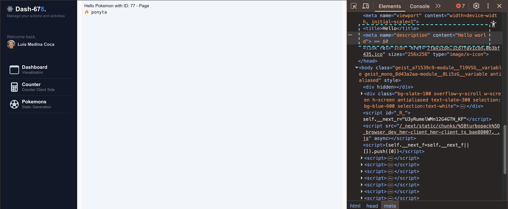


#### 3. Update this `generateMetadata` function:
```tsx
/* src/app/dashboard/pokemon/[id]/page.tsx */
import { Pokemon } from "@/pokemons";
import { Metadata } from "next";

interface Props {
  params: Promise<{
    id: string;
  }>;
}

/*
export const metadata = {
  title: "SEO Title",
  description: "SEO Description",
};
*/

export async function generateMetadata({ params }: Props): Promise<Metadata> {
  const { id } = await params;
  const pokemon = await getPokemon(id);               // 👈🏽 ✅
  return {
    title: `Pokemon #${id} - ${pokemon.name}`,        // 👈🏽 ✅
    description: `${pokemon.name} page`,              // 👈🏽 ✅
  };
}

const getPokemon = async (id: string): Promise<Pokemon> => {
  const pokemon = await fetch(`https://pokeapi.co/api/v2/pokemon/${id}`, {
    cache: "force-cache", // TODO: change this in future steps
  }).then((resp) => resp.json());

  console.log("🐼 Pokemon name:", pokemon.name);

  return pokemon;
};

export default async function PokemonPage({ params }: Props) {
  const { id } = await params;
  console.log("ID:", id);
  const pokemon = await getPokemon(id);

  return (
    <div>
      <h1>Hello Pokemon with ID: {id} - Page</h1>
      <pre>🔥 {pokemon.name}</pre>
    </div>
  );
}
```

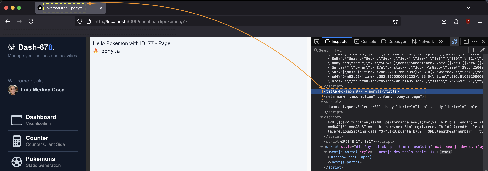
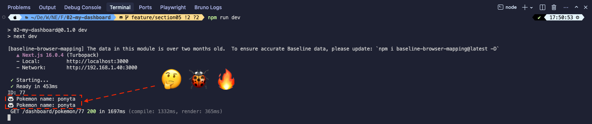


### 🐞 10.3 Issues:
- **Duplicate HTTP requests**: The `getPokemon` function is called twice - once in `generateMetadata` and once in the page component, resulting in unnecessary API calls and slower page loads.
- **No error handling**: If the Pokemon API fails or returns an invalid response, both `generateMetadata` and the page component will crash without proper error boundaries.
- **No validation**: The Pokemon ID parameter is not validated before making API calls, which could lead to unnecessary requests for invalid IDs.
- **Cache inefficiency**: While Next.js may deduplicate requests in some cases, explicitly handling this would be more reliable and performant.
- **Missing fallback metadata**: If the Pokemon fetch fails in `generateMetadata`, there's no fallback metadata, which could result in broken SEO tags.

### 🧱 10.4 Pending Fixes (TODO)

```md
- [ ] Optimize duplicate API calls by implementing request deduplication or caching strategy
- [ ] Add try-catch error handling in `generateMetadata` function to handle API failures gracefully
- [ ] Implement fallback metadata when Pokemon fetch fails in `generateMetadata`
- [ ] Add error handling in the page component with proper error boundaries
- [ ] Validate Pokemon ID parameter before making API calls (check for valid format, range, etc.)
- [ ] Create a not-found page or error page for invalid Pokemon IDs (404 scenarios)
- [ ] Consider implementing static metadata generation for all Pokemon pages at build time (using `generateStaticParams` with `generateMetadata`)
- [ ] Add TypeScript error handling for API response validation
- [ ] Implement proper error messages and user feedback when Pokemon data cannot be loaded
- [ ] Add Open Graph and Twitter Card metadata for better social media sharing
- [ ] Consider adding Pokemon image to metadata for richer social media previews
- [ ] Implement request deduplication using React cache or a custom caching solution
```


## 🔧 11. Lesson 060 — *Pokemon screen*

### 🧠 11.1 Context:

In this lesson, we create a detailed Pokemon information page that displays comprehensive information about a specific Pokemon. The page is designed as a profile card using Tailwind CSS, inspired by Horizon UI's Profile Information Card component.

The page displays:
- **Pokemon identification**: ID number and name
- **Main image**: Dream world sprite (high-quality artwork)
- **Moves**: All available moves for the Pokemon
- **Types**: Pokemon type(s) (e.g., Fire, Water, Grass)
- **Weight**: Pokemon weight value
- **Regular Sprites**: Front and back default sprites
- **Shiny Sprites**: Front and back shiny variant sprites

The implementation uses Next.js Server Components with async data fetching from the PokeAPI. The page also includes dynamic metadata generation using `generateMetadata` to improve SEO and provide proper page titles.

Additionally, we need to configure Next.js to allow loading images from external domains (like `raw.githubusercontent.com`) by updating the `next.config.ts` file with the appropriate `remotePatterns` configuration.


### ⚙️ 11.2 Updating code according the context:

#### 11.2.1 Replace the `gyst` link content in `src/app/dashboard/pokemon/[id]/page.tsx` file:

- Link: [Tailwind CSS Profile Information Card - Horizon UI Tailwind | Cards](https://www.creative-tim.com/twcomponents/component/profile-information-card-horizon-ui-tailwind)
- gist: [Pokemon screen](https://gist.github.com/Klerith/67e34298b2eb6e680514e8d16b44b328)

```tsx
/* src/app/dashboard/pokemon/[id]/page.tsx */
import { Pokemon } from "@/pokemons";
import { Metadata } from "next";
import Image from "next/image";

interface Props {
  params: Promise<{
    id: string;
  }>;
}

export async function generateMetadata({ params }: Props): Promise<Metadata> {
  const { id } = await params;
  const pokemon = await getPokemon(id);
  return {
    title: `Pokemon #${id} - ${pokemon.name}`,
    description: `${pokemon.name} page`,
  };
}

const getPokemon = async (id: string): Promise<Pokemon> => {
  const pokemon = await fetch(`https://pokeapi.co/api/v2/pokemon/${id}`, {
    cache: "force-cache", // TODO: change this in future steps
  }).then((resp) => resp.json());
  console.log("🐼 Pokemon name:", pokemon.name);
  return pokemon;
};

/*
export default async function PokemonPage({ params }: Props) {
  const { id } = await params;
  console.log("ID:", id);
  const pokemon = await getPokemon(id);

  return (
    <div>
      <h1>Hello Pokemon with ID: {id} - Page</h1>
      <pre>🔥 {pokemon.name}</pre>
    </div>
  );
}
*/

export default async function PokemonPage({ params }: Props) {. // 👈🏽 ✅
  const { id } = await params;
  const pokemon = await getPokemon(id);

  return (
    <div className="flex mt-5 flex-col items-center text-slate-800">
      <div className="relative flex flex-col items-center rounded-[20px] w-[700px] mx-auto bg-white bg-clip-border  shadow-lg  p-3">
        <div className="mt-2 mb-8 w-full">
          <h1 className="px-2 text-xl font-bold text-slate-700 capitalize">
            #{pokemon.id} {pokemon.name}
          </h1>
          <div className="flex flex-col justify-center items-center">
            <Image
              src={pokemon.sprites.other?.dream_world.front_default ?? ""}
              width={150}
              height={150}
              alt={`Imagen del pokemon ${pokemon.name}`}
              className="w-auto h-auto mb-5"
              priority={true}
            />

            <div className="flex flex-wrap">
              {pokemon.moves.map((move) => (
                <p key={move.move.name} className="mr-2 capitalize">
                  {move.move.name}
                </p>
              ))}
            </div>
          </div>
        </div>
        <div className="grid grid-cols-2 gap-4 px-2 w-full">
          <div className="flex flex-col items-start justify-center rounded-2xl bg-white bg-clip-border px-3 py-4  drop-shadow-lg ">
            <p className="text-sm text-gray-600">Types</p>
            <div className="text-base font-medium text-navy-700 flex">
              {pokemon.types.map((type) => (
                <p key={type.slot} className="mr-2 capitalize">
                  {type.type.name}
                </p>
              ))}
            </div>
          </div>

          <div className="flex flex-col items-start justify-center rounded-2xl bg-white bg-clip-border px-3 py-4  drop-shadow-lg ">
            <p className="text-sm text-gray-600">Peso</p>
            <span className="text-base font-medium text-navy-700 flex">{pokemon.weight}</span>
          </div>

          <div className="flex flex-col justify-center rounded-2xl bg-white bg-clip-border px-3 py-4  drop-shadow-lg">
            <p className="text-sm text-gray-600">Regular Sprites</p>
            <div className="flex justify-center">
              <Image src={pokemon.sprites.front_default} width={100} height={100} alt={`sprite ${pokemon.name}`} />

              <Image src={pokemon.sprites.back_default} width={100} height={100} alt={`sprite ${pokemon.name}`} />
            </div>
          </div>

          <div className="flex flex-col justify-center rounded-2xl bg-white bg-clip-border px-3 py-4  drop-shadow-lg">
            <p className="text-sm text-gray-600">Shiny Sprites</p>
            <div className="flex justify-center">
              <Image src={pokemon.sprites.front_shiny} width={100} height={100} alt={`sprite ${pokemon.name}`} />

              <Image src={pokemon.sprites.back_shiny} width={100} height={100} alt={`sprite ${pokemon.name}`} />
            </div>
          </div>
        </div>
      </div>
    </div>
  );
}
```

#### 11.2.2 Issue related to image hostname:
```ts
/* next.config.ts */
import type { NextConfig } from "next";

const nextConfig: NextConfig = {
  images: {
    remotePatterns: [
      {
        protocol: "https",
        hostname: "images.unsplash.com",
      },
      {
        protocol: "https",                        // 👈🏽 ✅
        hostname: "raw.githubusercontent.com",    // 👈🏽 ✅
      },
      {
        protocol: "https",
        hostname: "avatars.githubusercontent.com",
      },
    ],
  },
};

export default nextConfig;
```

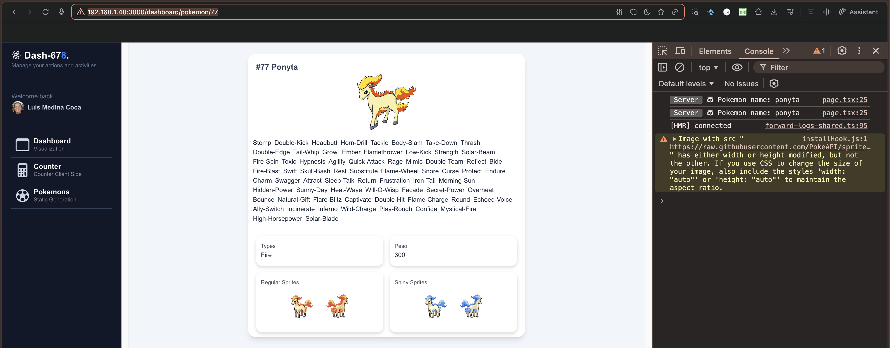

### 🐞 11.3 Issues:

- **No error handling for invalid Pokemon IDs**: When a user enters an invalid ID (non-numeric string like "abc" or a number outside the valid range like "1700"), the API call will fail but there's no error boundary or try-catch to handle this gracefully. The page will crash or display an error without user-friendly feedback.

- **No validation of Pokemon ID parameter**: The `id` parameter from the URL is not validated before making the API request. This could lead to unnecessary API calls for obviously invalid IDs.

- **Potential image loading failures**: If the Pokemon's dream world sprite doesn't exist (some Pokemon don't have this sprite), the fallback to an empty string (`?? ""`) will result in a broken image. There's no proper fallback image or error handling for missing sprites.

- **No loading state**: Since this is a Server Component, there's no loading state shown to users while the Pokemon data is being fetched, which could lead to a blank page during slow network conditions.

- **Unlimited moves display**: All Pokemon moves are displayed without any limit or pagination. Some Pokemon have 50+ moves, which could make the UI cluttered and hard to read.

- **Weight display without units**: The weight value is displayed as a raw number without indicating the unit (likely hectograms or kilograms), making it unclear to users what the value represents.

- **No error handling in `generateMetadata`**: If the Pokemon fetch fails in `generateMetadata`, the entire metadata generation will fail, potentially causing SEO issues or broken page titles.

- **Cache strategy may not be optimal**: Using `force-cache` means the Pokemon data will be cached indefinitely, which might not be ideal if Pokemon data changes or if we want to show updated information.


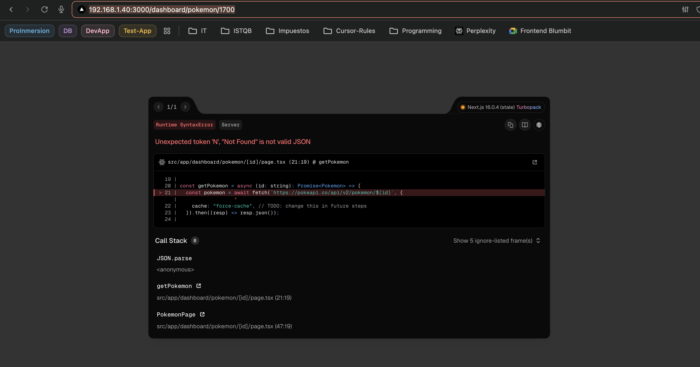

### 🧱 11.4 Pending Fixes (TODO)

```md
- [ ] Add error handling for invalid Pokemon IDs (non-numeric strings like "abc" or IDs outside valid range like "1700")
- [ ] Implement validation for Pokemon ID parameter before making API requests
- [ ] Add proper fallback image handling when dream world sprite doesn't exist
- [ ] Implement error boundary or try-catch blocks in both `generateMetadata` and page component
- [ ] Add fallback metadata when Pokemon fetch fails in `generateMetadata`
- [ ] Limit or paginate Pokemon moves display (some Pokemon have 50+ moves)
- [ ] Add units to weight display (convert from hectograms to kilograms with proper formatting)
- [ ] Consider implementing a loading.tsx file for better loading state management
- [ ] Review and optimize cache strategy (consider using `revalidate` instead of `force-cache` for better data freshness)
```


## 🔧 12. Lesson 061 — *Debugging code - Breakpoints*

### 🧠 12.1 Context:

Debugging is an essential skill for developers, and breakpoints are one of the most powerful tools for understanding code execution flow and identifying bugs. In this lesson, we learn how to set up and use breakpoints in VS Code (or Cursor) to debug Next.js applications.

**What are Breakpoints?**
Breakpoints are markers placed in your code that pause execution when reached, allowing you to:
- Inspect variable values at that point in execution
- Step through code line by line
- Evaluate expressions in the current context
- Understand the call stack and execution flow
- Identify where bugs occur or unexpected behavior happens

**Debugging in Next.js:**
Next.js applications can be debugged using VS Code's built-in debugger. The debugger works with both:
- **Server Components**: Code that runs on the server (like `getPokemon` function)
- **Client Components**: Code that runs in the browser (marked with `"use client"`)

**How it Works:**
1. Set a breakpoint by clicking in the gutter (left of line numbers) or pressing `F9` on a line
2. Start the debugger using the Debug panel or keyboard shortcuts
3. When execution reaches the breakpoint, the debugger pauses
4. You can inspect variables, step over/into functions, and continue execution

**Debugging Server-Side Code:**
For Next.js Server Components and API routes, the debugger attaches to the Node.js process running the Next.js dev server. This allows you to debug server-side code execution, inspect async operations, and trace data fetching logic.

**Benefits:**
- Faster bug identification compared to console.log statements
- Visual inspection of variable states
- Step-by-step code execution analysis
- Better understanding of async/await flow
- Ability to modify variable values on the fly for testing


### ⚙️ 12.2 Updating code according the context:

Add a breaking point at `console.log("🐼 Pokemon name:", pokemon.name);` line in `getPokemon()` method.
```tsx
/* src/app/dashboard/pokemon/[id]/page.tsx */
import { Pokemon } from "@/pokemons";
import { Metadata } from "next";
import Image from "next/image";

interface Props {
  params: Promise<{
    id: string;
  }>;
}

export async function generateMetadata({ params }: Props): Promise<Metadata> {
  const { id } = await params;
  const pokemon = await getPokemon(id);
  return {
    title: `Pokemon #${id} - ${pokemon.name}`,
    description: `${pokemon.name} page`,
  };
}

const getPokemon = async (id: string): Promise<Pokemon> => {
  const pokemon = await fetch(`https://pokeapi.co/api/v2/pokemon/${id}`, {
    cache: "force-cache", // TODO: change this in future steps
  }).then((resp) => resp.json());

  🔴 console.log("🐼 Pokemon name:", pokemon.name);

  return pokemon;
};

export default async function PokemonPage({ params }: Props) {
  const { id } = await params;
  const pokemon = await getPokemon(id);

  return (
    <div className="flex mt-5 flex-col items-center text-slate-800">
      <div className="relative flex flex-col items-center rounded-[20px] w-[700px] mx-auto bg-white bg-clip-border  shadow-lg  p-3">
        ...
      </div>
    </div>
  );
}

```
#### 12.2.1 Go to `package.json` file:
1. Click on `Debug` button:


2. Select `dev next dev`:

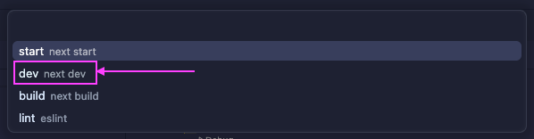

3. Expected Result:

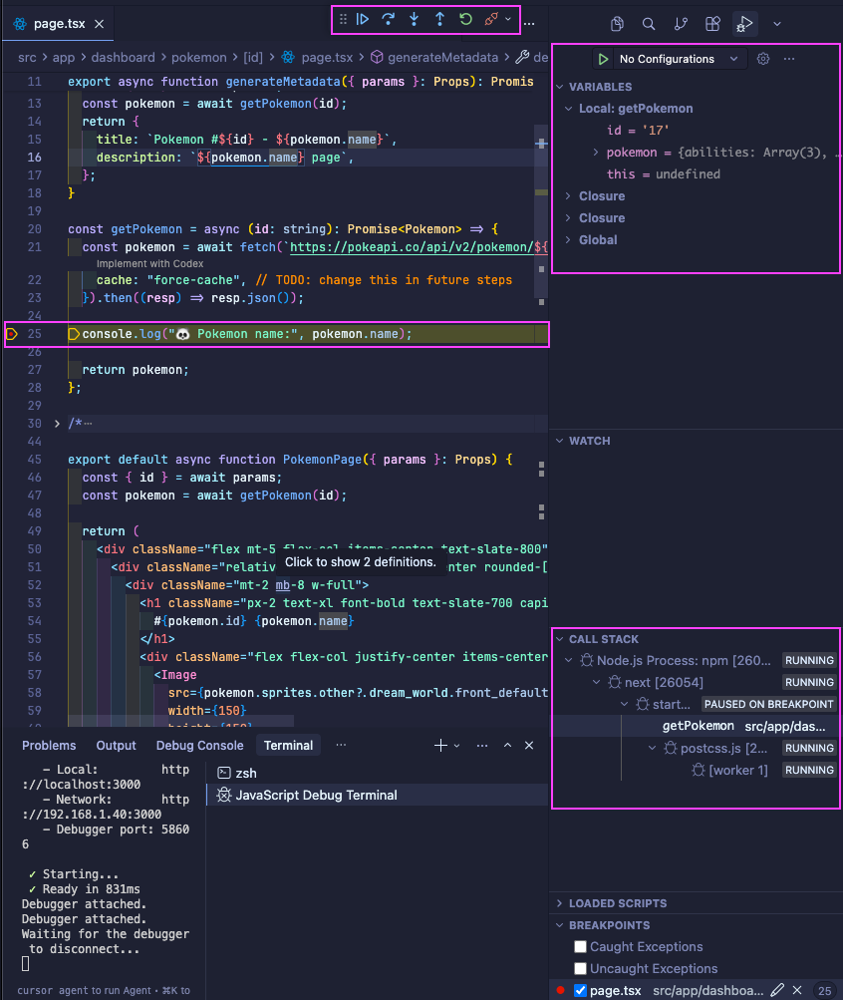

#### 12.2.2 Fastest mode:
1. `CMD/Ctrl + P`:
2. Write `> Debug`
3. Click on `Debug: Debug npm Script`

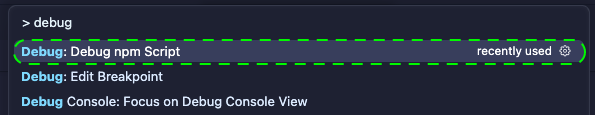


### 🐞 12.3 Issues:

- **Breakpoints may not hit in Server Components without proper configuration**: If the debugger isn't properly configured or if source maps aren't generated correctly, breakpoints in Server Components might not pause execution, making debugging difficult.

- **Debugging async functions can be confusing**: When debugging async functions like `getPokemon`, stepping through code can jump between different execution contexts, making it harder to follow the flow, especially with `.then()` chains vs async/await.

- **No error handling in debugged code**: The `getPokemon` function doesn't have try-catch blocks, so if the API call fails during debugging, the error might not be caught gracefully, potentially crashing the debug session.

- **Breakpoints in `generateMetadata` might not work as expected**: Since `generateMetadata` runs during build time and request time, breakpoints might only hit during certain phases, making it harder to debug metadata generation issues.

- **Console.log statements left in production code**: The `console.log("🐼 Pokemon name:", pokemon.name);` statement is left in the code, which should be removed or replaced with proper logging in production builds.

- **No conditional breakpoints demonstrated**: The lesson only shows simple breakpoints, but conditional breakpoints (e.g., break only when `pokemon.id === 25`) can be more powerful for debugging specific scenarios.

- **Debugging might not work if Next.js dev server isn't started via debugger**: If you start the dev server manually (`npm run dev`) instead of through the debugger, breakpoints won't work because the debugger isn't attached to the process.

- **Source map issues with TypeScript**: If TypeScript source maps aren't configured correctly, breakpoints might hit at incorrect lines or show transpiled JavaScript instead of the original TypeScript code.

- **No debugging configuration file (launch.json)**: The lesson relies on VS Code's automatic detection, but a proper `launch.json` configuration file would provide more control and better debugging experience.

- **Breakpoints in multiple files simultaneously**: When debugging, you might need to set breakpoints in multiple files (e.g., both `page.tsx` and utility functions), but the lesson only demonstrates breakpoints in a single file.

### 🧱 12.4 Pending Fixes (TODO)

```md
- [ ] Create a proper `.vscode/launch.json` configuration file for Next.js debugging with explicit settings
- [ ] Add error handling (try-catch) to `getPokemon` function to make debugging errors more graceful
- [ ] Remove or replace `console.log` statements with proper logging solution (e.g., using a logger utility)
- [ ] Document how to set conditional breakpoints for debugging specific scenarios (e.g., break when pokemon.id === 25)
- [ ] Add instructions for debugging Client Components separately from Server Components
- [ ] Configure TypeScript source maps properly in `tsconfig.json` to ensure accurate breakpoint locations
- [ ] Document how to debug API routes and middleware in Next.js
- [ ] Add instructions for debugging production builds (requires source maps in production)
- [ ] Create a debugging guide for common Next.js debugging scenarios (data fetching, routing, etc.)
- [ ] Add breakpoints in multiple files to demonstrate debugging across component boundaries
- [ ] Document how to use VS Code's debug console to evaluate expressions during debugging
- [ ] Add instructions for using watch expressions to monitor variable values during debugging
- [ ] Document how to debug async/await vs Promise chains for better understanding of execution flow
- [ ] Add instructions for debugging `generateMetadata` function specifically (build-time vs runtime)
- [ ] Create a checklist for debugging setup to ensure breakpoints work correctly
```


## 🔧 13. Lesson 062 — *Not found Page - 404*

### 🧠 13.1 Context:

In Next.js 13+ with the App Router, handling 404 errors is done through special `not-found.tsx` files. Next.js provides a built-in mechanism to display custom 404 pages when a route is not found or when `notFound()` function is called programmatically.

This lesson focuses on implementing custom 404 pages at two levels:
1. **Global level** (`src/app/not-found.tsx`): Handles 404 errors for routes that don't exist anywhere in the application
2. **Route-specific level** (`src/app/dashboard/pokemon/[id]/not-found.tsx`): Handles 404 errors specifically for non-existent Pokemon IDs

When a user tries to access a Pokemon page with an invalid ID (e.g., `/dashboard/pokemon/99999`), the `getPokemon` function detects the error and calls `notFound()`, which triggers the route-specific `not-found.tsx` page. This provides a better user experience than showing a generic error or blank page.

The implementation includes:
- Error handling in the `getPokemon` function using `notFound()` from Next.js navigation
- Try-catch blocks in `generateMetadata` to handle metadata generation errors gracefully
- Styled 404 pages with consistent design matching the dashboard layout
- Navigation links to help users return to valid pages

### ⚙️ 13.2 Updating code according the context:

- Enter a URL searching for non-existent pokemon page.
- Return a basic 404 page.


#### 13.2.1 Create `not-found.tsx` file a global level:
```tsx
/* src/app/not-found.tsx */
import Link from "next/link";

export default function NotFound() {
  return (
    <div>
      <h2>Not Found</h2>
      <p>Could not find requested resource</p>
      <Link href="/dashboard/counter">Go to Counter Page</Link>  // 👈🏽 ✅
    </div>
  );
}
```
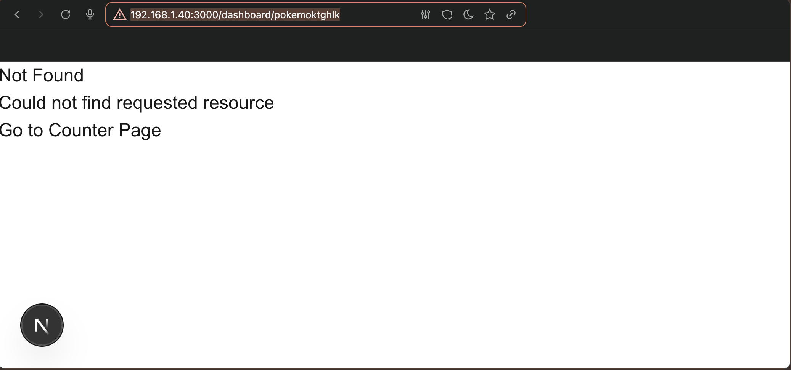

#### 13.2.2 Add style to `not-found.tsx` file:
- using some code from `dashboard/layout.tsx`
```tsx
/* src/app/dashboard/layout.tsx */
<div className="bg-slate-100 overflow-y-scroll w-screen h-screen antialiased text-slate-300 selection:bg-blue-600 selection:text-white">
      <div className="flex">
        <Sidebar />
        <div className="p-2 w-full text-slate-900">
          {.... from "https://www.creative-tim.com/twcomponents/component/404-page-not-found" }
        </div>
      </div>
    </div>
```

[404 Page Not Found | Pages, Widget](https://www.creative-tim.com/twcomponents/component/404-page-not-found)


#### 13.2.3 Finally `not-found` page looks like:
```tsx
/* src/app/not-found.tsx */
import { Sidebar } from "@/components/Sidebar";
import Link from "next/link";

export default function NotFound() {
  return (
    <div className="bg-slate-100 overflow-y-scroll w-screen h-screen antialiased text-slate-300 selection:bg-blue-600 selection:text-white">
      <div className="flex">
        <Sidebar />
        <div className="p-2 w-full text-slate-900">
          <main className="h-screen w-full flex flex-col justify-center items-center bg-[#1A2238]">
            <h1 className="text-9xl font-extrabold text-white tracking-widest">404</h1>
            <div className="bg-[#FF6A3D] px-2 text-sm rounded rotate-12 absolute">Page Not Found</div>
            <button className="mt-5">
              <a className="relative inline-block text-sm font-medium text-[#FF6A3D] group active:text-orange-500 focus:outline-none focus:ring">
                <span className="absolute inset-0 transition-transform translate-x-0.5 translate-y-0.5 bg-[#FF6A3D] group-hover:translate-y-0 group-hover:translate-x-0"></span>
                <span className="relative block px-8 py-3 bg-[#1A2238] border border-current">
                  <Link href="/dashboard/main">Go Dashboard</Link>
                </span>
              </a>
            </button>
          </main>
        </div>
      </div>
    </div>
  );
}
```
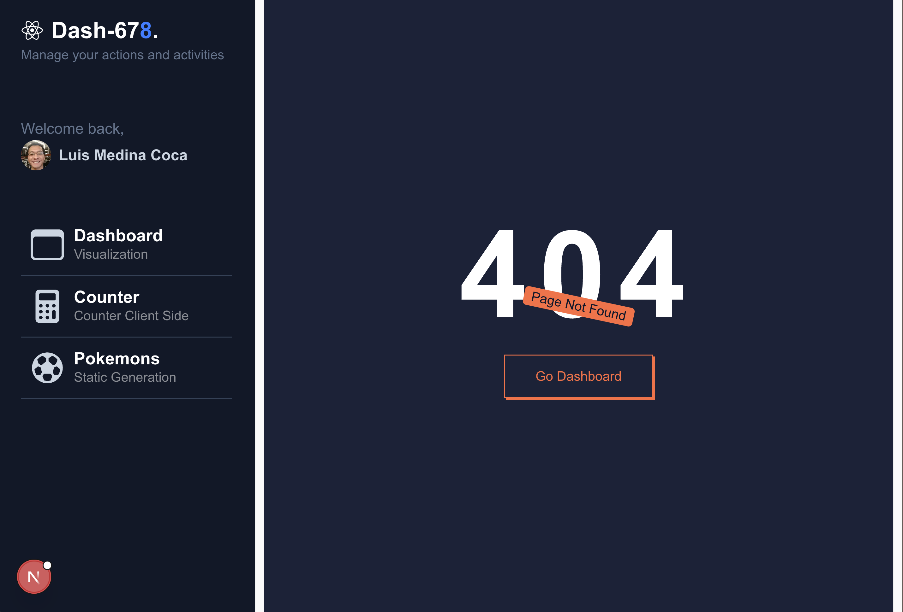


#### 13.2.4 Adding `try-catch` in metadata pokemon ID page:
```tsx
/* src/app/dashboard/pokemon/[id]/page.tsx */
import { Pokemon } from "@/pokemons";
import { Metadata } from "next";
import Image from "next/image";

interface Props {
  params: Promise<{
    id: string;
  }>;
}

export async function generateMetadata({ params }: Props): Promise<Metadata> {
  const { id } = await params;
  const pokemon = await getPokemon(id);
  try {  // 👈🏽 ✅
    return {
      title: `Pokemon #${id} - ${pokemon.name}`,
      description: `${pokemon.name} page`,
    };
  } catch (error) {  // 👈🏽 ✅
    return {
      title: "Pokemon page not found",
      description: "Pokemon page not found",
    };
  }
}

const getPokemon = async (id: string): Promise<Pokemon> => {
  const pokemon = await fetch(`https://pokeapi.co/api/v2/pokemon/${id}`, {
    cache: "force-cache", // TODO: change this in future steps
  }).then((resp) => resp.json());

  console.log("🐼 Pokemon name:", pokemon.name);

  return pokemon;
};

export default async function PokemonPage({ params }: Props) {
  const { id } = await params;
  const pokemon = await getPokemon(id);

  return (
    <div className="flex mt-5 flex-col items-center text-slate-800">
      <div className="relative flex flex-col items-center rounded-[20px] w-[700px] mx-auto bg-white bg-clip-border shadow-lg p-3">
        <div className="mt-2 mb-8 w-full">
          <h1 className="px-2 text-xl font-bold text-slate-700 capitalize">
            #{pokemon.id} {pokemon.name}
          </h1>
          <div className="flex flex-col justify-center items-center">
            <Image
              src={pokemon.sprites.other?.dream_world.front_default ?? ""}
              width={150}
              height={150}
              alt={`Imagen del pokemon ${pokemon.name}`}
              className="w-auto h-auto mb-5"
              priority={true}
            />

            <div className="flex flex-wrap">
              {pokemon.moves.map((move) => (
                <p key={move.move.name} className="mr-2 capitalize">
                  {move.move.name}
                </p>
              ))}
            </div>
          </div>
        </div>
        <div className="grid grid-cols-2 gap-4 px-2 w-full">
          <div className="flex flex-col items-start justify-center rounded-2xl bg-white bg-clip-border px-3 py-4  drop-shadow-lg ">
            <p className="text-sm text-gray-600">Types</p>
            <div className="text-base font-medium text-navy-700 flex">
              {pokemon.types.map((type) => (
                <p key={type.slot} className="mr-2 capitalize">
                  {type.type.name}
                </p>
              ))}
            </div>
          </div>

          <div className="flex flex-col items-start justify-center rounded-2xl bg-white bg-clip-border px-3 py-4  drop-shadow-lg ">
            <p className="text-sm text-gray-600">Peso</p>
            <span className="text-base font-medium text-navy-700 flex">{pokemon.weight}</span>
          </div>

          <div className="flex flex-col justify-center rounded-2xl bg-white bg-clip-border px-3 py-4  drop-shadow-lg">
            <p className="text-sm text-gray-600">Regular Sprites</p>
            <div className="flex justify-center">
              <Image src={pokemon.sprites.front_default} width={100} height={100} alt={`sprite ${pokemon.name}`} />

              <Image src={pokemon.sprites.back_default} width={100} height={100} alt={`sprite ${pokemon.name}`} />
            </div>
          </div>

          <div className="flex flex-col justify-center rounded-2xl bg-white bg-clip-border px-3 py-4  drop-shadow-lg">
            <p className="text-sm text-gray-600">Shiny Sprites</p>
            <div className="flex justify-center">
              <Image src={pokemon.sprites.front_shiny} width={100} height={100} alt={`sprite ${pokemon.name}`} />

              <Image src={pokemon.sprites.back_shiny} width={100} height={100} alt={`sprite ${pokemon.name}`} />
            </div>
          </div>
        </div>
      </div>
    </div>
  );
}
```
#### 13.2.5 Copy/Paste the `not-found.tsx` file into `src/app/dashboard/pokemon/[id]` folder and update changes:
```tsx
/*  */
import Link from "next/link";
export default function NotFound() {
  return (
    <main className="h-screen w-full flex flex-col justify-center items-center bg-[#1A2238]">
      <h1 className="text-9xl font-extrabold text-white tracking-widest">404</h1>
      <div className="bg-[#FF6A3D] px-2 text-sm rounded rotate-12 absolute">Pokémon Not Found</div>
      <button className="mt-5">
        <a className="relative inline-block text-sm font-medium text-[#FF6A3D] group active:text-orange-500 focus:outline-none focus:ring">
          <span className="absolute inset-0 transition-transform translate-x-0.5 translate-y-0.5 bg-[#FF6A3D] group-hover:translate-y-0 group-hover:translate-x-0"></span>
          <span className="relative block px-8 py-3 bg-[#1A2238] border border-current">
            <Link href="/dashboard/pokemons">Go Pokemon Dashboard</Link>
          </span>
        </a>
      </button>
    </main>
  );
}
```
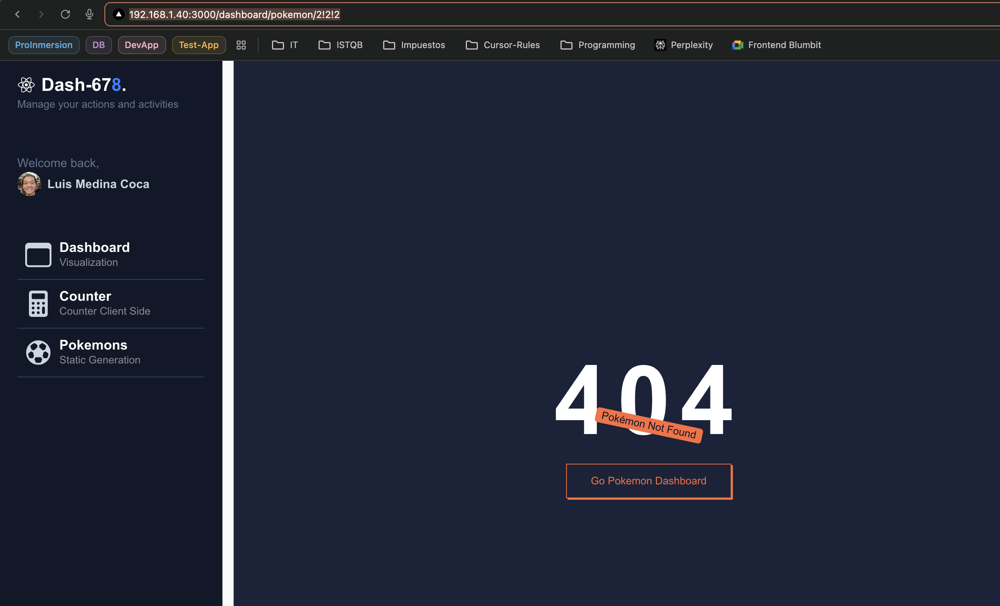

### 🐞 13.3 Issues:

- **Issue 1: Try-catch in generateMetadata doesn't properly handle notFound()**: The `generateMetadata` function wraps `getPokemon` in a try-catch block, but `getPokemon` calls `notFound()` which throws a special Next.js error that should not be caught. When `notFound()` is called, it should propagate up to trigger the `not-found.tsx` page, but the try-catch might interfere with this behavior.

- **Issue 2: Inconsistent layout between global and pokemon-specific not-found pages**: The global `not-found.tsx` includes the Sidebar component and matches the dashboard layout, while the pokemon-specific `not-found.tsx` only renders the main content without the Sidebar. This creates an inconsistent user experience.

- **Issue 3: Missing await in getPokemon function**: In the actual implementation, there's a potential issue where `resp.json()` might not be awaited properly, which could cause race conditions or incorrect error handling.

- **Issue 4: Padding inconsistency**: The global `not-found.tsx` has padding (`p-2`) in the wrapper div, but the pokemon-specific `not-found.tsx` doesn't have any padding, causing layout inconsistencies. Additionally, the pokemon-specific page doesn't inherit the dashboard layout structure.

- **Issue 5: Error handling in generateMetadata**: The try-catch in `generateMetadata` catches errors but doesn't call `notFound()`, which means if `getPokemon` fails, it will return default metadata instead of triggering the 404 page. This could lead to incorrect metadata being generated for non-existent Pokemon.

### 🧱 13.4 Pending Fixes (TODO)

```md
- [ ] Fix padding inconsistency in 404 Pokemon Not Found page (add proper padding or wrap with dashboard layout)
- [ ] Fix padding inconsistency in 404 not found general page (ensure consistent padding with dashboard layout)
- [ ] Refactor generateMetadata to properly handle notFound() calls without try-catch interference
- [ ] Ensure pokemon-specific not-found.tsx inherits dashboard layout structure (add Sidebar and consistent styling)
- [ ] Add proper error handling in getPokemon function to ensure notFound() is called correctly
- [ ] Verify that await is properly used in getPokemon function for resp.json() call
- [ ] Consider extracting not-found page styles into a reusable component to maintain consistency
- [ ] Add proper TypeScript types for error handling in generateMetadata function
```


## 🔧 14. Lesson 063 — *Wrap-Up Notes*

### 🧠 14.1 Context:

This lesson serves as a wrap-up for Section 05, focusing on understanding how Next.js determines which pages are statically generated at build time versus which pages are dynamically rendered on the server. Understanding this distinction is crucial for optimizing application performance and making informed decisions about caching strategies.

**Key Concepts:**
- **Static Generation (○)**: Pages that are pre-rendered at build time and served as static HTML files. These pages are fast, cacheable, and ideal for content that doesn't change frequently.
- **Dynamic Rendering (ƒ)**: Pages that are rendered on-demand on the server for each request. These pages are necessary when content depends on request-time data or user-specific information.

**Why This Matters:**
- Static pages provide the best performance and can be cached at the CDN level
- Dynamic pages allow for personalized content and real-time data
- The build output shows which rendering strategy Next.js has chosen for each route
- Understanding this helps developers optimize their application's performance and caching strategy

**Build Output Analysis:**
When running `npm run build`, Next.js analyzes each route and determines the optimal rendering strategy based on:
- Whether the page uses dynamic functions (`cookies()`, `headers()`, `searchParams`)
- Whether the page uses dynamic route segments (`[id]`, `[slug]`)
- Whether the page uses `generateStaticParams()` to pre-generate specific routes
- Cache configuration in fetch requests (`force-cache`, `no-store`, etc.)

### ⚙️ 14.2 Updating code according the context:

#### 14.2.1 Verify which URL pages will be generated by server side or will be static:

1. Run from terminal:
```bash
npm run build
```

2. Analyze the build output to see which routes are static (○) and which are dynamic (ƒ):

```bash
Route (app)
┌ ○ /
├ ○ /_not-found
├ ○ /dashboard/counter
├ ○ /dashboard/main
├ ƒ /dashboard/pokemon/[id]
└ ○ /dashboard/pokemons
```

**Route Analysis:**

- **`/` (○ Static)**: The homepage redirects to `/dashboard/counter`, so it's statically generated
- **`/_not-found` (○ Static)**: The global 404 page is statically generated
- **`/dashboard/counter` (○ Static)**: Client-side counter page with no server-side data fetching, statically generated
- **`/dashboard/main` (○ Static)**: Main dashboard page with no dynamic content, statically generated
- **`/dashboard/pokemon/[id]` (ƒ Dynamic)**: Dynamic route that fetches Pokemon data based on the `id` parameter. Since it uses dynamic route segments and fetches data at request time, it's server-rendered on demand
- **`/dashboard/pokemons` (○ Static)**: The Pokemon list page uses `force-cache` in fetch, so it's statically generated at build time

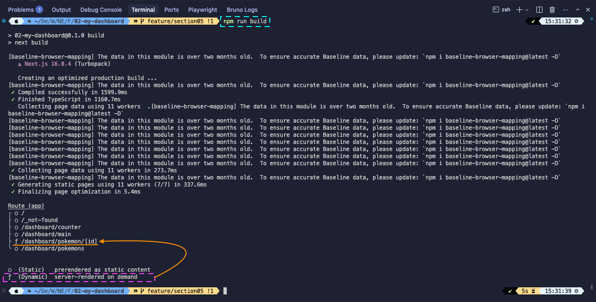

#### 14.2.2 Understanding the Pokemon dynamic route:

The `/dashboard/pokemon/[id]` route is marked as dynamic (ƒ) because:

1. **Dynamic Route Segment**: Uses `[id]` parameter that can be any value
2. **Request-time Data Fetching**: Fetches Pokemon data based on the URL parameter
3. **No Static Generation**: Doesn't use `generateStaticParams()` to pre-generate specific Pokemon pages
4. **Error Handling**: Uses `notFound()` which requires server-side rendering to handle 404 cases

**Current Implementation:**
```tsx
/* src/app/dashboard/pokemon/[id]/page.tsx */
export async function generateMetadata({ params }: Props): Promise<Metadata> {
  const { id } = await params;
  try {
    const pokemon = await getPokemon(id); // 👈🏽 ✅ (1) - Moved inside try block
    return {
      title: `Pokemon #${id} - ${pokemon.name}`,
      description: `${pokemon.name} page`,
    };
  } catch {
    return {
      title: "Pokemon page not found",
      description: "Pokemon page not found",
    };
  }
}

const getPokemon = async (id: string): Promise<Pokemon> => {
  const resp = await fetch(`https://pokeapi.co/api/v2/pokemon/${id}`, {
    cache: "force-cache", // TODO: change this in future steps
  });
  if (!resp.ok) {
    notFound(); // Esto activará not-found.tsx
  }

  const pokemon = await resp.json(); // 👈🏽 ✅ (2) - Fixed: Added await
  console.log("🐼 Pokemon name:", pokemon);
  return pokemon;
};
```

**Note**: Even though `cache: "force-cache"` is used, the route is still dynamic because:
- The route segment `[id]` is dynamic
- Next.js cannot determine all possible `id` values at build time
- The page needs to handle invalid IDs with `notFound()` at request time

### 🐞 14.3 Issues:

- **Issue 1: Missing await in getPokemon function**: The `resp.json()` call was missing `await`, which could cause the function to return a Promise instead of the actual Pokemon data. This has been fixed in the code example above.

- **Issue 2: Cache strategy inconsistency**: The Pokemon detail page uses `cache: "force-cache"` but is still rendered dynamically. This means the cache is per-request, not build-time. Consider using `generateStaticParams()` if you want to pre-generate specific Pokemon pages at build time.

- **Issue 3: No static generation optimization**: The Pokemon detail pages are not pre-generated, meaning every request requires a server-side render. For better performance, consider implementing `generateStaticParams()` to pre-generate the first 151 Pokemon (or a subset) at build time.

- **Issue 4: Console.log in production code**: The `console.log("🐼 Pokemon name:", pokemon)` statement should be removed or replaced with proper logging for production builds.

### 🧱 14.4 Pending Fixes (TODO)

```md
- [ ] Fix missing await in getPokemon function for resp.json() call (already fixed in documentation)
- [ ] Implement generateStaticParams() to pre-generate first 151 Pokemon pages at build time for better performance
- [ ] Consider changing cache strategy from "force-cache" to "no-store" if Pokemon data changes frequently
- [ ] Remove or replace console.log statements with proper logging solution for production
- [ ] Add ISR (Incremental Static Regeneration) strategy if Pokemon data needs periodic updates
- [ ] Consider implementing on-demand revalidation for Pokemon pages when data updates
- [ ] Add performance monitoring to track server-side render times for dynamic Pokemon pages
- [ ] Document the decision between static generation vs dynamic rendering for future routes
- [ ] Consider implementing a hybrid approach: pre-generate popular Pokemon (1-151) and dynamically render others
- [ ] Add error tracking and monitoring for failed Pokemon data fetches
```


---


# 👨🏾‍💻 Section 06: Incremental and Static Generation

## 📑 Table of Contents

- [⚙️ Section: Dynamic Generation – SSR](#️-section-dynamic-generation--ssr)
  - [📑 Table of Contents](#-table-of-contents-1)
  - [🔧 Lesson 069 — *Static generation and revalidation*](#-1-lesson-069--Static-generation-and-revalidation-)


## 🔧 1. Lesson 069 — *Static generation and revalidation*

### 🧠 1.1 Context:

**Static Site Generation (SSG)** is a Next.js rendering strategy where pages are pre-rendered at build time into static HTML files. This approach provides optimal performance, SEO benefits, and reduces server load by serving pre-generated content.

**When Static Generation Occurs:**
- During the build process (`npm run build`)
- Pages are generated once and served as static files
- No server-side computation needed at request time
- Content is determined at build time, not request time

**`generateStaticParams()` Function:**
This function allows you to specify which dynamic route parameters should be pre-rendered at build time. In this lesson, we use it to pre-generate pages for the first 151 Pokemon (IDs 1-151) instead of rendering them on-demand.

**How It Works in This Project:**
- The `generateStaticParams()` function returns an array of objects with route parameters
- Each object represents a route that will be statically generated
- For Pokemon pages: `[{ id: "1" }, { id: "2" }, ...]` generates `/pokemon/1`, `/pokemon/2`, etc.
- Next.js pre-renders these pages during build time
- Pages not in the list are still accessible but rendered on-demand (ISR fallback)

**Revalidation:**
Revalidation is the process of regenerating static pages after they've been built. While this lesson focuses on static generation, revalidation strategies (ISR - Incremental Static Regeneration) allow pages to be updated periodically without rebuilding the entire site.

**Advantages:**
- **Performance**: Fastest possible page load times (served as static files)
- **SEO**: Search engines can easily crawl pre-rendered HTML
- **Cost**: Reduced server costs (no server computation per request)
- **Scalability**: Static files can be cached at CDN level
- **Reliability**: No server failures affect static pages

**Disadvantages:**
- **Build Time**: All pages must be generated during build (can slow down builds)
- **Stale Data**: Content is frozen at build time (unless using revalidation)
- **Dynamic Content**: Not suitable for user-specific or real-time content
- **Storage**: Requires storage for all generated static files

**When to Consider Alternatives:**
- **Server-Side Rendering (SSR)**: When content changes frequently or is user-specific
- **Client-Side Rendering**: When content is highly dynamic and user-interactive
- **ISR (Incremental Static Regeneration)**: When you need static performance but with periodic updates
- **On-Demand Revalidation**: When you need to update specific pages after data changes

**Project Implementation:**
In this lesson, we implement static generation for Pokemon detail pages by:
1. Using `Array.from({ length: 151 })` to create an array of 151 elements
2. Mapping the array to generate Pokemon IDs from 1 to 151
3. Returning these IDs in `generateStaticParams()` to pre-generate 151 Pokemon pages
4. Using `cache: "force-cache"` to ensure data is cached during build time
5. Pages are pre-built during `npm run build` and stored in `.next/server/app/dashboard/pokemon/`

**Build Output Analysis:**
After implementing `generateStaticParams()`, running `npm run build` shows:
- The `/dashboard/pokemon/[id]` route changes from dynamic (ƒ) to static (○) for the 151 pre-generated pages
- Additional Pokemon pages (beyond 151) are still rendered on-demand
- Build time increases as 151 pages are generated, but runtime performance improves significantly

### ⚙️ 1.2 Updating code according the context:

#### 1.2.1 Remember - create an array:
```tsx
Array.from({ length: 151 })
```
> Expected Result:

+ An array with 151 elements and each element is `undefined`.

```tsx
Array.from({ length: 151 }).map( (value, index) => index + 1);
```

> Expected Result:

+ An array with 151 elements and each element is `index + 1`.

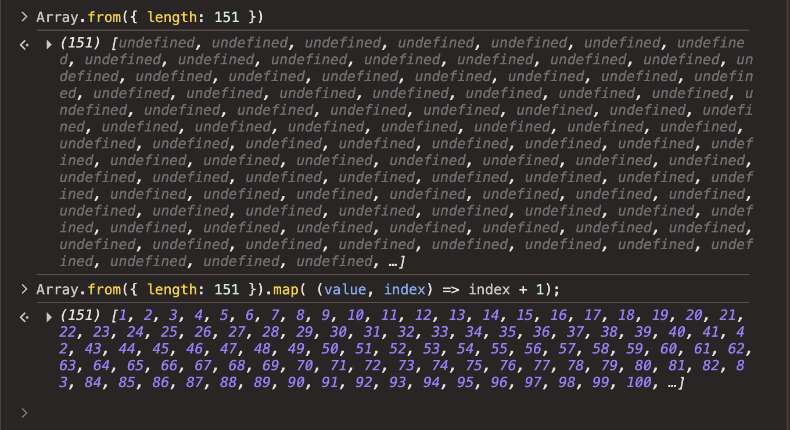


#### 1.2.2 Add the `generateStaticParams()` method with some static values:
```tsx
/* src/app/dashboard/pokemon/[id]/page.tsx */
import { Pokemon } from "@/pokemons";
import { Metadata } from "next";
import Image from "next/image";
import { notFound } from "next/navigation";
interface Props {
  params: Promise<{
    id: string;
  }>;
}

export async function generateStaticParams() { // 👈🏽 ✅ 
  return [
    { id: "1" }, 
    { id: "2" }, 
    { id: "3" }, 
    { id: "4" }
  ];
}

export async function generateMetadata({ params }: Props): Promise<Metadata> {
  const { id } = await params;
  try {
    const pokemon = await getPokemon(id);
    return {
      title: `Pokemon #${id} - ${pokemon.name}`,
      description: `${pokemon.name} page`,
    };
  } catch {
    return {
      title: "Pokemon page not found",
      description: "Pokemon page not found",
    };
  }
}
const getPokemon = async (id: string): Promise<Pokemon> => {
  const resp = await fetch(`https://pokeapi.co/api/v2/pokemon/${id}`, {
    cache: "force-cache", // TODO: change this in future steps
  });
  //.then((resp) => {
  if (!resp.ok) {
    notFound(); 
  }
  const pokemon = await resp.json();
  console.log("🐼 Pokemon name:", pokemon);
  return pokemon;
};
export default async function PokemonPage({ params }: Props) {
  const { id } = await params;
  const pokemon = await getPokemon(id);

  return (....);
}
```

#### 1.2.3 Go to the terminal and run:
```bash
npm run build
```

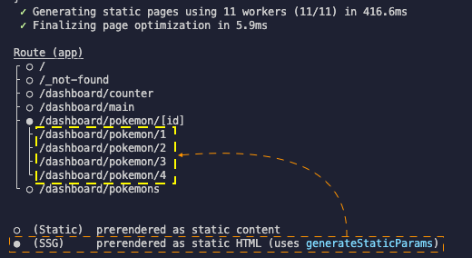


```bash
npm run start
```

- Then go to `.next/server/app/dashboard/pokemon`
- There are only 4 preloaded Pokémon pages

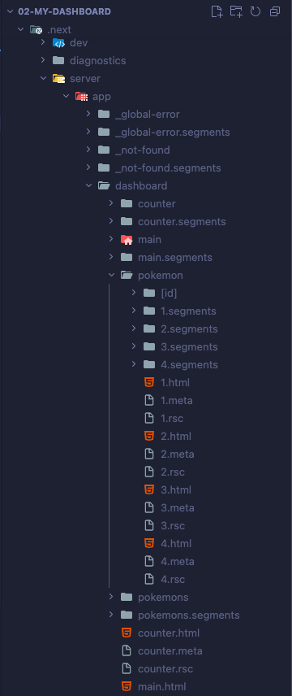

* In case user scrolls down, all data will be built and loaded on demand!

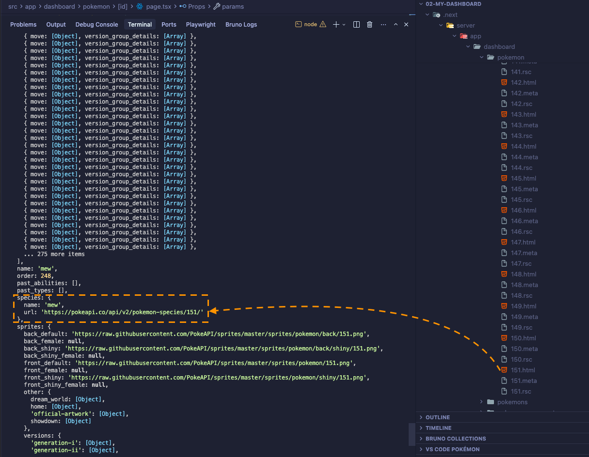

#### 1.2.4 Adding the algorithm to generate the 151 pokemons element in an array:
```ts
/* src/app/dashboard/pokemon/[id]/page.tsx */
import { Pokemon } from "@/pokemons";
import { Metadata } from "next";
import Image from "next/image";
import { notFound } from "next/navigation";
interface Props {
  params: Promise<{
    id: string;
  }>;
}

export async function generateStaticParams() {
  const static151Pokemons = Array.from({ length: 151 }).map((value, index) => `${index + 1}`);
  //return [{ id: "1" }, { id: "2" }, { id: "3" }, { id: "4" }];

  return static151Pokemons.map((id) => ({ // 👈🏽 ✅ 
    id: id,
  }));
}

export async function generateMetadata({ params }: Props): Promise<Metadata> {
  const { id } = await params;
  try {
    const pokemon = await getPokemon(id);
    return {
      title: `Pokemon #${id} - ${pokemon.name}`,
      description: `${pokemon.name} page`,
    };
  } catch {
    return {
      title: "Pokemon page not found",
      description: "Pokemon page not found",
    };
  }
}

const getPokemon = async (id: string): Promise<Pokemon> => {
  const resp = await fetch(`https://pokeapi.co/api/v2/pokemon/${id}`, {
    cache: "force-cache", // TODO: change this in future steps
  });
  if (!resp.ok) {
    notFound(); 
  }
  const pokemon = await resp.json();
  console.log("🐼 Pokemon name:", pokemon);
  return pokemon;
};
export default async function PokemonPage({ params }: Props) {
  const { id } = await params;
  const pokemon = await getPokemon(id);

  return (....);
}
```


### 🐞 1.3 Issues:

| Issue | Status | Log/Error |
|---|---|---|
| **Missing revalidation strategy** | ⚠️ Identified | No revalidation configured in `getPokemon()` function. Using `cache: "force-cache"` means Pokemon data will never update after build time. If Pokemon data changes in the API, pages will show stale content until next build. Location: `src/app/dashboard/pokemon/[id]/page.tsx:39-40` |
| **Console.log in production code** | ⚠️ Identified | `console.log("🐼 Pokemon name:", pokemon)` statement should be removed or replaced with proper logging solution for production. Location: `src/app/dashboard/pokemon/[id]/page.tsx:49` |
| **Hardcoded Pokemon count** | ℹ️ Low Priority | The number 151 is hardcoded in `generateStaticParams()`. Consider making it configurable or extracting to a constant. Location: `src/app/dashboard/pokemon/[id]/page.tsx:14` |
| **No error handling in generateStaticParams** | ⚠️ Identified | If the API fails during build time for any Pokemon ID, the entire build could fail. Consider adding error handling or try-catch blocks. Location: `src/app/dashboard/pokemon/[id]/page.tsx:13-20` |
| **Typo in documentation** | ✅ Fixed | Documentation shows `generateStaticPatams()` instead of `generateStaticParams()` in section 1.2.2. This is a typo in the docs, not in the actual code. |
| **Missing ISR configuration** | ℹ️ Low Priority | No Incremental Static Regeneration (ISR) strategy implemented. If Pokemon data needs periodic updates, consider adding `revalidate` option to fetch or page configuration. |
| **Build performance concern** | ℹ️ Low Priority | Generating 151 pages at build time increases build duration. For larger datasets, consider implementing ISR or on-demand generation for less popular Pokemon. |

### 🧱 1.4 Pending Fixes (TODO)

```md
- [ ] Add revalidation strategy to `getPokemon()` function - consider using `revalidate` option in fetch or implementing ISR with `revalidate` export
- [ ] Remove or replace `console.log("🐼 Pokemon name:", pokemon)` with proper logging solution (e.g., using a logging library or environment-based logging)
- [ ] Extract hardcoded Pokemon count (151) to a configuration constant or environment variable for easier maintenance
- [ ] Add error handling in `generateStaticParams()` to gracefully handle API failures during build time (e.g., try-catch or filtering out failed Pokemon IDs)
- [ ] Consider implementing ISR (Incremental Static Regeneration) by adding `export const revalidate = 3600` to enable periodic page regeneration
- [ ] Add on-demand revalidation endpoint for updating specific Pokemon pages when data changes in the API
- [ ] Monitor build times and consider optimizing `generateStaticParams()` if build duration becomes problematic
- [ ] Add TypeScript type safety for Pokemon ID range (1-151) to prevent invalid IDs
- [ ] Consider implementing a fallback strategy for Pokemon IDs beyond 151 (currently handled on-demand, but could be optimized)
- [ ] Document the static generation strategy and revalidation approach for future developers
```


---

## 🔥 🔥 🔥

---

## 📚 Lecture 0

### 1.

### 🧠 1.1 Context:


### ⚙️ 1.2 Updating code according the context:


#### 4.2.2
```tsx
/*  */

```

### 🐞 4.3 Issues:
- **first issue**: something..

### 🧱 4.4 Pending Fixes (TODO)

```md
- [ ]
```
